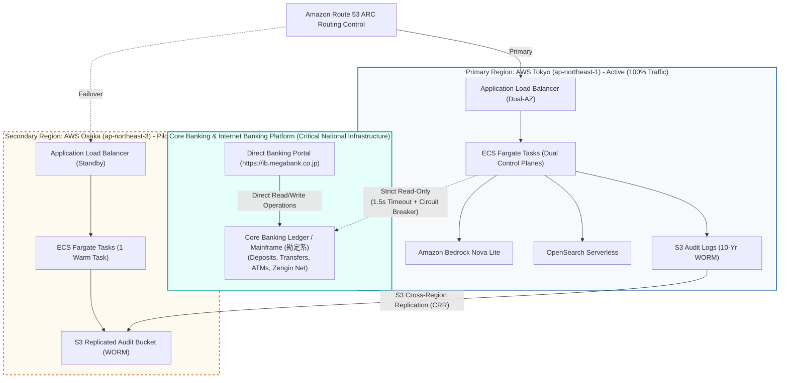

# ADR 0022: Cross-Region Disaster Recovery (Tokyo-Osaka), Fault Tolerance, and Main Banking Operational Independence

* **Status**: Accepted
* **Date**: 2026-09-02
* **Deciders**: Chief Information Officer (CIO), Chief Information Security Officer (CISO), Principal Banking Solutions Architect, Lead Resilience Engineer

---

## Context & Problem Statement

As a major Japanese commercial bank operating critical national infrastructure, the digital banking assistant must satisfy strict regulatory compliance under the **Banking Act (銀行法第13条)**, **Financial Services Agency (FSA) AI Guidelines**, and **FISC Security Standards (FISC安全対策基準 第9版 障害・コンティンジェンシー計画)**.

Two existential architectural questions were raised during architectural audit:
1. **Disaster Recovery (DR)**: While the system is resilient across Availability Zones within AWS Tokyo (`ap-northeast-1`), how does the application survive a catastrophic wide-area disaster (e.g., severe Kanto earthquake, wide-area power grid failure, regional optical network severance)?
2. **Main Banking Operational Independence (Zero-Blast-Radius Guarantee)**: If any AI chat component, Bedrock endpoint, In-VPC control plane, or streaming controller hangs indefinitely, drops requests, or crashes, how do we guarantee mathematically and architecturally that the core commercial banking platform (transfers, deposits, withdrawals, ATMs, and direct internet banking) will **never** stop operating or experience degradation?

---

## Decision Drivers

1. **Unconditional Main Banking Continuity**: Core banking features must have 0% dependency on the AI assistant; an unrecoverable AI collapse must never impact account balances or money movement.
2. **FISC & APPI Japanese Data Sovereignty**: All customer data, interaction logs, and compute must remain strictly within Japanese territory. Cross-border failover to overseas AWS regions is legally prohibited.
3. **Deterministic RTO and RPO Targets**:
   - Component & In-VPC Failure: RTO < 30s, RPO = 0.
   - Core Banking Outage: RTO = 0 (immediate automated graceful degradation to FAQ).
   - Regional Catastrophic Disaster: RTO < 15 min, RPO < 1 min.
4. **FISC Periodic Disaster Drills & Chaos Validation**: Standardized operational runbooks and automated chaos engineering injection.

---

## Considered Options

1. **AWS Tokyo (`ap-northeast-1`) Primary + AWS Osaka (`ap-northeast-3`) Warm Standby / Pilot Light with Complete Decoupling (Chosen Option)**:
   - Designate AWS Osaka (`ap-northeast-3`) as the secondary Japanese domestic DR region.
   - Replicate audit logs and vector FAQ knowledge asynchronously using S3 Cross-Region Replication (CRR) encrypted with AWS KMS Multi-Region Keys (`mrk-`).
   - Route traffic using Amazon Route 53 Application Recovery Controller (ARC) with automated health check routing controls.
   - Enforce a strict **unidirectional read-only extraction boundary**: Core banking operates completely independently and never calls, waits for, or proxies through the AI Chat system.
2. **Multi-Region Active-Active across Tokyo and Osaka**:
   - Run active traffic simultaneously across Tokyo and Osaka with distributed vector stores.
   - *Drawback*: Excessive ongoing cloud infrastructure cost (~$4,500/mo extra) for conversational advisory traffic, complex cross-region vector consistency, and unnecessary operational complexity for non-core conversational services.
3. **Single-Region Tokyo Only with On-Demand Rebuild**:
   - Maintain Terraform configs and rebuild Osaka only after a disaster is declared.
   - *Drawback*: Violates FISC 15-minute RTO compliance due to container image pull, VPC provisioning, and DNS propagation latency (> 2 hours).

---

## Decision Outcome

Chosen Option: **Option 1 (AWS Tokyo Primary + AWS Osaka Pilot Light with Complete Decoupling)**.

### Architectural Rules & Implementation Principles:

### 1. Main Banking Non-Interference Guarantee
1. **Unidirectional Read-Only Extraction**:
   - The AI Assistant is strictly a downstream data consumer via [`CoreBankingClient`](file:///home/joe/src/bank-ai-chat/src/core_banking/client.py).
   - Core Banking does not invoke, listen to, or route through the AI Assistant.
2. **Zero In-Chat Transaction Execution**:
   - High-value transactions (transfers, PIN changes, closures) are prohibited in chat per [ADR-0014](file:///home/joe/src/bank-ai-chat/docs/adr/0014-zero-trust-step-up-authentication-boundary.md). The AI issues deep links to Direct Banking.
3. **Core Banking Ledger Protection**:
   - 1.5s execution timeout + in-memory 60s cache + 3-state Circuit Breaker (`CLOSED`, `OPEN`, `HALF_OPEN`).
   - If AI chat crashes or core banking slows down, the circuit breaker trips to `OPEN`, immediately shielding core banking from AI-generated connection spikes.

### 2. Cross-Region Disaster Recovery Topology (Tokyo $\rightarrow$ Osaka)
1. **Secondary Region Pairing**: AWS Osaka (`ap-northeast-3`) is configured as the warm pilot-light DR environment with an identical 3-tier VPC (`10.101.0.0/16`).
2. **Audit Trail Data Durability**:
   - S3 Cross-Region Replication (CRR) automatically mirrors tamper-evident SHA-256 signed audit logs from `ap-northeast-1` to `ap-northeast-3`.
   - KMS Multi-Region Keys (`mrk-`) ensure seamless decryption and validation in Osaka.
3. **Health Check Separation (Shallow vs. Deep)**:
   - `GET /api/health/liveness` (Shallow): Verifies local container responsiveness for ALB task restarts.
   - `GET /api/health/readiness` (Deep): Verifies Bedrock and Core Banking connectivity for Route 53 ARC regional routing shifts.

### 3. Tiered RTO / RPO Matrix

| Failure Tier | Scope | Target RTO | Target RPO | Automated Recovery Action |
|---|---|---|---|---|
| **Tier 1: Container Crash** | ECS Task failure | < 30s | RPO = 0 | ECS service replaces task; ALB drains failed task. |
| **Tier 2: Upstream Core Outage** | Core Banking Ledger down | 0s (Instant) | RPO = 0 | Circuit breaker trips; AI provides polite Keigo maintenance guidance. |
| **Tier 3: AZ Outage** | Single Tokyo AZ failure | < 1 min | RPO = 0 | ALB shifts traffic to surviving AZ task (`ap-northeast-1c`). |
| **Tier 4: Regional Disaster** | AWS Tokyo (`ap-northeast-1`) down | < 15 min | < 1 min | Route 53 ARC shifts DNS to Osaka (`ap-northeast-3`); ECS auto-scales. |

---

## Consequences

### Positive:
- **Absolute Core Banking Safety**: Complete isolation guarantees that retail banking, ATM operations, and transfers never stop even during a full AI chat collapse.
- **FISC 9th Edition Compliance**: Fully satisfies contingency and off-site backup regulations within domestic Japanese legal boundaries.
- **Cost-Effective Resilience**: Pilot light in Osaka avoids idle compute costs while ensuring $< 15\text{ min}$ RTO.

### Negative / Risks:
- **KMS Multi-Region Key Management**: Requires synchronized KMS policy maintenance across both Tokyo and Osaka regions.
- **Semi-Annual BCP Drills Required**: Operations teams must execute simulated regional failover exercises every 6–12 months to validate Route 53 ARC routing controls.
