# Comprehensive System Architecture, Control Plane Governance & Source Code Mapping Specification
## Japanese Major Bank Production AI Assistant System (`bank-ai-chat`)

---

## Executive Overview & Architectural Foundation

This document provides a comprehensive, production-grade architectural specification for the **Japanese Major Bank AI Customer Assistant System**. Deployed natively in AWS Tokyo (`ap-northeast-1`), the system integrates an **In-VPC Dual Control Plane Architecture** engineered to comply with Japanese banking regulatory mandates—including the **FISC Security Standards (FISC安全対策基準)**, the **Act on the Protection of Personal Information (APPI / 個人情報保護法)**, **Financial Services Agency (FSA / 金融庁) AI Guidelines**, and the **Financial Instruments and Exchange Act (FIEA Article 38 / 金融商品取引法)**.

This architectural blueprint encompasses **ALL implemented subsystems** in the project repository:
1. **AWS Tokyo Cloud Production Infrastructure**: Multi-AZ 3-tier VPC network, PrivateLink isolation, ECS Fargate compute, Amazon Bedrock Nova Lite, and OpenSearch Serverless.
2. **Core Banking System & Synthetic Accounts Subsystem**: Core database schemas, customer profiles, balance query APIs, and REST extraction clients ([ADR 0008](file:///home/joe/src/bank-ai-chat/docs/adr/0008-decoupled-core-banking-database-and-api.md)).
3. **FAQ Knowledge Ingestion & Crawler Subsystem**: Automated Rakuten Bank FAQ scraper, JSON parser, and vector embedding generator.
4. **Local Development & Fallback Engine Subsystem**: Zero-cloud offline emulator, Ollama/vLLM integration, and setup validation scripts ([ADR 0019](file:///home/joe/src/bank-ai-chat/docs/adr/0019-local-llm-provider-and-fallback-architecture.md)).
5. **CI/CD Pipeline & DevOps Governance Subsystem**: GitHub Actions automated pipeline, OIDC IAM deployment roles, Bandit SAST scanner, Trivy container scanner, ECR registry, and Terraform remote state locking ([ADR 0016](file:///home/joe/src/bank-ai-chat/docs/adr/0016-deterministic-terraform-iac-architecture-and-remote-state-management.md)).
6. **Multi-Portal Frontend Interfaces Subsystem**: Customer Portal and User App mounted via FastAPI ASGI routes.

---

## Legend & Unified Styling Standards Across Architectural Mappings

All three architectural models share the **EXACT SAME ARCHITECTURAL TOPOLOGY AND GRAPH LAYOUT** across all subsystems, allowing effortless visual cross-comparison:

```mermaid
graph LR
    subgraph LEGEND["Unified Architectural Legend & System Components"]
        style LEGEND fill:#F8F9FA,stroke:#6C757D,stroke-width:2px,color:#212529
        
        N_COMPUTE["Compute & Backend Microservices<br/>(AWS ECS Fargate / FastAPI)"]
        N_SECURITY["Security & Control Planes<br/>(WAF / Guardrails / Salt Token Vault)"]
        N_STORAGE["Storage & Vector Databases<br/>(S3 WORM / OpenSearch / Core SQLite)"]
        N_AI["AI & Managed ML Services<br/>(Bedrock Nova Lite / Titan Embeddings)"]
        N_NETWORK["Networking & Hybrid Transit<br/>(ALB / PrivateLink / DirectConnect)"]
        N_DEVOPS["CI/CD & DevOps Automation<br/>(GitHub Actions / ECR / Terraform)"]
        N_CODE["Source Code Modules<br/>(Python / JavaScript / Files)"]
    end

    classDef compute fill:#4A90E2,stroke:#1C5DAB,stroke-width:2px,color:#FFFFFF
    classDef security fill:#D0021B,stroke:#90000D,stroke-width:2px,color:#FFFFFF
    classDef storage fill:#00838F,stroke:#005662,stroke-width:2px,color:#FFFFFF
    classDef ai fill:#7B1FA2,stroke:#4A0072,stroke-width:2px,color:#FFFFFF
    classDef network fill:#F5A623,stroke:#B7791F,stroke-width:2px,color:#FFFFFF
    classDef devops fill:#E65100,stroke:#BF360C,stroke-width:2px,color:#FFFFFF
    classDef code fill:#2E7D32,stroke:#1B5E20,stroke-width:2px,color:#FFFFFF

    class N_COMPUTE compute
    class N_SECURITY security
    class N_STORAGE storage
    class N_AI ai
    class N_NETWORK network
    class N_DEVOPS devops
    class N_CODE code
```

---

## Diagram 1: Master System Architecture Diagram (Infrastructure & Subsystems Topology)

This diagram details all physical infrastructure, cloud networks, core databases, ingestion scrapers, local development engines, and CI/CD pipelines.

```mermaid
flowchart TD
    classDef compute fill:#4A90E2,stroke:#1C5DAB,stroke-width:2px,color:#FFFFFF
    classDef security fill:#D0021B,stroke:#90000D,stroke-width:2px,color:#FFFFFF
    classDef storage fill:#00838F,stroke:#005662,stroke-width:2px,color:#FFFFFF
    classDef ai fill:#7B1FA2,stroke:#4A0072,stroke-width:2px,color:#FFFFFF
    classDef network fill:#F5A623,stroke:#B7791F,stroke-width:2px,color:#FFFFFF
    classDef devops fill:#E65100,stroke:#BF360C,stroke-width:2px,color:#FFFFFF
    classDef code fill:#2E7D32,stroke:#1B5E20,stroke-width:2px,color:#FFFFFF

    subgraph CLIENT_TIER["Web Portal & User Interfaces Subsystem (フロントエンド層)"]
        style CLIENT_TIER fill:#FFF3E0,stroke:#E65100,stroke-width:2px,color:#BF360C
        MAIN_PORTAL["Customer Banking Portal<br/>(Interactive Chat & Telemetry UI)"]
        USER_PORTAL["User App Dedicated Portal<br/>(Mounted at /user Route)"]
        class MAIN_PORTAL,USER_PORTAL network
    end

    subgraph ONPREM["Core Banking & Synthetic Account Subsystem (勘定系システム)"]
        style ONPREM fill:#ECEFF1,stroke:#455A64,stroke-width:2px,color:#263238
        MAINFRAME["Core Banking Database<br/>(SQLite Accounts DB Engine)"]
        CUSTOMER_DB["Customer Account Master<br/>(Synthetic Japanese Balances & History)"]
        class MAINFRAME,CUSTOMER_DB storage
    end

    subgraph OFFLINE_INGEST["FAQ Ingestion & Crawler Subsystem (ナレッジ収集)"]
        style OFFLINE_INGEST fill:#F3E5F5,stroke:#7B1FA2,stroke-width:2px,color:#4A0072
        FAQ_CRAWLER["Rakuten FAQ Web Crawler<br/>(Automated HTML Scraper & Parser)"]
        FAQ_DATASET["FAQ Knowledge Dataset<br/>(Formatted JSON Vectors)"]
        class FAQ_CRAWLER devops
        class FAQ_DATASET storage
    end

    subgraph LOCAL_DEV["Local Development & Offline LLM Subsystem (ローカル開発環境)"]
        style LOCAL_DEV fill:#E8F5E9,stroke:#388E3C,stroke-width:2px,color:#1B5E20
        LOCAL_EMULATOR["Local Provider Engine<br/>(Ollama / vLLM / Built-in Fallback)"]
        SETUP_SCRIPT["Local Setup & Validator<br/>(Environment Readiness Script)"]
        class LOCAL_EMULATOR ai
        class SETUP_SCRIPT devops
    end

    subgraph CICD_PIPELINE["CI/CD Pipeline & Security Automation (DevOps Subsystem)"]
        style CICD_PIPELINE fill:#FBE9E7,stroke:#D84315,stroke-width:2px,color:#BF360C
        GITHUB_ACTIONS["GitHub Actions CD Pipeline<br/>(OIDC Deployment Authentication)"]
        SECURITY_SCANNERS["Bandit & Trivy Scanners<br/>(SAST & Container Vulnerability Scans)"]
        TF_REMOTE_STATE["Terraform Remote State<br/>(S3 State Bucket & DynamoDB Lock Table)"]
        class GITHUB_ACTIONS,SECURITY_SCANNERS,TF_REMOTE_STATE devops
    end

    subgraph AWS_REGION["AWS Tokyo Region (ap-northeast-1) Production System"]
        style AWS_REGION fill:#FAFAFA,stroke:#37474F,stroke-width:3px,color:#263238

        DX["AWS Direct Connect 10Gbps<br/>+ Encrypted IPsec VPN Link"]
        class DX network

        subgraph VPC["Private VPC Security Zone (10.100.0.0/16)"]
            style VPC fill:#FFFFFF,stroke:#0288D1,stroke-width:2px,color:#01579B

            subgraph PUBLIC_SUBNETS["Public Subnets Tier (AZ 1A: 10.100.1.0/24 | AZ 1C: 10.100.2.0/24 | AZ 1D: 10.100.3.0/24)"]
                style PUBLIC_SUBNETS fill:#FFF8E1,stroke:#FFA000,stroke-width:1px,color:#FF6F00
                IGW["Internet Gateway (IGW)"]
                WAF["AWS WAF Web ACL<br/>(OWASP Top 10 + FISC Rate Rules)"]
                ALB["Application Load Balancer (ALB)<br/>(TLS 1.3 / ACM SSL Certificate)"]
                NAT["Multi-AZ NAT Gateways (1A, 1C, 1D)"]
                class WAF,ALB,NAT,IGW network
            end

            subgraph PRIVATE_APP_SUBNETS["Private App Subnets Tier (AZ 1A: 10.100.10.0/23 | AZ 1C: 10.100.12.0/23 | AZ 1D: 10.100.14.0/23)"]
                style PRIVATE_APP_SUBNETS fill:#E3F2FD,stroke:#1976D2,stroke-width:1px,color:#0D47A1
                ECS_FARGATE["AWS ECS Fargate Task<br/>(ARM64 Graviton / FastAPI App Service)"]
                IN_GUARD_COMP["Inbound Control Plane Engine"]
                OUT_GUARD_COMP["Outbound Control Plane Engine"]
                AUDIT_COMP["FISC Audit Stream Engine"]
                class ECS_FARGATE,IN_GUARD_COMP,OUT_GUARD_COMP,AUDIT_COMP compute
            end

            subgraph ISOLATED_DATA_SUBNETS["Isolated Data Subnets Tier (AZ 1A: 10.100.20.0/24 | AZ 1C: 10.100.21.0/24 | AZ 1D: 10.100.22.0/24)"]
                style ISOLATED_DATA_SUBNETS fill:#E8F5E9,stroke:#388E3C,stroke-width:1px,color:#1B5E20
                VPCE_BEDROCK["AWS PrivateLink Endpoint<br/>(com.amazonaws.ap-northeast-1.bedrock-runtime)"]
                VPCE_AOSS["AWS PrivateLink Endpoint<br/>(com.amazonaws.ap-northeast-1.aoss)"]
                VPCE_KMS["AWS PrivateLink Endpoint<br/>(com.amazonaws.ap-northeast-1.kms)"]
                VPCE_S3["AWS Gateway VPC Endpoint<br/>(com.amazonaws.ap-northeast-1.s3)"]
                VPCE_LOGS["AWS PrivateLink Endpoint<br/>(com.amazonaws.ap-northeast-1.logs)"]
                class VPCE_BEDROCK,VPCE_AOSS,VPCE_KMS,VPCE_S3,VPCE_LOGS network
            end
        end

        subgraph AWS_MANAGED["AWS Managed AI & Infrastructure Security Services"]
            style AWS_MANAGED fill:#F3E5F5,stroke:#7B1FA2,stroke-width:2px,color:#4A0072
            BEDROCK["Amazon Bedrock Runtime<br/>(Amazon Nova Lite: amazon.nova-lite-v1:0)"]
            TITAN_EMBED["Amazon Titan Embeddings<br/>(amazon.titan-embed-text-v2:0)"]
            AOSS["Amazon OpenSearch Serverless (AOSS)<br/>(1536-Dim Cosine Vector Index)"]
            KMS["AWS KMS Customer Managed Key (CMK)<br/>(AES-256 Key Rotation)"]
            S3_WORM["Amazon S3 Audit Lock Bucket<br/>(10-Yr WORM COMPLIANCE Mode)"]
            CW_LOGS["AWS CloudWatch Logs & X-Ray<br/>(Metrics / Guardrail Alarms)"]
            GUARDDUTY["AWS GuardDuty & Security Hub<br/>(Threat Intelligence Monitoring)"]
            SECRETS_MGR["AWS Secrets Manager<br/>(Salt Vault HMAC Keys)"]
            ECR_REGISTRY["Amazon ECR Registry<br/>(Encrypted Container Images)"]
            
            class BEDROCK,TITAN_EMBED ai
            class AOSS,S3_WORM storage
            class KMS,GUARDDUTY,SECRETS_MGR security
            class CW_LOGS compute
            class ECR_REGISTRY devops
        end
    end

    %% Flow Connections Across Subsystems
    MAINFRAME & CUSTOMER_DB --> DX
    DX -->|REST Extraction Client| ECS_FARGATE

    FAQ_CRAWLER --> FAQ_DATASET
    FAQ_DATASET -->|Embed & Index| TITAN_EMBED & AOSS

    MAIN_PORTAL & USER_PORTAL -->|HTTPS TLS 1.3| WAF
    WAF --> ALB
    ALB -->|Target Group Port 8000| ECS_FARGATE

    ECS_FARGATE --> IN_GUARD_COMP
    IN_GUARD_COMP --> VPCE_KMS
    VPCE_KMS --> KMS

    ECS_FARGATE --> VPCE_AOSS
    VPCE_AOSS --> AOSS

    ECS_FARGATE --> VPCE_BEDROCK
    VPCE_BEDROCK --> BEDROCK
    VPCE_BEDROCK --> TITAN_EMBED

    BEDROCK --> OUT_GUARD_COMP
    OUT_GUARD_COMP --> AUDIT_COMP
    AUDIT_COMP --> VPCE_LOGS
    AUDIT_COMP --> VPCE_S3
    VPCE_LOGS --> CW_LOGS
    VPCE_S3 --> S3_WORM

    SECRETS_MGR -.->|Inject Vault Salt| IN_GUARD_COMP
    GUARDDUTY -.->|Threat Telemetry| ECS_FARGATE

    GITHUB_ACTIONS --> SECURITY_SCANNERS
    SECURITY_SCANNERS --> ECR_REGISTRY
    ECR_REGISTRY -->|Deploy Image| ECS_FARGATE
    GITHUB_ACTIONS -.->|Locks State| TF_REMOTE_STATE

    LOCAL_DEV -.->|Fallback Execution| ECS_FARGATE
```

---

## Diagram 2: Control Planes, Security Guardrails & Regulatory Governance Overlay (Exact Structural Match)

This diagram overlays the exact governance controls, security policies, DLP filters, and compliance mandates across all implemented subsystems.

```mermaid
flowchart TD
    classDef compute fill:#4A90E2,stroke:#1C5DAB,stroke-width:2px,color:#FFFFFF
    classDef security fill:#D0021B,stroke:#90000D,stroke-width:2px,color:#FFFFFF
    classDef storage fill:#00838F,stroke:#005662,stroke-width:2px,color:#FFFFFF
    classDef ai fill:#7B1FA2,stroke:#4A0072,stroke-width:2px,color:#FFFFFF
    classDef network fill:#F5A623,stroke:#B7791F,stroke-width:2px,color:#FFFFFF
    classDef devops fill:#E65100,stroke:#BF360C,stroke-width:2px,color:#FFFFFF
    classDef code fill:#2E7D32,stroke:#1B5E20,stroke-width:2px,color:#FFFFFF

    subgraph CLIENT_TIER["Web Portal & User Interfaces Subsystem (フロントエンド層)"]
        style CLIENT_TIER fill:#FFF3E0,stroke:#E65100,stroke-width:2px,color:#BF360C
        MAIN_PORTAL["CFPB Guidance UI Boundary<br/>(One-Click Human Escalation & AI Notice)"]
        USER_PORTAL["Zero-Trust Session Isolation<br/>(Isolated Context Session Clearance)"]
        class MAIN_PORTAL,USER_PORTAL security
    end

    subgraph ONPREM["Core Banking & Synthetic Account Subsystem (勘定系システム)"]
        style ONPREM fill:#ECEFF1,stroke:#455A64,stroke-width:2px,color:#263238
        MAINFRAME["FISC Sec 3.1 Data Sovereignty<br/>(Encrypted NPI Storage Boundary)"]
        CUSTOMER_DB["APPI Anonymization Vault<br/>(Synthetic Japanese Account Mirror)"]
        class MAINFRAME,CUSTOMER_DB security
    end

    subgraph OFFLINE_INGEST["FAQ Ingestion & Crawler Subsystem (ナレッジ収集)"]
        style OFFLINE_INGEST fill:#F3E5F5,stroke:#7B1FA2,stroke-width:2px,color:#4A0072
        FAQ_CRAWLER["Data Provenance Scraper<br/>(Verified Banking FAQ Extractor)"]
        FAQ_DATASET["Knowledge Integrity Filter<br/>(Sanitized Reference Corpus)"]
        class FAQ_CRAWLER,FAQ_DATASET security
    end

    subgraph LOCAL_DEV["Local Development & Offline LLM Subsystem (ローカル開発環境)"]
        style LOCAL_DEV fill:#E8F5E9,stroke:#388E3C,stroke-width:2px,color:#1B5E20
        LOCAL_EMULATOR["Offline Development Boundary<br/>(Zero Third-Party Data Transmission)"]
        SETUP_SCRIPT["Environment Integrity Check<br/>(Local Security Policy Validator)"]
        class LOCAL_EMULATOR,SETUP_SCRIPT security
    end

    subgraph CICD_PIPELINE["CI/CD Pipeline & Security Automation (DevOps Subsystem)"]
        style CICD_PIPELINE fill:#FBE9E7,stroke:#D84315,stroke-width:2px,color:#BF360C
        GITHUB_ACTIONS["OIDC Short-Lived Credentials<br/>(Zero Hardcoded AWS Keys)"]
        SECURITY_SCANNERS["DevSecOps SAST & Vulnerability Gate<br/>(Bandit Code Scan & Trivy Image Gate)"]
        TF_REMOTE_STATE["Deterministic State Locking<br/>(KMS Encrypted S3 & DynamoDB Lock)"]
        class GITHUB_ACTIONS,SECURITY_SCANNERS,TF_REMOTE_STATE security
    end

    subgraph AWS_REGION["AWS Tokyo Region (ap-northeast-1) Production System"]
        style AWS_REGION fill:#FAFAFA,stroke:#37474F,stroke-width:3px,color:#263238

        DX["Secure Hybrid Connectivity Boundary<br/>(mTLS & Short-Lived OAuth 2.0 Auth)"]
        class DX security

        subgraph VPC["Private VPC Security Zone (10.100.0.0/16)"]
            style VPC fill:#FFFFFF,stroke:#0288D1,stroke-width:2px,color:#01579B

            subgraph PUBLIC_SUBNETS["Public Subnets Tier (AZ 1A: 10.100.1.0/24 | AZ 1C: 10.100.2.0/24 | AZ 1D: 10.100.3.0/24)"]
                style PUBLIC_SUBNETS fill:#FFF8E1,stroke:#FFA000,stroke-width:1px,color:#FF6F00
                IGW["Perimeter Ingress Boundary"]
                WAF["Perimeter Edge Protection Guardrail<br/>(OWASP SQLi/XSS + FISC 1000req/5m Rate Limit)"]
                ALB["Transport Security Termination Boundary<br/>(TLS 1.3 Strict ELBSecurityPolicy)"]
                NAT["Egress Network Translation Boundary"]
                class WAF,ALB,NAT,IGW security
            end

            subgraph PRIVATE_APP_SUBNETS["Private App Subnets Tier (AZ 1A: 10.100.10.0/23 | AZ 1C: 10.100.12.0/23 | AZ 1D: 10.100.14.0/23)"]
                style PRIVATE_APP_SUBNETS fill:#E3F2FD,stroke:#1976D2,stroke-width:1px,color:#0D47A1
                ECS_FARGATE["In-VPC Execution Environment<br/>(FastAPI Microservice & Control Plane Runtime)"]
                IN_GUARD_COMP["Inbound Control Plane & DLP<br/>(Unicode NFC + Injection Scanner + PII Redaction)"]
                OUT_GUARD_COMP["Outbound Control Plane & DLP<br/>(NLI Grounding Score >= 0.85 + FIEA Art. 38 Check)"]
                AUDIT_COMP["FISC Tamper-Evident Audit Stream<br/>(SHA-256 Sig = SHA256(Session|TS|Prompt|Flags))"]
                class ECS_FARGATE,IN_GUARD_COMP,OUT_GUARD_COMP,AUDIT_COMP security
            end

            subgraph ISOLATED_DATA_SUBNETS["Isolated Data Subnets Tier (AZ 1A: 10.100.20.0/24 | AZ 1C: 10.100.21.0/24 | AZ 1D: 10.100.22.0/24)"]
                style ISOLATED_DATA_SUBNETS fill:#E8F5E9,stroke:#388E3C,stroke-width:1px,color:#1B5E20
                VPCE_BEDROCK["Inference Network Isolation Endpoint<br/>(PrivateLink Zero-Public-Internet Exposure)"]
                VPCE_AOSS["RAG Network Isolation Endpoint<br/>(PrivateLink Vector Search Access)"]
                VPCE_KMS["KMS Cryptographic Isolation Endpoint<br/>(PrivateLink Salt Vault Key Access)"]
                VPCE_S3["Storage Isolation Gateway Endpoint<br/>(PrivateLink TLS 1.3 Enforcement)"]
                VPCE_LOGS["Telemetry Network Isolation Endpoint<br/>(PrivateLink Audit Stream Transit)"]
                class VPCE_BEDROCK,VPCE_AOSS,VPCE_KMS,VPCE_S3,VPCE_LOGS network
            end
        end

        subgraph AWS_MANAGED["AWS Managed AI & Infrastructure Security Services"]
            style AWS_MANAGED fill:#F3E5F5,stroke:#7B1FA2,stroke-width:2px,color:#4A0072
            BEDROCK["Private Model Execution Layer<br/>(Zero Prompt Retention / APPI Data Sovereignty)"]
            TITAN_EMBED["Vector Embedding Generation Engine<br/>(1536-Dim Text Embeddings)"]
            AOSS["Context Retrieval & RBAC Filter<br/>(Loyalty Stage Filter: VIP / SUPER_VIP)"]
            KMS["In-VPC Salted Tokenization Vault<br/>(HMAC-SHA256 Tokenization [TOKEN_ACCT_...])"]
            S3_WORM["Immutable Audit Log Storage<br/>(FISC Sec 4.2 / 10-Yr COMPLIANCE WORM Lock)"]
            CW_LOGS["Security Telemetry & Guardrail Alarms<br/>(P95 Latency & Block Surge Metrics)"]
            GUARDDUTY["Continuous Threat Monitoring<br/>(Security Hub Intrusion Telemetry)"]
            SECRETS_MGR["HMAC Secret Key Vault<br/>(Rotated Salt Secrets Manager)"]
            ECR_REGISTRY["Container Image Security Registry<br/>(Vulnerability Scanning & Immutable Tags)"]
            
            class BEDROCK,TITAN_EMBED ai
            class AOSS,S3_WORM storage
            class KMS,GUARDDUTY,SECRETS_MGR security
            class CW_LOGS compute
            class ECR_REGISTRY devops
        end
    end

    %% Flow Connections (Exact Structural Mirror)
    MAINFRAME & CUSTOMER_DB --> DX
    DX -->|mTLS / OAuth 2.0 Auth| ECS_FARGATE

    FAQ_CRAWLER --> FAQ_DATASET
    FAQ_DATASET -->|Validated Reference| TITAN_EMBED & AOSS

    MAIN_PORTAL & USER_PORTAL -->|HTTPS TLS 1.3| WAF
    WAF --> ALB
    ALB -->|In-VPC Target Port 8000| ECS_FARGATE

    ECS_FARGATE --> IN_GUARD_COMP
    IN_GUARD_COMP --> VPCE_KMS
    VPCE_KMS --> KMS

    ECS_FARGATE --> VPCE_AOSS
    VPCE_AOSS --> AOSS

    ECS_FARGATE --> VPCE_BEDROCK
    VPCE_BEDROCK --> BEDROCK
    VPCE_BEDROCK --> TITAN_EMBED

    BEDROCK --> OUT_GUARD_COMP
    OUT_GUARD_COMP --> AUDIT_COMP
    AUDIT_COMP --> VPCE_LOGS
    AUDIT_COMP --> VPCE_S3
    VPCE_LOGS --> CW_LOGS
    VPCE_S3 --> S3_WORM

    SECRETS_MGR -.->|Inject Vault Salt| IN_GUARD_COMP
    GUARDDUTY -.->|Threat Telemetry| ECS_FARGATE

    GITHUB_ACTIONS --> SECURITY_SCANNERS
    SECURITY_SCANNERS --> ECR_REGISTRY
    ECR_REGISTRY -->|Deploy Scanned Container| ECS_FARGATE
    GITHUB_ACTIONS -.->|Locks State| TF_REMOTE_STATE

    LOCAL_DEV -.->|Zero-Cloud Dev Fallback| ECS_FARGATE
```

---

## Diagram 3: Source Code Modules Overlay (Exact Structural Match)

This diagram maps every application source file, script, dataset, and CI/CD workflow directly onto its matching component site.

```mermaid
flowchart TD
    classDef compute fill:#4A90E2,stroke:#1C5DAB,stroke-width:2px,color:#FFFFFF
    classDef security fill:#D0021B,stroke:#90000D,stroke-width:2px,color:#FFFFFF
    classDef storage fill:#00838F,stroke:#005662,stroke-width:2px,color:#FFFFFF
    classDef ai fill:#7B1FA2,stroke:#4A0072,stroke-width:2px,color:#FFFFFF
    classDef network fill:#F5A623,stroke:#B7791F,stroke-width:2px,color:#FFFFFF
    classDef devops fill:#E65100,stroke:#BF360C,stroke-width:2px,color:#FFFFFF
    classDef code fill:#2E7D32,stroke:#1B5E20,stroke-width:2px,color:#FFFFFF

    subgraph CLIENT_TIER["Web Portal & User Interfaces Subsystem (フロントエンド層)"]
        style CLIENT_TIER fill:#FFF3E0,stroke:#E65100,stroke-width:2px,color:#BF360C
        MAIN_PORTAL["src/frontend/index.html & app.js<br/>(Customer Portal UI & Telemetry View)"]
        USER_PORTAL["src/frontend/user/index.html<br/>(Dedicated User App View Mounted at /user)"]
        class MAIN_PORTAL,USER_PORTAL code
    end

    subgraph ONPREM["Core Banking & Synthetic Account Subsystem (勘定系システム)"]
        style ONPREM fill:#ECEFF1,stroke:#455A64,stroke-width:2px,color:#263238
        MAINFRAME["src/core_banking/database.py<br/>(SQLite Core Accounts Database & Schema)"]
        CUSTOMER_DB["data/mock_bank_accounts.json<br/>(Synthetic Customer Profiles & Transactions)"]
        class MAINFRAME,CUSTOMER_DB code
    end

    subgraph OFFLINE_INGEST["FAQ Ingestion & Crawler Subsystem (ナレッジ収集)"]
        style OFFLINE_INGEST fill:#F3E5F5,stroke:#7B1FA2,stroke-width:2px,color:#4A0072
        FAQ_CRAWLER["scripts/crawl_full_rakuten_faq.py<br/>(Rakuten FAQ Scraper & JSON Extractor)"]
        FAQ_DATASET["data/rakuten_faq.json<br/>(Knowledge Base FAQ Dataset)"]
        class FAQ_CRAWLER,FAQ_DATASET code
    end

    subgraph LOCAL_DEV["Local Development & Offline LLM Subsystem (ローカル開発環境)"]
        style LOCAL_DEV fill:#E8F5E9,stroke:#388E3C,stroke-width:2px,color:#1B5E20
        LOCAL_EMULATOR["src/llm/local_llm.py<br/>(Ollama / vLLM & Local Emulator Client)"]
        SETUP_SCRIPT["scripts/setup_local_llm.py<br/>(Local LLM Installer & Test Validator)"]
        class LOCAL_EMULATOR,SETUP_SCRIPT code
    end

    subgraph CICD_PIPELINE["CI/CD Pipeline & Security Automation (DevOps Subsystem)"]
        style CICD_PIPELINE fill:#FBE9E7,stroke:#D84315,stroke-width:2px,color:#BF360C
        GITHUB_ACTIONS[".github/workflows/cd.yml<br/>(GitHub Actions Continuous Delivery)"]
        SECURITY_SCANNERS["Bandit & Trivy Configs<br/>(SAST Rules & Container Vulnerability Scans)"]
        TF_REMOTE_STATE["docs/adr/0016-*.md & Terraform State<br/>(Remote S3 State & DynamoDB Locking)"]
        class GITHUB_ACTIONS,SECURITY_SCANNERS,TF_REMOTE_STATE code
    end

    subgraph AWS_REGION["AWS Tokyo Region (ap-northeast-1) Production System"]
        style AWS_REGION fill:#FAFAFA,stroke:#37474F,stroke-width:3px,color:#263238

        DX["src/core_banking/client.py<br/>(Core Banking REST Client & Data Extractors)"]
        class DX code

        subgraph VPC["Private VPC Security Zone (10.100.0.0/16)"]
            style VPC fill:#FFFFFF,stroke:#0288D1,stroke-width:2px,color:#01579B

            subgraph PUBLIC_SUBNETS["Public Subnets Tier (AZ 1A: 10.100.1.0/24 | AZ 1C: 10.100.2.0/24 | AZ 1D: 10.100.3.0/24)"]
                style PUBLIC_SUBNETS fill:#FFF8E1,stroke:#FFA000,stroke-width:1px,color:#FF6F00
                IGW["src/frontend/styles.css<br/>(Responsive Banking Stylesheet)"]
                WAF["FastAPI CORSMiddleware & Rate Limit<br/>(Perimeter Security Config in app.py)"]
                ALB["src/backend/server.py<br/>(ASGI Server Execution, Uvicorn & SSE Handler)"]
                NAT["docker-compose.yml & Dockerfile<br/>(Container Infrastructure Spec)"]
                class WAF,ALB,NAT,IGW code
            end

            subgraph PRIVATE_APP_SUBNETS["Private App Subnets Tier (AZ 1A: 10.100.10.0/23 | AZ 1C: 10.100.12.0/23 | AZ 1D: 10.100.14.0/23)"]
                style PRIVATE_APP_SUBNETS fill:#E3F2FD,stroke:#1976D2,stroke-width:1px,color:#0D47A1
                ECS_FARGATE["src/backend/app.py<br/>(FastAPI Main Application Router & Endpoints)"]
                IN_GUARD_COMP["src/control_plane/input_guardrail.py<br/>(InputGuardrail Class & PII Scrubbing Regexes)"]
                OUT_GUARD_COMP["src/control_plane/output_guardrail.py<br/>(OutputGuardrail Class & NLI Grounding Verifier)"]
                AUDIT_COMP["src/control_plane/audit_logger.py<br/>(AuditLogger Class & SHA-256 Signature Builder)"]
                class ECS_FARGATE,IN_GUARD_COMP,OUT_GUARD_COMP,AUDIT_COMP code
            end

            subgraph ISOLATED_DATA_SUBNETS["Isolated Data Subnets Tier (AZ 1A: 10.100.20.0/24 | AZ 1C: 10.100.21.0/24 | AZ 1D: 10.100.22.0/24)"]
                style ISOLATED_DATA_SUBNETS fill:#E8F5E9,stroke:#388E3C,stroke-width:1px,color:#1B5E20
                VPCE_BEDROCK["src/llm/bedrock_nova.py<br/>(boto3 bedrock-runtime VPC Endpoint Client)"]
                VPCE_AOSS["src/rag/vector_store.py<br/>(OpenSearch Serverless Private Client Connection)"]
                VPCE_KMS["src/control_plane/input_guardrail.py<br/>(boto3 KMS Key Client for Salted Vault)"]
                VPCE_S3["src/control_plane/audit_logger.py<br/>(boto3 S3 PutObject Audit Stream)"]
                VPCE_LOGS["src/control_plane/audit_logger.py<br/>(CloudWatch Logs Async Logger)"]
                class VPCE_BEDROCK,VPCE_AOSS,VPCE_KMS,VPCE_S3,VPCE_LOGS code
            end
        end

        subgraph AWS_MANAGED["AWS Managed AI & Infrastructure Security Services"]
            style AWS_MANAGED fill:#F3E5F5,stroke:#7B1FA2,stroke-width:2px,color:#4A0072
            BEDROCK["src/llm/bedrock_nova.py<br/>(BedrockNovaLiteClient & amazon.nova-lite-v1:0)"]
            TITAN_EMBED["src/rag/vector_store.py<br/>(Amazon Titan Text Embeddings Invocation)"]
            AOSS["src/rag/vector_store.py & data/rakuten_faq.json<br/>(VectorStore Search & Knowledge Dataset)"]
            KMS["src/control_plane/input_guardrail.py<br/>(PATTERNS & Salted Tokenization Mapping)"]
            S3_WORM["data/audit_logs.json & S3 Bucket<br/>(Audit Log File Storage & S3 WORM Upload)"]
            CW_LOGS["tests/test_guardrails.py<br/>(Guardrail Telemetry & Unit Test Verifiers)"]
            GUARDDUTY["tests/test_account_data.py & test_core_banking.py<br/>(Compliance Test Verification Suite)"]
            SECRETS_MGR["src/llm/local_llm.py<br/>(Local Dev Provider Environment Variables)"]
            ECR_REGISTRY["Dockerfile & pyproject.toml / uv.lock<br/>(Container Dependencies & Image Build Spec)"]
            
            class BEDROCK,TITAN_EMBED,AOSS,S3_WORM,KMS,CW_LOGS,GUARDDUTY,SECRETS_MGR,ECR_REGISTRY code
        end
    end

    %% Flow Connections (Exact Structural Mirror)
    MAINFRAME & CUSTOMER_DB --> DX
    DX -->|Reads Accounts DB| ECS_FARGATE

    FAQ_CRAWLER --> FAQ_DATASET
    FAQ_DATASET -->|Populates Knowledge| TITAN_EMBED & AOSS

    MAIN_PORTAL & USER_PORTAL -->|HTTP / REST API| WAF
    WAF --> ALB
    ALB -->|Mounts Static & API Routes| ECS_FARGATE

    ECS_FARGATE --> IN_GUARD_COMP
    IN_GUARD_COMP --> VPCE_KMS
    VPCE_KMS --> KMS

    ECS_FARGATE --> VPCE_AOSS
    VPCE_AOSS --> AOSS

    ECS_FARGATE --> VPCE_BEDROCK
    VPCE_BEDROCK --> BEDROCK
    VPCE_BEDROCK --> TITAN_EMBED

    BEDROCK --> OUT_GUARD_COMP
    OUT_GUARD_COMP --> AUDIT_COMP
    AUDIT_COMP --> VPCE_LOGS
    AUDIT_COMP --> VPCE_S3
    VPCE_LOGS --> CW_LOGS
    VPCE_S3 --> S3_WORM

    SECRETS_MGR -.->|Provides HMAC Salt| IN_GUARD_COMP
    GUARDDUTY -.->|Verifies Container State| ECS_FARGATE

    GITHUB_ACTIONS --> SECURITY_SCANNERS
    SECURITY_SCANNERS --> ECR_REGISTRY
    ECR_REGISTRY -->|Deploys Container| ECS_FARGATE
    GITHUB_ACTIONS -.->|Manages State| TF_REMOTE_STATE

    LOCAL_DEV -.->|Fallback Execution| ECS_FARGATE
```

---

## Traceability Summary Matrix Across All Subsystems

| Subsystem Component | AWS Infrastructure Target | Control Plane & Governance Rule | Primary Source Code Files |
|---|---|---|---|
| **Perimeter Defense** | WAF + ALB (`sg-alb`) | OWASP Top 10 + TLS 1.3 Termination | `src/backend/app.py`, `src/backend/server.py` |
| **Backend Execution** | ECS Fargate Graviton | Banking Act Art 21 Task Role Isolation | `src/backend/app.py`, `server.py` |
| **Inbound Guardrail** | KMS CMK Endpoint | APPI Art 20 PII Tokenization Vault | `src/control_plane/input_guardrail.py` |
| **RAG Vector Engine** | OpenSearch Serverless | FSA Grounding & Tier RBAC Filter | `src/rag/vector_store.py` |
| **Core Banking Integration** | DirectConnect VPN | FISC Data Isolation Boundary | `src/core_banking/client.py`, `service.py`, `database.py` |
| **Model Inference** | Bedrock Nova Lite | Tokyo APPI Data Sovereignty (`ap-northeast-1`) | `src/llm/bedrock_nova.py` |
| **Outbound Guardrail** | ECS Fargate In-Memory NLI | FIEA Art 38 Advice Restrictor & Disclaimer | `src/control_plane/output_guardrail.py` |
| **Audit Logger** | S3 Object Lock WORM | FISC Sec 4.2 SHA-256 Tamper Proof Trail | `src/control_plane/audit_logger.py` |
| **Web Portals UI** | ALB Static Asset Mount | CFPB AI Guidance Escalation Interface | `src/frontend/index.html`, `app.js`, `user/index.html` |
| **FAQ Crawler & Scraper** | Offline Build Container | Knowledge Provenance & Dataset Integrity | `scripts/crawl_full_rakuten_faq.py`, `extract_rakuten_faq.py` |
| **Local LLM Engine** | Workstation GPU/CPU | Zero-Cloud Offline Developer Velocity | `src/llm/local_llm.py`, `scripts/setup_local_llm.py` |
| **CI/CD & DevSecOps** | GitHub Actions / ECR | OIDC Short-Lived Auth & SAST Scans | `.github/workflows/cd.yml`, `Dockerfile`, `docker-compose.yml` |
| **IaC Remote State** | S3 State & DynamoDB | Deterministic Lock Management | `docs/adr/0016-*.md` |
