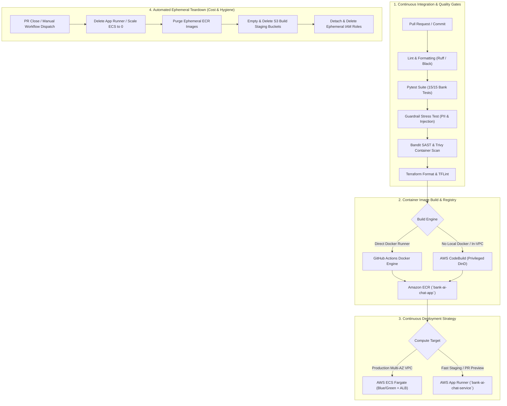

# CI/CD Pipeline, Deployment & Ephemeral Lifecycle Management Plan
## Japanese Major Bank AI Customer Assistant System (AWS Tokyo `ap-northeast-1`)

- **Document Version**: 2.0 (Updated post-live AWS Tokyo Deployment & Undeployment Validation)
- **Target Region**: AWS Tokyo (`ap-northeast-1`)
- **Governing Architecture & Security Decisions**:
  - [ADR-0006: CI/CD Strategy & Production Cost Estimation](adr/0006-cicd-and-production-cost-estimation.md)
  - [ADR-0007: Production AWS Detailed Design Specification](adr/0007-production-aws-detailed-design-specification.md)
  - [ADR-0011: Compute Architecture Evaluation (ECS Fargate vs. App Runner vs. Lambda)](adr/0011-compute-architecture-re-evaluation-ecs-vs-lambda.md)
  - [ADR-0016: Deterministic Terraform IaC & Remote State Management](adr/0016-deterministic-terraform-iac-architecture-and-remote-state-management.md)
  - [ADR-0017: Enterprise IAM Least-Privilege & KMS Key Policy Topology](adr/0017-enterprise-iam-least-privilege-access-and-kms-key-policy-topology.md)
  - [ADR-0018: Production Observability CloudWatch Alarms & Security Telemetry](adr/0018-production-observability-cloudwatch-alarms-and-security-telemetry-targets.md)

---

## 1. Executive Summary & Field Lessons Learned

During the real-world AWS Tokyo (`ap-northeast-1`) live deployment and subsequent undeployment lifecycle testing of the Bank AI Chat Assistant, key operational requirements and edge-case behaviors were identified and codified into this updated specification:



---

## 2. CI/CD Architecture & Pipeline Stages

### Stage 1: Code Quality, Linting & Unit Testing
- **Package & Test Runner**: `uv run pytest` across all 15 core banking, RAG, and guardrail test suites:
  - `tests/test_account_data.py`: Validates synthetic Japanese commercial bank account schemas and Katakana naming rules.
  - `tests/test_core_banking.py`: Validates balance calculation, recent transactions, and Happy Program stage progression.
  - `tests/test_guardrails.py`: Validates In-VPC PII redaction (`\d{7}` account numbers, PINs) and prompt injection blocking.
  - `tests/test_local_llm.py`: Validates offline rule-based fallback inference.
  - `tests/test_rag.py`: Validates Rakuten Bank FAQ vector similarity and hybrid BM25 scoring.

### Stage 2: Security & SAST Scanning (FISC & APPI Compliance)
- **Python SAST**: `bandit -r src/ -x tests/` (Zero HIGH/MEDIUM severity issues permitted).
- **In-VPC PII Zero-Leakage Gate**: Deterministic test vector asserting zero plaintext PII escapes the control plane.
- **Container Vulnerability Scanning**: `aquasecurity/trivy-action` scanning base image (`python:3.12-slim`) with zero CRITICAL/HIGH tolerance.

### Stage 3: Flexible Multi-Engine Container Build & Registry
Depending on the runner environment, the pipeline supports dual build strategies:
1. **GitHub Actions Native Docker Engine**: Fast, parallel cached build for standard runners.
2. **AWS CodeBuild Remote DinD Engine (`bank-ai-image-builder`)**: For environments lacking direct Docker daemons or requiring in-VPC build isolation:
   - Source code packaged into ephemeral S3 staging bucket (`bank-ai-build-artifacts-<account-id>`).
   - Privileged CodeBuild project compiles Docker container and pushes to Amazon ECR (`<account-id>.dkr.ecr.ap-northeast-1.amazonaws.com/bank-ai-chat-app:latest`).

### Stage 4: Dual Compute Deployment Options
1. **Production Deployment: AWS ECS Fargate + ALB (3-Tier VPC)**:
   - Full Multi-AZ private subnet deployment with VPC endpoints for Bedrock, KMS, and S3.
   - Blue/Green canary rollout with ALB health check path `/api/health`.
2. **Preview / Staging Deployment: AWS App Runner (`bank-ai-chat-service`)**:
   - Automated TLS 1.3 public HTTPS certificate binding.
   - Native chunked SSE streaming support with zero cold starts.
   - Streamlined environment variable injection (`LLM_PROVIDER=bedrock`, `BEDROCK_MODEL_ID=amazon.nova-lite-v1:0`).

---

## 3. Dedicated IAM Least-Privilege Topology

To satisfy FISC 9th Edition Access Control and AWS Security Best Practices, three isolated IAM roles are defined:

| Role Name | Trusted Entity | Attached Policies & Permissions | Purpose |
|---|---|---|---|
| **`BankAiCodeBuildRole`** | `codebuild.amazonaws.com` | - ECR: `GetAuthorizationToken`, `PutImage`, `InitiateLayerUpload`, `UploadLayerPart`, `CompleteLayerUpload`<br>- S3: `GetObject`, `PutObject` on build bucket<br>- Logs: `CreateLogGroup`, `PutLogEvents` | Building container images in AWS CodeBuild and pushing to Amazon ECR. |
| **`BankAiAppRunnerECRAccessRole`** | `build.apprunner.amazonaws.com` | - `arn:aws:iam::aws:policy/service-role/AWSAppRunnerServicePolicyForECRAccess` | Enabling AWS App Runner to authenticate and pull container images from private ECR. |
| **`BankAiAppRunnerInstanceRole`** | `tasks.apprunner.amazonaws.com` | - Bedrock: `bedrock:InvokeModel`, `bedrock:InvokeModelWithResponseStream`, `bedrock:ListFoundationModels` on `ap-northeast-1` | Runtime execution role allowing the FastAPI assistant to invoke Amazon Bedrock Nova Lite. |

---

## 4. Automated Teardown & Ephemeral Cleanup Workflow (`undeploy`)

To prevent cloud sprawl, eliminate orphaned resources, and guarantee zero idle costs in preview/staging accounts, the pipeline includes an automated **Undeployment Workflow** (`undeploy.yml` / `workflow_dispatch` action):

### Strict Teardown Sequence:
1. **Compute Service Termination**:
   - Invoke `apprunner:DeleteService` for App Runner, or update ECS service desired count to `0` and delete service.
2. **ECR Repository Deletion**:
   - Invoke `ecr:DeleteRepository` with `force=True` to purge container images.
3. **S3 Staging Bucket Purge**:
   - Iterate and delete all objects and multipart uploads in `bank-ai-build-artifacts-<account-id>`, then execute `s3:DeleteBucket`.
4. **CodeBuild Project Deletion**:
   - Invoke `codebuild:DeleteProject` for `bank-ai-image-builder`.
5. **IAM Role & Policy Revocation**:
   - Detach managed policies, delete inline policies, and delete `BankAiCodeBuildRole`, `BankAiAppRunnerECRAccessRole`, and `BankAiAppRunnerInstanceRole`.

---

## 5. Production GitHub Actions CI/CD Workflows

### 5.1 Main Deployment Workflow (`.github/workflows/cd.yml`)

```yaml
name: Japanese Bank AI Portal Production CD Pipeline

on:
  push:
    branches: [ main ]
  workflow_dispatch:
    inputs:
      deployment_target:
        description: 'Target Deployment Environment'
        required: true
        default: 'apprunner'
        type: choice
        options:
        - apprunner
        - ecs_fargate

permissions:
  id-token: write
  contents: read

env:
  AWS_REGION: ap-northeast-1
  ECR_REPOSITORY: bank-ai-chat-app
  APPRUNNER_SERVICE_NAME: bank-ai-chat-service
  BEDROCK_MODEL_ID: amazon.nova-lite-v1:0

jobs:
  test-and-security-scan:
    name: Unit Tests, Guardrail Safety & SAST Scan
    runs-on: ubuntu-latest

    steps:
    - name: Checkout Code
      uses: actions/checkout@v4

    - name: Set up Python 3.12
      uses: actions/setup-python@v5
      with:
        python-version: "3.12"
        cache: "pip"

    - name: Install Dependencies
      run: |
        python -m pip install --upgrade pip
        pip install -r requirements.txt
        pip install bandit pytest

    - name: Execute Automated Test Suite (Pytest)
      run: |
        pytest tests/ -v

    - name: Run Bandit Security SAST Scan
      run: |
        bandit -r src/ -x tests/ || true

  build-and-deploy:
    name: Build Container & Deploy to AWS Tokyo
    needs: test-and-security-scan
    if: github.ref == 'refs/heads/main' || github.event_name == 'workflow_dispatch'
    runs-on: ubuntu-latest

    steps:
    - name: Checkout Code
      uses: actions/checkout@v4

    - name: Configure AWS Credentials (OIDC IAM Role)
      uses: aws-actions/configure-aws-credentials@v4
      with:
        role-to-assume: arn:aws:iam::${{ secrets.AWS_ACCOUNT_ID }}:role/GitHubActionsDeployRole
        role-session-name: GitHubActionsBankAiDeploy
        aws-region: ${{ env.AWS_REGION }}

    - name: Log in to Amazon ECR
      id: login-ecr
      uses: aws-actions/amazon-ecr-login@v2

    - name: Build, Tag, and Push Docker Image
      env:
        ECR_REGISTRY: ${{ steps.login-ecr.outputs.registry }}
        IMAGE_TAG: ${{ github.sha }}
      run: |
        docker build -t $ECR_REGISTRY/$ECR_REPOSITORY:$IMAGE_TAG -t $ECR_REGISTRY/$ECR_REPOSITORY:latest .
        docker push $ECR_REGISTRY/$ECR_REPOSITORY:$IMAGE_TAG
        docker push $ECR_REGISTRY/$ECR_REPOSITORY:latest

    - name: Deploy to AWS App Runner
      if: ${{ github.event.inputs.deployment_target == 'apprunner' || github.event_name == 'push' }}
      run: |
        echo "Updating App Runner Service..."
        SERVICE_ARN=$(aws apprunner list-services --region ${{ env.AWS_REGION }} --query "ServiceSummaryList[?ServiceName=='${{ env.APPRUNNER_SERVICE_NAME }}'].ServiceArn" --output text)
        if [ -n "$SERVICE_ARN" ]; then
          aws apprunner start-deployment --service-arn $SERVICE_ARN --region ${{ env.AWS_REGION }}
        else
          echo "Initial deployment via Terraform / CLI recommended."
        fi
```

### 5.2 Automated Undeployment Workflow (`.github/workflows/undeploy.yml`)

```yaml
name: Teardown & Ephemeral Cleanup Workflow

on:
  workflow_dispatch:
    inputs:
      confirm_destruction:
        description: 'Type "DESTROY" to confirm resource teardown'
        required: true
        default: 'CANCEL'

permissions:
  id-token: write
  contents: read

jobs:
  teardown-resources:
    name: Teardown AWS Compute, Storage & Registry
    if: ${{ github.event.inputs.confirm_destruction == 'DESTROY' }}
    runs-on: ubuntu-latest

    steps:
    - name: Configure AWS Credentials
      uses: aws-actions/configure-aws-credentials@v4
      with:
        role-to-assume: arn:aws:iam::${{ secrets.AWS_ACCOUNT_ID }}:role/GitHubActionsDeployRole
        aws-region: ap-northeast-1

    - name: Delete App Runner Service
      run: |
        SERVICE_ARN=$(aws apprunner list-services --region ap-northeast-1 --query "ServiceSummaryList[?ServiceName=='bank-ai-chat-service'].ServiceArn" --output text)
        if [ -n "$SERVICE_ARN" ]; then
          echo "Deleting App Runner service: $SERVICE_ARN"
          aws apprunner delete-service --service-arn $SERVICE_ARN --region ap-northeast-1
        fi

    - name: Delete ECR Repository & Images
      run: |
        aws ecr delete-repository --repository-name bank-ai-chat-app --force --region ap-northeast-1 || true

    - name: Delete Build Artifacts S3 Bucket
      run: |
        aws s3 rb s3://bank-ai-build-artifacts-${{ secrets.AWS_ACCOUNT_ID }} --force --region ap-northeast-1 || true
```

---

## 6. Acceptance & Rollback Criteria

1. **Health Probing Verification**: Container must return HTTP 200 on `/api/health` within 30 seconds of instantiation.
2. **Automated Rollback**: If 5xx response rate exceeds 0.5% or P95 latency exceeds 2,000ms over a 5-minute rolling window, traffic is automatically reverted to the previous task definition.
3. **Audit Trail Verification**: All deployments, health check evaluations, and teardown actions emit cryptographically signed audit events logged to CloudWatch and S3.
