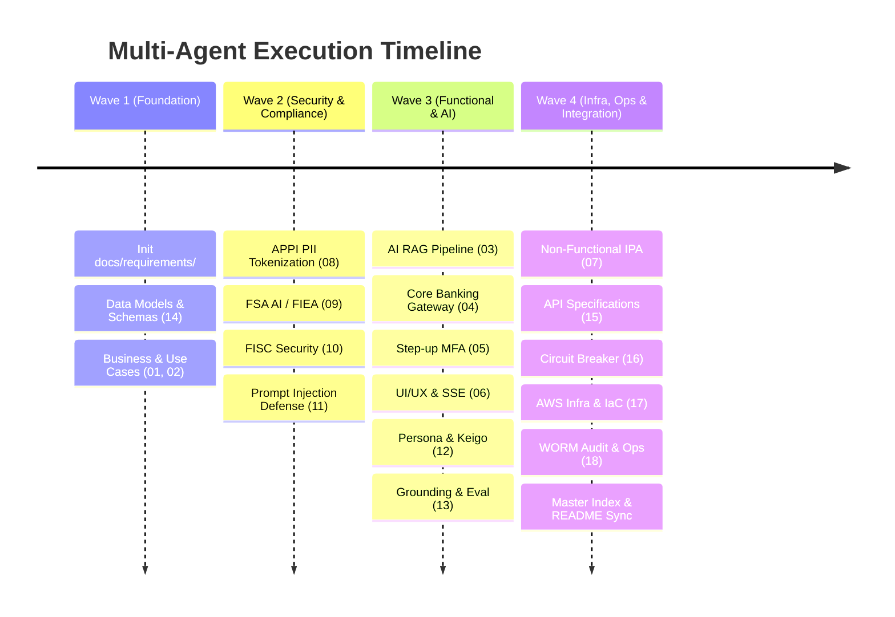

# Multi-Agent Execution Plan: Japanese Bank Enterprise AI Chat Requirements Definition Suite

This document defines the multi-agent execution plan for authoring, validating, and publishing the full **Enterprise Requirements Definition Suite (18 specialized documents across 7 domains)** for the Japanese Major Bank AI Customer Assistant System.

To guarantee zero context overflow, zero hallucination, and 100% adherence to Japanese banking compliance (APPI, FSA, FISC, FIEA, Banking Act), the workload is distributed across a **3-Tier Hierarchical Multi-Agent Architecture** utilizing **Gemini 3.7 Flash (High)**.

---

## 1. Architectural Strategy & Context Overflow Prevention

### 1.1 The Context Degradation Problem in Enterprise Banking Specs
Authoring 18 enterprise-grade banking requirement specifications in a single flat context window inevitably causes:
1. **Context Bloat & Token Degradation**: Forgetting fine-grained regulatory clauses (FISC controls, APPI articles, FIEA disclaimers).
2. **Cross-Document Inconsistency**: Drifting terminologies, mismatched schema types, or broken ADR link paths.
3. **Truncation Risk**: Large outputs hitting token limits and generating partial sections.

### 1.2 Multi-Tier Hierarchical Agent Topology

```mermaid
graph TD
    subgraph Tier0["Tier 0: Lead Orchestrator Agent (Master Governance)"]
        L0["Lead Orchestrator (Gemini 3.7 Flash)"]
        IDX["Shared Context Bus: Terminology Glossary & Traceability Matrix"]
    end

    subgraph Tier1["Tier 1: Domain Lead Sub-Agents"]
        D1["Sub-Agent 1: Business & Process Lead"]
        D2["Sub-Agent 2: Functional Architecture Lead"]
        D3["Sub-Agent 3: Non-Functional & Reliability Lead"]
        D4["Sub-Agent 4: Security, DLP & Compliance Lead"]
        D5["Sub-Agent 5: AI Models, Data & Persona Lead"]
        D6["Sub-Agent 6: Interfaces, Infra & Operations Lead"]
    end

    subgraph Tier2["Tier 2: Document Specialist Sub-Sub-Agents (Focused Workers)"]
        W1["Worker 01: Business Requirements Spec"]
        W2["Worker 02: Process & Use Cases Spec"]
        W3["Worker 03: AI & RAG Functional Spec"]
        W4["Worker 04: Core Banking Integration Spec"]
        W5["Worker 05: Auth & Step-up MFA Spec"]
        W6["Worker 06: UI/UX & Streaming Spec"]
        W7["Worker 07: Non-Functional IPA Spec"]
        W8["Worker 08: APPI & PII Tokenization Spec"]
        W9["Worker 09: FSA & Legal Compliance Spec"]
        W10["Worker 10: FISC Standards Spec"]
        W11["Worker 11: Prompt Injection & Guardrails Spec"]
        W12["Worker 12: Banking Persona & Keigo Spec"]
        W13["Worker 13: Grounding & Evaluation Spec"]
        W14["Worker 14: Data Schemas & Dictionary Spec"]
        W15["Worker 15: API & SSE Stream Spec"]
        W16["Worker 16: Fallback & Circuit Breaker Spec"]
        W17["Worker 17: AWS 3-Tier Infra & IaC Spec"]
        W18["Worker 18: Audit Log WORM & Ops Spec"]
    end

    L0 --> IDX
    L0 --> D1 & D2 & D3 & D4 & D5 & D6
    D1 --> W1 & W2
    D2 --> W3 & W4 & W5 & W6
    D3 --> W7
    D4 --> W8 & W9 & W10 & W11
    D5 --> W12 & W13 & W14
    D6 --> W15 & W16 & W17 & W18
```



### 1.3 Baseline Ingestion Strategy: Synthesizing & Modularizing Existing Docs

The repository already contains rich, highly detailed architectural and security specifications. The multi-agent process does **NOT** invent requirements from scratch; rather, it performs a **lossless modularization, refinement, and expansion** of the existing baseline documents:

| Existing Baseline Document | Size / Scope | Primary Ingestion Target in Requirements Suite |
|---|---|---|
| [`docs/requirements_definition.md`](requirements_definition.md) | 35.8 KB / 14 Sections | Modularized across `01`, `02`, `03`, `04`, `05`, `07`, `14`, `15`, `16` |
| [`docs/security_dlp_guardrails_requirements.md`](security_dlp_guardrails_requirements.md) | 26.6 KB / DLP & Compliance | Decomposed into `08` (APPI), `09` (FSA/FIEA), `10` (FISC), `11` (DLP/Injection) |
| [`docs/aws_architecture.md`](aws_architecture.md) | 26.6 KB / 3-Tier VPC & Services | Feeds into `07` (Non-Functional) and `17` (Infra & IaC) |
| [`docs/aws_detailed_design_specification.md`](aws_detailed_design_specification.md) | 15.6 KB / Network & Endpoints | Feeds into `17` (AWS 3-Tier Infra & IaC Requirements) |
| [`docs/aws_architecture_governance_and_expert_review.md`](aws_architecture_governance_and_expert_review.md) | 29.8 KB / Well-Architected & FinOps | Feeds into `01` (Business ROI), `07` (Reliability), `18` (Governance) |
| [`docs/aws_cloud_architect_masterclass.md`](aws_cloud_architect_masterclass.md) | 23.1 KB / Streaming & Latency | Feeds into `06` (UI/UX SSE Streaming) and `07` (P95 Performance) |
| [`docs/cicd_pipeline.md`](cicd_pipeline.md) | 11.3 KB / GitHub Actions & Gates | Feeds into `17` (CI/CD Quality Gates & Release Management) |
| [`docs/cost_estimation.md`](cost_estimation.md) | 5.0 KB / Financial Model | Feeds into `01` (Business Value & Financial Model) |
| [`docs/local_llm_development.md`](local_llm_development.md) | 2.9 KB / Offline Fallback Engine | Feeds into `16` (Offline & Degraded Fallback Operations) |
| [`docs/adr/0001` ~ `0019`](adr/) | 19 Decision Records | Direct governing policy and decision rationale for each respective document |

### 1.4 Codebase Implementation Ingestion & As-Built Binding Strategy

The multi-agent process directly inspects and binds the **existing production source code, synthetic data, tests, and scripts** to ensure 100% agreement between specification and code:

| Existing Codebase Component | Implementation Files | Ingested Code Artifacts & Binding Target |
|---|---|---|
| **Control Plane (In-VPC DLP)** | `src/control_plane/input_guardrail.py`<br/>`src/control_plane/output_guardrail.py`<br/>`src/control_plane/audit_logger.py` | Regex patterns (`\d{7}`, Katakana names), PII tokenization dictionary, Grounding Score threshold (`0.85`), SHA-256 HMAC tamper-evident log structures -> Binds to **`08`, `09`, `11`, `18`** |
| **Core Banking System** | `src/core_banking/database.py`<br/>`src/core_banking/service.py`<br/>`src/core_banking/client.py` | SQLite schema (`customers`, `accounts`, `transactions`), Happy Program VIP loyalty rules, balance inquiry logic -> Binds to **`04`, `14`** |
| **RAG & Knowledge Base** | `src/rag/vector_store.py`<br/>`data/rakuten_faq.json`<br/>`scripts/crawl_full_rakuten_faq.py` | FAQ document schema (`category`, `question`, `answer`), TF-IDF/Vector similarity search, 1024-dim Titan embeddings -> Binds to **`03`, `13`** |
| **LLM Inference & Persona** | `src/llm/bedrock_nova.py`<br/>`src/llm/local_llm.py` | Amazon Bedrock Nova Lite invocation, Japanese Keigo system prompts, SSE chunk buffer, local offline fallback -> Binds to **`03`, `12`, `16`** |
| **Backend API Gateway** | `src/backend/app.py`<br/>`src/backend/server.py` | FastAPI REST routes (`/api/chat/stream`, `/api/customers`, `/api/step-up-auth`), CORS, error handlers, step-up MFA -> Binds to **`05`, `15`, `16`** |
| **Frontend Banking Portal** | `src/frontend/app.js`<br/>`src/frontend/index.html`<br/>`src/frontend/styles.css` | Customer persona switcher, SSE event stream listener, control plane telemetry dashboard, disclaimer rendering -> Binds to **`06`** |
| **Automated Test Vectors** | `tests/test_guardrails.py`<br/>`tests/test_core_banking.py`<br/>`tests/test_account_data.py`<br/>`tests/test_rag.py`<br/>`tests/test_local_llm.py` | Deterministic test vectors, PII attack vectors, injection payloads, grounding assertion test cases -> Binds to **Acceptance Criteria of `01` ~ `18`** |

---

## 2. Requirements Definition Document Suite (18 Documents)

| No | Category | Document Name (JA) | File Path | Primary Standards / Scope |
|---|---|---|---|---|
| **01** | Business | 業務要件定義書 (総括) | `docs/requirements/01_business/01_business_requirements.md` | Business Background, Scope, 24/7 SLA, ROI |
| **02** | Business | 業務フロー・ユースケース定義書 | `docs/requirements/01_business/02_business_process_and_use_cases.md` | Balance Inquiry, Transactions, Loyalty, Human Escalation |
| **03** | Functional | AI対話・RAG機能要件定義書 | `docs/requirements/02_functional/03_ai_and_rag_functional.md` | Bedrock Nova Lite, Titan v2 Embeddings, OpenSearch Serverless |
| **04** | Functional | 勘定系連携・トランザクション要件書 | `docs/requirements/02_functional/04_core_banking_integration.md` | Core Banking REST Gateway, Caching, Read-Only Boundary |
| **05** | Functional | 認証・認可・セッション管理要件書 | `docs/requirements/02_functional/05_auth_and_session.md` | Zero Trust, Direct Banking MFA, Step-up Auth |
| **06** | Functional | UI/UX・画面表示要件定義書 | `docs/requirements/02_functional/06_frontend_and_uiux.md` | Web Widget, SSE Streaming, Legal Disclaimers, JIS X 8341-3 |
| **07** | Non-Functional | IPA準拠 非機能要件定義書 | `docs/requirements/03_non_functional/07_non_functional_requirements.md` | 99.95% Availability, P95 < 2.0s Latency, Multi-AZ DR |
| **08** | Security | 個人情報保護法 (APPI) 準拠要件書 | `docs/requirements/04_security_and_compliance/08_appi_pii_dlp_requirements.md` | Zero PII Boundary, Salted HMAC Token Vault, Masking Regex |
| **09** | Security | 金融庁 (FSA)・金商法コンプライアンス要件書 | `docs/requirements/04_security_and_compliance/09_fsa_and_legal_compliance.md` | FIEA Art. 38 Investment Advice Restriction, Mandatory Notice |
| **10** | Security | FISC安全対策基準 適合性要件書 | `docs/requirements/04_security_and_compliance/10_fisc_security_standards.md` | FISC 9th Edition, Tokyo Region `ap-northeast-1`, KMS AES-256 |
| **11** | Security | 敵対的攻撃防御・ガードレール要件書 | `docs/requirements/04_security_and_compliance/11_prompt_injection_defense.md` | Dual Control Plane, Zero-Width Sanitizer, Jailbreak Defense |
| **12** | AI & Data | AIプロンプト・銀行敬語ペルソナ定義書 | `docs/requirements/05_ai_and_data/12_prompt_and_banking_persona.md` | Japanese Keigo (丁寧語/謙譲語/尊敬語), Taboo Word Filter |
| **13** | AI & Data | AIモデル評価・グラウンディング判定基準書 | `docs/requirements/05_ai_and_data/13_grounding_and_evaluation.md` | NLI Entailment Score > 0.85, Hallucination Automated Bench |
| **14** | AI & Data | データモデル・スキーマ定義書 | `docs/requirements/05_ai_and_data/14_data_models_and_schemas.md` | JSON Schemas: Accounts, Transactions, Happy Program Tiers |
| **15** | Interfaces | API・外部インターフェース仕様書 | `docs/requirements/06_interfaces/15_api_specifications.md` | OpenAPI 3.1 REST Endpoints, SSE Streaming Protocol |
| **16** | Interfaces | エラーハンドリング・縮退運用要件書 | `docs/requirements/06_interfaces/16_fallback_and_circuit_breaker.md` | Core Banking Outage Fallback, LLM Timeout Circuit Breaker |
| **17** | Infra & Ops | インフラストラクチャ・IaC要件書 | `docs/requirements/07_operations_and_infra/17_infrastructure_iac_requirements.md` | AWS 3-Tier VPC, ECS Fargate, Private VPCE, Terraform Module |
| **18** | Infra & Ops | 監査ログ・証跡管理・運用保守要件書 | `docs/requirements/07_operations_and_infra/18_audit_logging_and_monitoring.md` | S3 Object Lock 10-Year WORM, SHA-256 Signatures, CloudWatch |

---

## 3. Agent Responsibilities & Protocols

### Tier 0: Lead Orchestrator Agent (Master Governance)
- **Role**: Coordinates overall project state, manages execution waves, and verifies document linkages.
- **Context Injection**: Rules ([`GEMINI.md`](../GEMINI.md)), ADR catalog ([`docs/adr/`](adr/)), and target document index.
- **Tasks**:
  1. Initialize `docs/requirements/` directory hierarchy.
  2. Maintain `docs/requirements/README.md` (Master Table of Contents and Traceability Matrix).
  3. Dispatch domain-level batches to Tier 1 Domain Leads.
  4. Perform post-generation link validation and schema consistency checks.
  5. Update repository [`README.md`](../README.md) and [`README_JA.md`](../README_JA.md) in sync.

---

### Tier 1: Domain Lead Sub-Agents
Each Domain Lead oversees a group of related requirement documents:

1. **`sub-agent-business`**: Governs Business Domain (`01`, `02`).
2. **`sub-agent-functional`**: Governs Core AI, Banking Gateway, Auth & Frontend (`03`, `04`, `05`, `06`).
3. **`sub-agent-non-functional`**: Governs IPA Grade Reliability, Capacity & DR (`07`).
4. **`sub-agent-security`**: Governs APPI, FSA, FISC, and Prompt Injection Defense (`08`, `09`, `10`, `11`).
5. **`sub-agent-ai-data`**: Governs Japanese Banking Persona, Grounding Evaluation & Schemas (`12`, `13`, `14`).
6. **`sub-agent-infra-ops`**: Governs API Specs, Circuit Breakers, AWS 3-Tier Infra & WORM Audit (`15`, `16`, `17`, `18`).

---

### Tier 2: Document Specialist Sub-Sub-Agents (Context-Isolated Workers)
- **Zero Token Pollution**: Each Sub-Sub-Agent is initialized with a clean, focused context window containing **ONLY**:
  1. The target document's specific section checklist.
  2. Governing ADRs ([ADR-0001](adr/0001-japanese-banking-compliance-and-control-planes.md) ~ [ADR-0019](adr/0019-local-llm-provider-and-fallback-architecture.md)).
  3. Relevant source code files in `src/` and data in `data/`.
  4. Regulatory reference excerpts (APPI, FISC 9th Edition, FIEA Art. 38).
- **Execution Output**: Deterministic, comprehensive Markdown document without placeholders or unguided omissions.

---

## 4. Phased Execution Waves



### Wave 1: Foundation & Data Schema Definitions
- **Lead Orchestrator**: Creates `docs/requirements/` directory tree.
- **Worker 14 (`sub-sub-w14`)**: Writes `14_data_models_and_schemas.md` (foundation for all subsequent documents).
- **Worker 01 & 02 (`sub-sub-w01`, `sub-sub-w02`)**: Writes `01_business_requirements.md` & `02_business_process_and_use_cases.md`.

### Wave 2: Security, Compliance & Regulatory Safeguards
- **Worker 08 (`sub-sub-w08`)**: Writes `08_appi_pii_dlp_requirements.md`.
- **Worker 09 (`sub-sub-w09`)**: Writes `09_fsa_and_legal_compliance.md`.
- **Worker 10 (`sub-sub-w10`)**: Writes `10_fisc_security_standards.md`.
- **Worker 11 (`sub-sub-w11`)**: Writes `11_prompt_injection_defense.md`.

### Wave 3: Core Functional, AI Models & Persona Specifications
- **Worker 03 (`sub-sub-w03`)**: Writes `03_ai_and_rag_functional.md`.
- **Worker 04 (`sub-sub-w04`)**: Writes `04_core_banking_integration.md`.
- **Worker 05 (`sub-sub-w05`)**: Writes `05_auth_and_session.md`.
- **Worker 06 (`sub-sub-w06`)**: Writes `06_frontend_and_uiux.md`.
- **Worker 12 (`sub-sub-w12`)**: Writes `12_prompt_and_banking_persona.md`.
- **Worker 13 (`sub-sub-w13`)**: Writes `13_grounding_and_evaluation.md`.

### Wave 4: Non-Functional, Interfaces, Infrastructure & Master Index
- **Worker 07 (`sub-sub-w07`)**: Writes `07_non_functional_requirements.md`.
- **Worker 15 (`sub-sub-w15`)**: Writes `15_api_specifications.md`.
- **Worker 16 (`sub-sub-w16`)**: Writes `16_fallback_and_circuit_breaker.md`.
- **Worker 17 (`sub-sub-w17`)**: Writes `17_infrastructure_iac_requirements.md`.
- **Worker 18 (`sub-sub-w18`)**: Writes `18_audit_logging_and_monitoring.md`.
- **Lead Orchestrator**:
  - Compiles `docs/requirements/README.md` (Master Index & Traceability Matrix).
  - Updates root [`README.md`](../README.md) and [`README_JA.md`](../README_JA.md).

---

## 5. Document Header & Governance Standard

Every requirements document is structured with a unified header:

```markdown
# [REQ-XXX-NNN] [Document Name in Japanese]
## Japanese Major Bank AI Customer Assistant System Requirements Specification

- **Document ID**: REQ-SEC-008
- **Version**: 1.0 (2026-08-21)
- **Target Environment**: AWS Tokyo (`ap-northeast-1`)
- **Regulatory Frameworks**: APPI Art. 20/23, FISC 9th Edition 4.2.1, FSA AI Guidelines
- **Governing ADRs**: [ADR-0001](../../adr/0001-japanese-banking-compliance-and-control-planes.md), [ADR-0009](../../adr/0009-dlp-security-guardrails-and-compliance-framework.md), [ADR-0012](../../adr/0012-in-vpc-salted-tokenization-vault.md)
- **Implementation Mapping**: `src/control_plane/input_guardrail.py`, `src/control_plane/token_vault.py`
```

---

## 6. Traceability Matrix to Existing ADRs, Base Documents & Codebase

| Requirements Document | Governing ADRs | Baseline Source Documents (Existing Docs) | Implementation Modules |
|---|---|---|---|
| `01_business_requirements.md` | [ADR-0001](adr/0001-japanese-banking-compliance-and-control-planes.md), [ADR-0005](adr/0005-hybrid-cloud-and-aws-poc-architecture.md) | `requirements_definition.md` (Sec 1), `cost_estimation.md` | `src/backend/app.py` |
| `02_business_process_and_use_cases.md` | [ADR-0004](adr/0004-synthetic-japanese-account-schema.md), [ADR-0010](adr/0010-personalized-account-tier-reasoning.md) | `requirements_definition.md` (Sec 1, 3, 10), `data/synthetic_accounts.json` | `src/backend/core_banking_client.py`, `data/` |
| `03_ai_and_rag_functional.md` | [ADR-0002](adr/0002-aws-bedrock-nova-lite-model-selection.md), [ADR-0003](adr/0003-rakuten-bank-faq-rag-pipeline.md), [ADR-0015](adr/0015-opensearch-serverless-network-isolation-and-vector-dimension-standard.md) | `requirements_definition.md` (Sec 4, 7), `aws_architecture.md` | `src/rag/`, `src/llm/bedrock_client.py` |
| `04_core_banking_integration.md` | [ADR-0004](adr/0004-synthetic-japanese-account-schema.md), [ADR-0008](adr/0008-decoupled-core-banking-database-and-api.md) | `requirements_definition.md` (Sec 6), `data/synthetic_accounts.json` | `src/backend/core_banking_client.py` |
| `05_auth_and_session.md` | [ADR-0014](adr/0014-zero-trust-step-up-authentication-boundary.md) | `requirements_definition.md` (Sec 10), `security_dlp_guardrails_requirements.md` | `src/backend/auth.py`, `src/control_plane/step_up.py` |
| `06_frontend_and_uiux.md` | [ADR-0013](adr/0013-sse-streaming-and-guardrail-buffer-architecture.md) | `requirements_definition.md` (Sec 4), `aws_cloud_architect_masterclass.md` | `src/frontend/` |
| `07_non_functional_requirements.md` | [ADR-0007](adr/0007-production-aws-detailed-design-specification.md), [ADR-0011](adr/0011-compute-architecture-re-evaluation-ecs-vs-lambda.md) | `requirements_definition.md` (Sec 8), `aws_architecture_governance_and_expert_review.md` | `Dockerfile`, ECS task definitions |
| `08_appi_pii_dlp_requirements.md` | [ADR-0001](adr/0001-japanese-banking-compliance-and-control-planes.md), [ADR-0009](adr/0009-dlp-security-guardrails-and-compliance-framework.md), [ADR-0012](adr/0012-in-vpc-salted-tokenization-vault.md) | `requirements_definition.md` (Sec 2.1, 4), `security_dlp_guardrails_requirements.md` (Sec 1, 2) | `src/control_plane/input_guardrail.py`, `token_vault.py` |
| `09_fsa_and_legal_compliance.md` | [ADR-0009](adr/0009-dlp-security-guardrails-and-compliance-framework.md), [ADR-0010](adr/0010-personalized-account-tier-reasoning.md) | `requirements_definition.md` (Sec 2.2, 4), `security_dlp_guardrails_requirements.md` (Sec 3) | `src/control_plane/output_guardrail.py` |
| `10_fisc_security_standards.md` | [ADR-0005](adr/0005-hybrid-cloud-and-aws-poc-architecture.md), [ADR-0017](adr/0017-enterprise-iam-least-privilege-access-and-kms-key-policy-topology.md) | `requirements_definition.md` (Sec 2.3, 12), `security_dlp_guardrails_requirements.md` (Sec 4) | KMS policies, IAM roles |
| `11_prompt_injection_defense.md` | [ADR-0001](adr/0001-japanese-banking-compliance-and-control-planes.md), [ADR-0009](adr/0009-dlp-security-guardrails-and-compliance-framework.md) | `requirements_definition.md` (Sec 4), `security_dlp_guardrails_requirements.md` (Sec 5) | `src/control_plane/input_guardrail.py` |
| `12_prompt_and_banking_persona.md` | [ADR-0001](adr/0001-japanese-banking-compliance-and-control-planes.md), [ADR-0002](adr/0002-aws-bedrock-nova-lite-model-selection.md) | `requirements_definition.md` (Sec 1, 4), `src/llm/bedrock_client.py` | `src/llm/bedrock_client.py` |
| `13_grounding_and_evaluation.md` | [ADR-0009](adr/0009-dlp-security-guardrails-and-compliance-framework.md) | `requirements_definition.md` (Sec 4), `security_dlp_guardrails_requirements.md` (Sec 3.3) | `src/control_plane/output_guardrail.py`, `tests/` |
| `14_data_models_and_schemas.md` | [ADR-0004](adr/0004-synthetic-japanese-account-schema.md) | `requirements_definition.md` (Sec 3), `data/synthetic_accounts.json` | `src/backend/schemas.py`, `data/synthetic_accounts.json` |
| `15_api_specifications.md` | [ADR-0008](adr/0008-decoupled-core-banking-database-and-api.md), [ADR-0013](adr/0013-sse-streaming-and-guardrail-buffer-architecture.md) | `requirements_definition.md` (Sec 6), `aws_architecture.md` | `src/backend/app.py` |
| `16_fallback_and_circuit_breaker.md` | [ADR-0008](adr/0008-decoupled-core-banking-database-and-api.md), [ADR-0019](adr/0019-local-llm-provider-and-fallback-architecture.md) | `requirements_definition.md` (Sec 6, 11), `local_llm_development.md` | `src/backend/core_banking_client.py`, `src/llm/` |
| `17_infrastructure_iac_requirements.md` | [ADR-0007](adr/0007-production-aws-detailed-design-specification.md), [ADR-0016](adr/0016-deterministic-terraform-iac-architecture-and-remote-state-management.md) | `aws_architecture.md`, `aws_detailed_design_specification.md`, `cicd_pipeline.md` | Terraform configs |
| `18_audit_logging_and_monitoring.md` | [ADR-0009](adr/0009-dlp-security-guardrails-and-compliance-framework.md), [ADR-0018](adr/0018-production-observability-cloudwatch-alarms-and-security-telemetry-targets.md) | `requirements_definition.md` (Sec 9), `security_dlp_guardrails_requirements.md` (Sec 6) | `src/control_plane/audit_logger.py` |
