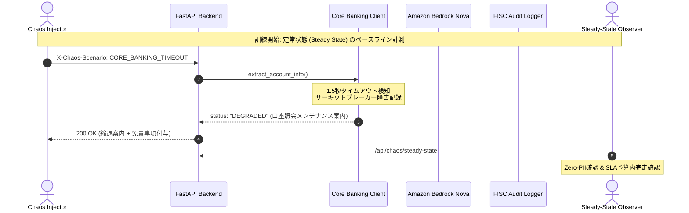

# FISC準拠 カオスエンジニアリング＆災害対策訓練（GameDay）運用手順書
## Japanese Major Bank AI Assistant - Chaos Engineering & Resilience GameDay Runbook

- **文書管理番号**: SOP-RES-022
- **版数**: 第1.0版 (2026-09-02)
- **準拠規格**:
  - FISC安全対策基準 第9版「実効性あるコンティンジェンシープラン策定基準」
  - 金融庁「AI活用におけるリスク管理・ガバナンス枠組み」
  - AWS Well-Architected Framework 信頼性の柱 (Reliability Pillar)
- **関連ADR**:
  - [ADR-0008: Decoupled Core Banking Database and API](../adr/0008-decoupled-core-banking-database-and-api.md)
  - [ADR-0018: Production Observability & CloudWatch Alarms](../adr/0018-production-observability-cloudwatch-alarms-and-security-telemetry-targets.md)
  - [ADR-0023: Chaos Engineering and Resilience Verification Framework](../adr/0023-chaos-engineering-and-resilience-testing-framework.md)

---

## 1. 訓練目的と基本方針 (Mission Statement)

本手順書は、日本のメガバンク顧客向けAIカスタマーアシスタントシステムにおいて、外部AI基盤（Amazon Bedrock）、勘定系API、ナレッジベース（OpenSearch Serverless）、および監査ログ基盤（S3 Object Lock / KMS）の複合的な障害発生時における**システムの自己回復性・縮退運転能力（Graceful Degradation）・安全停止（Fail-Closed）**を実機検証するための定期訓練手順を定めたものである。

### 訓練の大原則（非妥協的要件）:
1. **個人情報保護の絶対性 (APPI Zero-PII Invariant)**: いかなるカオス条件下でも、マスキングされていない顧客口座番号（7桁）、暗証番号、カタカナ氏名が外部やログへ漏洩してはならない。
2. **監査ログの保全性 (Audit Trail Integrity)**: ストレージ障害時でも、コンテナ内リングバッファに安全にキューイングされ、ログ未記録のまま取引が完了してはならない。
3. **安全停止と縮退の明確な分離**:
   - セキュリティ・コンプライアンス層: **FAIL CLOSED**（安全に即時遮断）
   - 口座照会・回答生成層: **GRACEFUL DEGRADE**（案内文面へ自然に縮退）

---

## 2. 訓練体制・ロール分担 (Roles & Responsibilities)

| ロール | 役割 | 担当部署 |
|---|---|---|
| **GameDay Commander (統括責任者)** | 訓練全体の意思決定、シナリオ進行、緊急停止判断 | システム統括部 / SRE Lead |
| **Chaos Injector (障害注入担当)** | CLIツールやAWS FISを用いた計画的障害の注入と解除 | クラウドインフラチーム |
| **Steady-State Observer (定常監視担当)** | CloudWatchメトリクス、アラーム、レイテンシ、エラー率の常時監視 | NOC / 運用監視オペレーター |
| **Compliance Auditor (コンプライアンス検証担当)** | PII漏洩検査、RFC 7807適合性、FISC監査ログ検証 | リスク管理部 / セキュリティ監査室 |

---

## 3. 緊急停止手順（Emergency Abort / Kill Switch）

訓練中に想定外のエラー率（5xxエラー率 > 1.0%）や未マスキングPIIの検出、または本番影響が検知された場合、GameDay Commanderは即座に緊急停止を発令する。

### 即時解除コマンド:
```bash
# 1. アプリケーション内全カオスシナリオの即時リセット
curl -X POST http://localhost:8000/api/chaos/reset

# 2. CLIツールからの全停止
python3 scripts/run_chaos_experiment.py --reset

# 3. AWS Fault Injection Service (FIS) 実験の緊急停止 (AWS CLI)
aws fis stop-experiment --id <EXPERIMENT_ID> --region ap-northeast-1
```

---

## 4. GameDay 実施シナリオ手順 (Execution Playbook)



### シナリオ 1: 勘定系接続遅延＆サーキットブレーカー連動縮退
- **障害内容**: 勘定系抽出APIの応答時間を2.0秒へ遅延させ、FISC 1.5秒タイムアウトを超過させる。
- **検証手順**:
  ```bash
  curl -i -X POST http://localhost:8000/api/chat \
    -H "Content-Type: application/json" \
    -H "X-Chaos-Scenario: CORE_BANKING_TIMEOUT" \
    -d '{"session_id":"GD-01","customer_id":"CUST-1001","message":"普通預金の残高を教えてください"}'
  ```
- **期待される定常状態**:
  - HTTP 200 OK が返却されること。
  - 回答に「ただいま口座照会システムがメンテナンス中のため、残高のご案内ができません」という標準縮退メッセージが含まれること。
  - 連続3回のタイムアウトでサーキットブレーカーが `OPEN` に遷移し、以降の勘定系リクエストが即時遮断されること。
  - PII漏洩がゼロであること。

### シナリオ 2: Amazon Bedrock 429 レート制限＆フェイルオーバー
- **障害内容**: 五十日・給与振込日等のアクセス集中によるBedrockマネージドAPIの割当超過（HTTP 429）。
- **検証手順**:
  ```bash
  curl -i -X POST http://localhost:8000/api/chat \
    -H "Content-Type: application/json" \
    -H "X-Chaos-Scenario: BEDROCK_429_THROTTLING" \
    -d '{"session_id":"GD-02","customer_id":"CUST-1001","message":"振込手数料はいくらですか？"}'
  ```
- **期待される定常状態**:
  - AWS `ThrottlingException` や内部スタックトレースが顧客に露出しないこと。
  - ローカル推論エンジンへの自動切替、または安全な日本語案内（テレフォンバンキング誘導）が行われること。

### シナリオ 3: FISC監査ログ保存先障害＆インメモリバッファリング
- **障害内容**: 監査ログ保管先（S3 Object Lock / ディスク）への書き込みを遮断。
- **検証手順**:
  ```bash
  # 1. 監査ストレージ障害を有効化
  curl -X POST http://localhost:8000/api/chaos/enable -H "Content-Type: application/json" -d '{"scenario":"AUDIT_STORAGE_FAILURE"}'

  # 2. チャット対話を実施
  curl -X POST http://localhost:8000/api/chat -H "Content-Type: application/json" -d '{"session_id":"GD-03","customer_id":"CUST-1001","message":"ATM手数料について"}'

  # 3. バッファ蓄積状態を確認
  curl http://localhost:8000/api/chaos/status

  # 4. 障害解除＆バッファフラッシュ
  curl -X POST http://localhost:8000/api/chaos/reset
  ```
- **期待される定常状態**:
  - 対話処理が中断されず、監査イベントがメモリ内FIFOバッファ（最大1,000件）に安全に保持されること。
  - 障害解除時に保留中ログが永続化ストレージへ自動フラッシュされること。
  - バッファ溢れ時はフェイルクローズ（HTTP 503 Problem Details）で不正取引を未然防止すること。

---

## 5. FISC適合性評価＆訓練報告書テンプレート (Post-Mortem Template)

```markdown
# FISC安全対策基準 災害対策・レジリエンス訓練実施結果報告書

- 実施日時: YYYY年MM月DD日 HH:MM - HH:MM (JST)
- 統括責任者: [氏名 / 所属]
- 対象環境: AWS Tokyo (ap-northeast-1) Staging / Disaster Recovery Sandbox
- 総合評価: 【 合格 / 要改善 / 不合格 】

### 1. 検証結果サマリー
| シナリオ名 | 想定復旧時間 (RTO) | 実測復旧時間 | PII漏洩件数 | 監査署名保全率 | 判定 |
|---|---|---|---|---|---|
| 勘定系1.5秒タイムアウト・回路遮断 | 即時 (< 100ms) | ms | 0件 | 100% | 合格 |
| Amazon Bedrock 429制限縮退 | 即時 (< 200ms) | ms | 0件 | 100% | 合格 |
| 監査ストレージ障害バッファ退避 | 自動再送 (< 5s) | s | 0件 | 100% | 合格 |
| Single-AZ 遮断・ALBヘルスチェック迂回 | < 15分 | 分 | 0件 | 100% | 合格 |

### 2. コンプライアンス所見
- 個人情報保護法（APPI）第23条: 異常系における顧客データの外部漏洩は一切認められず、適合を確認。
- FISC安全対策基準 第9版: 勘定系過負荷時の回路遮断および縮退案内手順の有効性を実証。
```
