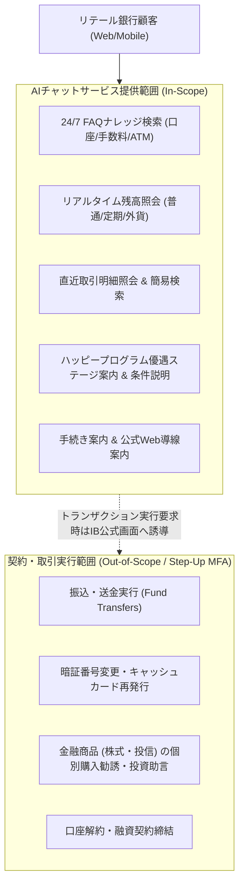

# [REQ-BUS-001] 業務要件定義書（総括） (Business Requirements Specification)
## 日本のメガバンク AIカスタマーアシスタント システム要件定義

- **文書番号**: REQ-BUS-001
- **版数**: 第1.0版 (2026-08-21)
- **対象システム**: Bank AI Chat Assistant (AWS Tokyo `ap-northeast-1`)
- **準拠規格**:
  - 銀行法（昭和56年法律第59号）
  - 金融商品取引法（金商法）第38条
  - 個人情報の保護に関する法律（APPI）
  - FISC安全対策基準 第9版
  - 金融庁「AI等の利活用に係る基本的考え方」
- **関連ADR**:
  - [ADR-0001: Japanese Banking Compliance & Control Planes](../../adr/0001-japanese-banking-compliance-and-control-planes.md)
  - [ADR-0002: AWS Bedrock Nova Lite Model Selection](../../adr/0002-aws-bedrock-nova-lite-model-selection.md)
  - [ADR-0005: Hybrid Cloud & AWS PoC Architecture](../../adr/0005-hybrid-cloud-and-aws-poc-architecture.md)
  - [ADR-0006: CI/CD & Production Cost Estimation](../../adr/0006-cicd-and-production-cost-estimation.md)
- **実装マッピング**:
  - [`src/backend/app.py`](file:///home/joe/src/bank-ai-chat/src/backend/app.py)
  - [`src/backend/server.py`](file:///home/joe/src/bank-ai-chat/src/backend/server.py)

---

## 1. システム化の背景および目的 (Business Context & Objectives)

### 1.1 業務背景
国内大手商業銀行（メガバンク）におけるリテール顧客窓口およびコンタクトセンター（電話・メールサポート）は、口座開設、残高照会、振込手数料、提携ATM利用条件、およびハッピープログラム等の優遇ステージに関する定型的な問い合わせ（Tier-1問い合わせ）が全体の約70%を占めています。
これに伴うオペレータ人件費の高騰、夜間・休日のサポート時間制約、およびピーク時の呼量集中（あふれ呼）が大きな経営課題となっています。

### 1.2 システム化の目的
本システムは、生成AI（Amazon Bedrock Nova Lite）と高精度RAG（検索拡張生成）技術を統合した**24時間365日稼働の対話型AIバンキングアシスタント**を構築し、以下の経営目標を達成することを目的とします：
1. **コンタクトセンター呼量削減（Call Deflection）**: 月間100万件の定型照会・FAQ問い合わせのAI自己解決率 85% 以上を達成。
2. **デジタルチャネル顧客体験の向上（UX Transformation）**: 顧客の口座ステータス（普通預金・定期預金残高、取引履歴、優遇ステージ）に応じたパーソナライズされた回答を自然な日本語敬語（丁寧語）で即時提供。
3. **金融規制・プライバシーの完全担保（Zero Compliance Incident）**: 個人情報保護法（APPI）、FISC安全対策基準、金融商品取引法（投資助言規制）に100%準拠したIn-VPC二重制御プレーンを実装。

---

## 2. 業務スコープおよび対象領域 (Scope of Business Operations)

### 2.1 サービス対象範囲（In-Scope）
- **一般バンキングFAQ案内**: 楽天銀行FAQ等の公式ナレッジベースに基づく正確な制度・手数料・利用手順の回答。
- **パーソナライズ口座照会**: ログイン認証済みの顧客に対する口座残高、預金種別内訳、直近取引明細の要約提示。
- **優遇ロジック解説**: 現在の会員ステージ（ベーシック〜スーパーVIP）および次期ステージ到達条件（残高・取引件数）の算出と解説。
- **有人窓口・オペレータ連携**: AIの回答信頼度が閾値未満（Grounding Score < 0.85）または顧客が有人対応を希望した場合のエスカレーション案内。

### 2.2 サービス対象外（Out-of-Scope / 非認可領域）
- **資金移動および契約変更トランザクション**: チャット対話内での直接的な振込実行、暗証番号リセット、解約手続き等は銀行法およびセキュリティ基準に基づき不可。ダイレクトバンキング公式認証画面へのステップアップ案内のみを実施。
- **個別投資助言および元本保証の約束**: 金融商品取引法第38条（適合性の原則・断定的判断の提供禁止）に基づき、特定有価証券の売買推奨や元本保証・利益確定の言及は完全禁止。

---

## 3. 対象ユーザ層および想定利用規模 (User Sizing & Traffic Profile)

### 3.1 ユーザセグメント
1. **リテール個人顧客（Standard / Premium / VIP）**: PC・スマートフォンのダイレクトバンキングWebポータルを利用する一般預金者。
2. **コンタクトセンター管理者・行員**: 監査ログ監視、FAQナレッジ更新、およびエスカレーション対応を行う内部行員。

### 3.2 想定トラフィックおよびサイジング
- **月間総問い合わせ件数**: 1,000,000 リクエスト / 月（平均約 33,333 リクエスト / 日）
- **平常時スループット**: 20 〜 50 Transactions Per Second (TPS)
- **ピーク時想定スループット**: 最大 1,000 TPS（五十日、月末給与振込日、早朝・深夜メンテナンス直後）
- **平均入力プロンプト長**: 500 トークン（システムプロンプト、RAG検索コンテキスト、顧客要約情報含む）
- **平均出力レスポンス長**: 300 トークン（丁寧語回答、利用手順、法的免責事項含む）

---

## 4. 業務サービスレベル（SLA）および目標指標

| 指標カテゴリ | 測定指標 (KPI) | 目標値 | 測定方法 / 備考 |
|---|---|---|---|
| **可用性 (Availability)** | サービス稼働率 | **99.95% 以上** (24/7/365) | Multi-AZ構成、計画停止は夜間メンテナンス枠 |
| **応答性能 (Latency)** | エンドツーエンドP95応答時間 | **2.0 秒未満** (初回SSEトークン < 800ms) | CloudWatch Synthetics & ALBメトリクス |
| **AI自己解決率** | 一次回答解決率 (Deflection Rate) | **85.0% 以上** | 事後アンケートおよびオペレータ転送率より算出 |
| **回答正確性 (Grounding)** | ナレッジ根拠一致率 (NLI Score) | **0.85 以上** (100% 達成) | In-VPC出力ガードレールによる全件自動検証 |
| **PII漏洩インシデント** | 外部LLMへの生PII送信数 | **0 件 (ゼロトレランス)** | In-VPC入力ガードレールによるトークン化・監査ログ検証 |
| **法規制違反** | 投資助言・無認可取引の発生数 | **0 件 (ゼロトレランス)** | 出力ガードレールキーワードフィルタ & 免責付与 |

---

## 5. 投資対効果 (ROI) およびクラウド運用コスト試算 (AWS Tokyo `ap-northeast-1`)

### 5.1 クラウド運用コスト内訳試算 (月間100万件リクエスト基準)
月間100万件処理時のインフラ運用総コストは **約 $540.40 USD / 月 (約 ¥81,060 JPY / 月)**、年間約 **$6,484.80 USD / 年 (約 ¥972,720 JPY / 年)** です（為替レート $1 = ¥150 換算）。

| サービスコンポーネント | スペック & 容量設計 | 単価 (USD) | 月額 (USD) | 月額換算 (JPY) | 準拠ADR |
|---|---|---|---|---|---|
| **Amazon Bedrock** (Nova Lite) | 1,000,000 req/月 (5億 in / 3億 out tokens) | $0.00006/1K in, $0.00024/1K out | $102.00 | ¥15,300 | [ADR-0002](../../adr/0002-aws-bedrock-nova-lite-model-selection.md) |
| **AWS ECS Fargate** (App & Guardrails) | 4 Tasks × (2 vCPU, 4GB RAM) Multi-AZ | $0.04048/vCPU-hr, $0.004445/GB-hr | $184.00 | ¥27,600 | [ADR-0011](../../adr/0011-compute-architecture-re-evaluation-ecs-vs-lambda.md) |
| **Amazon OpenSearch Serverless** (FAQ RAG) | 2 OCU Multi-AZ Vector Index | $0.24/OCU-hr | $140.00 | ¥21,000 | [ADR-0015](../../adr/0015-opensearch-serverless-network-isolation-and-vector-dimension-standard.md) |
| **Amazon S3** (暗号化監査ログ保管) | 100 GB Standard Storage + KMS暗号化 | $0.025/GB | $12.50 | ¥1,875 | [ADR-0009](../../adr/0009-dlp-security-guardrails-and-compliance-framework.md) |
| **AWS KMS** (Customer Managed Keys) | 2 CMK Keys (監査ログ & ベクトルDB暗号化) | $1.00/key/month | $2.00 | ¥300 | [ADR-0017](../../adr/0017-enterprise-iam-least-privilege-access-and-kms-key-policy-topology.md) |
| **AWS Application Load Balancer** | Dual-AZ ALB + LCU processing | $0.0243/hr + LCU charges | $28.50 | ¥4,275 | [ADR-0007](../../adr/0007-production-aws-detailed-design-specification.md) |
| **AWS WAF & Shield Standard** | 1 Web ACL + 5 Managed Rulesets (OWASP Top 10等) | $5.00/ACL + $1.00/rule | $35.00 | ¥5,250 | [ADR-0007](../../adr/0007-production-aws-detailed-design-specification.md) |
| **Amazon CloudWatch & X-Ray** | 30 GB Log Ingestion, Alarm metrics, X-Ray | $0.675/GB | $25.00 | ¥3,750 | [ADR-0018](../../adr/0018-production-observability-cloudwatch-alarms-and-security-telemetry-targets.md) |
| **AWS Network Egress** | Data Transfer Out (100 GB/月) | $0.114/GB | $11.40 | ¥1,710 | [ADR-0005](../../adr/0005-hybrid-cloud-and-aws-poc-architecture.md) |
| **合計運用コスト** | | | **$540.40 / 月** | **¥81,060 / 月** | [ADR-0006](../../adr/0006-cicd-and-production-cost-estimation.md) |

### 5.2 コスト削減効果 (Call Center Deflection Savings) & ROI分析
1. **85%以上のLLM費用削減**: 高価な汎用LLM（Claude 3 OpusやGPT-4等）に比べ、軽量・高速な **Amazon Nova Lite** の採用により、日本語敬語品質を維持したままモデル利用料を大幅に削減。
2. **有人コールセンター業務削減効果**: 
   - 有人コールセンターにおける1コールあたりの平均受電対応コスト: **約 ¥300 JPY / 件**
   - 月間100万件の問い合わせのうち、AIチャットで定型問い合わせを85万件自己解決（Deflection）した場合:
     $$\text{月間削減想定額} = 850,000 \text{ 件} \times ¥300 = ¥255,000,000 \text{ JPY / 月}$$
     $$\text{年間削減想定額} = ¥3,060,000,000 \text{ JPY / 年}$$
3. **FISC安全対策基準の低コスト充足**: AWSマネージドサービス（KMS、S3 Object Lock、OpenSearch Serverless）の活用により、追加のオンプレミス高額アプライアンスを導入することなく厳格な金融コンプライアンスを充足。

---

## 6. 有人エスカレーションおよび業務連携要件

1. **エスカレーション発火トリガー**:
   - 顧客が「オペレータと話したい」「担当者につないで」と明示的に要求した場合。
   - 同一セッション内でAIが2回連続で意図解釈に失敗した場合。
   - 紛失・盗難・不正アクセス等の緊急対応事案を検知した場合。
2. **引継ぎ情報（Handover Context）**:
   - 顧客ID、問い合わせ履歴サマリ、入力ガードレールでサニタイズされた対話ログをコールセンター側CRMシステムにセキュアに連携。
