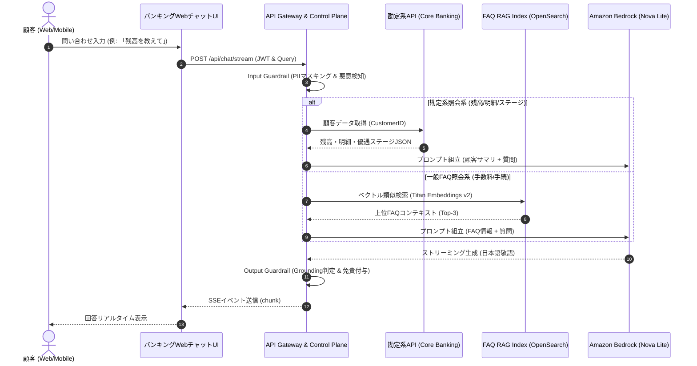

# [REQ-BUS-002] 業務フロー・ユースケース定義書 (Business Process & Use Cases)
## 日本のメガバンク AIカスタマーアシスタント システム要件定義

- **文書番号**: REQ-BUS-002
- **版数**: 第1.0版 (2026-08-21)
- **対象システム**: Bank AI Chat Assistant (AWS Tokyo `ap-northeast-1`)
- **準拠規格**:
  - 銀行法（昭和56年法律第59号）第13条の2（取引時確認等の措置）
  - 全銀協「インターネットバンキングにおける不正送金防止対策基準」
  - 金融庁「マネー・ローンダリング及びテロ資金供与対策に関するガイドライン」
- **関連ADR**:
  - [ADR-0004: Synthetic Japanese Account Schema](../../adr/0004-synthetic-japanese-account-schema.md)
  - [ADR-0010: Personalized Account Tier Reasoning](../../adr/0010-personalized-account-tier-reasoning.md)
  - [ADR-0014: Zero Trust Step-Up Authentication Boundary](../../adr/0014-zero-trust-step-up-authentication-boundary.md)
- **ベースライン文書**: [`docs/requirements_definition.md`](../requirements_definition.md) (Sec 1, 3, 10)
- **実装マッピング**:
  - [`src/core_banking/service.py`](file:///home/joe/src/bank-ai-chat/src/core_banking/service.py)
  - [`src/backend/app.py`](file:///home/joe/src/bank-ai-chat/src/backend/app.py)
  - [`src/frontend/app.js`](file:///home/joe/src/bank-ai-chat/src/frontend/app.js)
  - [`tests/test_core_banking.py`](file:///home/joe/src/bank-ai-chat/tests/test_core_banking.py)

---

## 1. 業務プロセスマップ全体像 (End-to-End Banking Process Map)

---

## 2. 詳細ユースケース定義 (Detailed Use Cases)

### UC-01: 口座残高照会 (Account Balance Inquiry)
- **アクター**: ログイン済み個人顧客
- **事前条件**: セッションJWTトークンが有効であり、普通預金口座がアクティブであること。
- **基本フロー**:
  1. 顧客が「残高はいくら？」「定期預金残高を教えて」等のメッセージを送信。
  2. Input Guardrailがクエリをサニタイズし、勘定系照会インテントを判定。
  3. バックエンドが `CoreBankingService.get_account_balances(customer_id)` を実行。
  4. 普通預金（JPY）、定期預金（JPY）、外貨預金（USD等）の内訳をBedrock Nova Liteへ連携。
  5. AIが丁寧語にて「山田様、現在の普通預金残高は 2,450,000円でございます。また、定期預金残高は 5,000,000円（年利0.250%、満期2027年3月31日）となっております。」と回答。
- **例外フロー**: 口座が凍結・利用停止（SUSPENDED）の場合は、残高数値を伏せ「現在お取引が制限されております。恐れ入りますがコンタクトセンターまでお問い合わせください。」と案内。

---

### UC-02: 直近取引明細照会 (Transaction History Search)
- **アクター**: ログイン済み個人顧客
- **事前条件**: 口座に過去の取引実績が存在すること。
- **基本フロー**:
  1. 顧客が「直近の引き落としを確認したい」「給料の振込はあった？」等のメッセージを送信。
  2. バックエンドが `CoreBankingService.get_transaction_history(customer_id, limit=10)` を実行。
  3. 日付、取引区分（DEPOSIT/WITHDRAWAL/TRANSFER）、金額、摘要（相手先名）、取引後残高を抽出。
  4. AIが最新の取引から順に分かりやすく箇条書きで要約回答。
- **代替フロー**: 取引件数が0件の場合は、「直近3ヶ月間のお取引明細はございません。」と回答。

---

### UC-03: ハッピープログラム（会員ステージ・特典）照会 (Loyalty Tier Reasoning)
- **アクター**: ログイン済み個人顧客
- **事前条件**: 顧客の会員ステージ（BASIC / ADVANCED / PREMIUM / VIP / SUPER_VIP）が設定されていること。
- **基本フロー**:
  1. 顧客が「今の会員ランクと無料回数は？」「VIPになるにはどうすればいい？」等と質問。
  2. システムが現在のステージ（例: `VIP`）と判定基準（残高100万円以上または取引20件以上）を抽出。
  3. AIが現在の特典（ATM手数料月5回無料、他行宛振込月3回無料、楽天ポイント3倍）を提示。
  4. 上位ステージ（SUPER_VIP: 残高300万円または取引30件）へのステップアップに必要な差分条件をシミュレーションして提示。

---

### UC-04: 一般バンキングFAQ検索 (General Banking FAQ RAG)
- **アクター**: 全顧客（ログイン有無不問）
- **事前条件**: OpenSearch Serverlessに楽天銀行FAQナレッジがインデックス済みであること。
- **基本フロー**:
  1. 顧客が「他行宛の振込手数料はいくらですか？」「コンビニATMの手数料は？」と質問。
  2. OpenSearch Serverlessが1024次元Titan Text Embeddings v2により上位3件のFAQドキュメントを検索。
  3. 類似度スコアが閾値（0.70）以上のコンテキストをプロンプトに注入。
  4. AIが公式FAQに忠実な手順・手数料体系を回答し、末尾に「※本回答は一般的なご案内です。」の免責文を付与。

---

### UC-05: 資金移動・暗証番号変更要求のステップアップ認証誘導 (Step-Up MFA Boundary)
- **アクター**: ログイン済み個人顧客
- **事前条件**: 顧客が資金移動（振込実行）や暗証番号変更など、契約・重要変更インテントを入力した場合。
- **基本フロー**:
  1. 顧客が「10万円を佐藤さんに振り込んで」「暗証番号を変更したい」と入力。
  2. Input GuardrailおよびTransaction Intent Filterが即座に検知。
  3. AIはチャット内での実行を拒否し、銀行法およびセキュリティ基準に基づく理由を説明。
  4. 公式インターネットバンキングの生体認証/ワンタイムパスワード（OTP）付き振込画面URL（`/banking/transfer?action=step_up`）をボタンリンクとして提示。
- **規制根拠**: 銀行法第13条の2、FISC安全対策基準（取引実行時の多要素認証義務）。

---

### UC-06: 有人オペレータへのエスカレーション (Human Escalation)
- **アクター**: 解決に至らなかった顧客
- **発火条件**:
  - 顧客が「オペレータに代わって」「窓口の人と話したい」と要求。
  - AIの回答信頼度（Grounding Score）が基準値（0.85）を下回った場合。
- **処理フロー**:
  1. AIが「承知いたしました。担当オペレータにお繋ぎいたします。」と応答。
  2. サニタイズ済みのセッションID、対話履歴サマリをCRM連携キューへプッシュ。
  3. フロントエンドに有人チャット接続ウィジェットまたはコンタクトセンター電話番号（0120-XXX-XXX）を表示。

---

### UC-07: 緊急セキュリティ事案（カード紛失・不正送金疑い）の緊急対応
- **アクター**: トラブルに直面した顧客
- **発火条件**: 「カードを落とした」「身に覚えのない引き落としがある」「盗難に遭った」等の緊急キーワード検知。
- **処理フロー**:
  1. 即座に最優先アラートモードへ遷移。
  2. AIは通常対話を中断し、「キャッシュカード紛失・盗難受付センター（24時間受付 0120-XXX-999）」への直通案内および「ダイレクトバンキング緊急利用停止画面」へのダイレクトリンクを最上部に強調表示。
