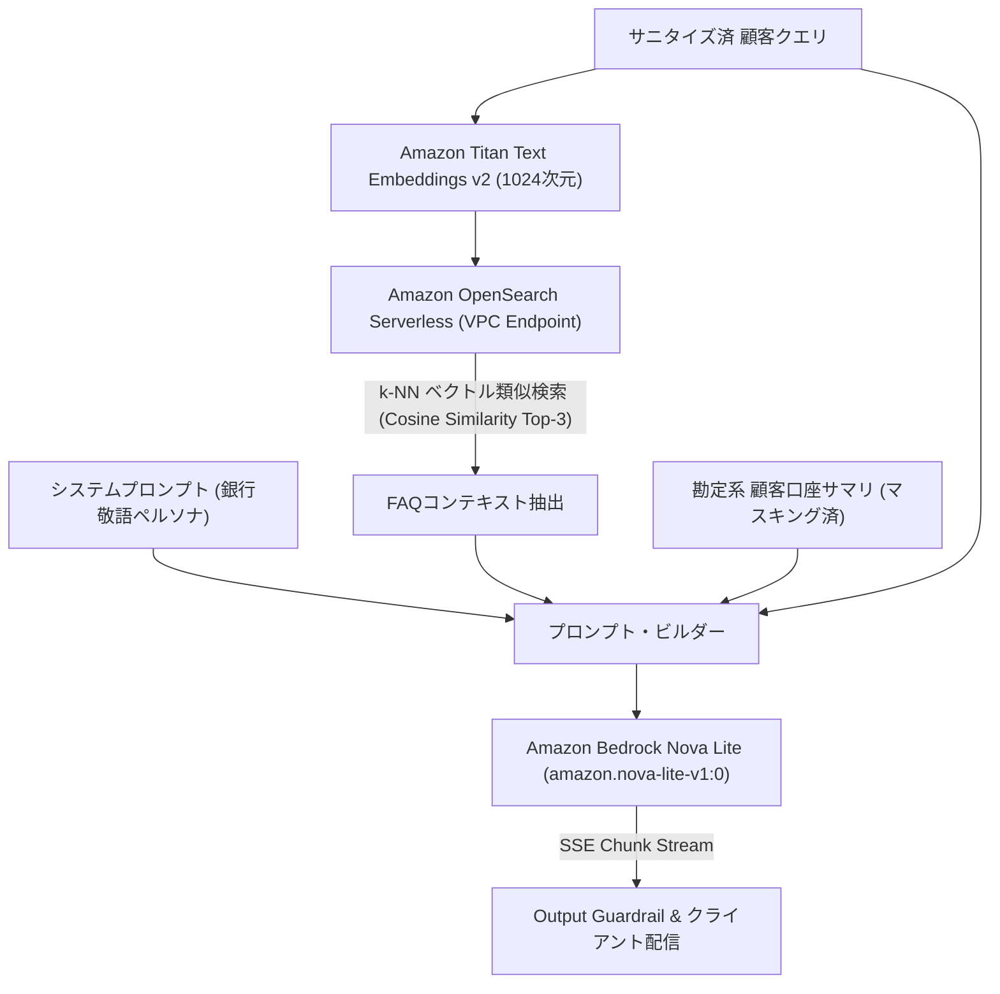

# [REQ-FUN-003] AI対話・RAGナレッジ検索 機能要件定義書 (AI & RAG Functional Spec)
## 日本のメガバンク AIカスタマーアシスタント システム要件定義

- **文書番号**: REQ-FUN-003
- **版数**: 第1.0版 (2026-08-21)
- **対象システム**: Bank AI Chat Assistant (AWS Tokyo `ap-northeast-1`)
- **準拠規格**:
  - FISC安全対策基準 第9版「外部サービス利用統制」
  - 金融庁「金融分野におけるAI・データガバナンス」
- **関連ADR**:
  - [ADR-0002: AWS Bedrock Nova Lite Model Selection](../../adr/0002-aws-bedrock-nova-lite-model-selection.md)
  - [ADR-0003: Rakuten Bank FAQ RAG Pipeline](../../adr/0003-rakuten-bank-faq-rag-pipeline.md)
  - [ADR-0015: OpenSearch Serverless Isolation & Vector Dimension Standard](../../adr/0015-opensearch-serverless-network-isolation-and-vector-dimension-standard.md)
- **実装マッピング**:
  - [`src/llm/bedrock_nova.py`](file:///home/joe/src/bank-ai-chat/src/llm/bedrock_nova.py)
  - [`src/rag/vector_store.py`](file:///home/joe/src/bank-ai-chat/src/rag/vector_store.py)
  - [`data/rakuten_faq.json`](file:///home/joe/src/bank-ai-chat/data/rakuten_faq.json)
  - [`tests/test_rag.py`](file:///home/joe/src/bank-ai-chat/tests/test_rag.py)

---

## 1. 目的およびAIオーケストレーション概要

本機能要件定義書は、Amazon Bedrock上の基盤モデル（Amazon Nova Lite）を用いた自然言語生成、およびAmazon OpenSearch Serverless上の楽天銀行FAQデータベースを用いた**ハイブリッドRAG（検索拡張生成）パイプライン**の機能仕様を規定します。



---

## 2. RAGナレッジ検索仕様 (OpenSearch Serverless Vector Pipeline)

### 2.1 埋め込みモデルおよびベクトル仕様 (ADR-0015準拠)
- **埋め込みモデル**: `amazon.titan-embed-text-v2:0`
- **ベクトル次元数**: **1024次元**（金融専門用語の密結合表現を保持）
- **類似度計算方式**: コサイン類似度（Cosine Similarity / HNSWアルゴリズム）
- **検索対象件数 ($k$)**: Top 3 件
- **類似度適合閾値**: $Score \ge 0.70$（閾値未満のドキュメントはプロンプト注入から除外）

### 2.2 FAQドキュメント構造 (`data/rakuten_faq.json`)
```json
{
  "faq_id": "FAQ-00142",
  "category": "手数料・ATM利用",
  "question": "他行宛の振込手数料はいくらですか？",
  "answer": "他行宛の振込手数料は、3万円未満の場合は168円（税込）、3万円以上の場合は229円（税込）となります。なお、ハッピープログラムの会員ステージがVIP以上のお客様は月3回まで無料となります。",
  "tags": ["振込手数料", "ハッピープログラム", "他行宛"]
}
```

---

## 3. LLM推論モデル仕様 (Amazon Bedrock Nova Lite)

### 3.1 モデル選定パラメータ (ADR-0002準拠)
- **Model ID**: `amazon.nova-lite-v1:0`
- **リージョン**: AWS東京リージョン (`ap-northeast-1`)
- **推論パラメータ設定**:
  - `temperature`: `0.2` (ハルシネーション抑制・決定論的銀行回答)
  - `top_p`: `0.9`
  - `max_tokens`: `1024`
  - `stop_sequences`: `["User:", "Human:", "\n\n\n"]`

### 3.2 プロンプト構成順序
1. **システムプロンプト (固定)**: 銀行公認アシスタントペルソナ、敬語規範、投資助言禁止ルール。
2. **【お客様口座情報】(動的)**: 顧客ID、名義、普通/定期預金残高、優遇ステージ、直近取引明細。
3. **【FAQ参照ナレッジ】(動的)**: OpenSearchから取得された上位FAQ（`<context>` タグ内）。
4. **【質問】(動的)**: サニタイズ済み顧客入力。

---

## 4. 受入テスト検証基準 (Acceptance Criteria)

- [x] `tests/test_rag.py` を実行し、FAQ検索において関連ドキュメントが正しく抽出されること。
- [x] Bedrock Nova Liteへのリクエストにおいて、1024次元埋め込みおよび東京リージョン指定が満たされていること。
- [x] ナレッジ未ヒット時（スコア < 0.70）に、無理な推測を行わず「公式窓口へのお問い合わせ」に適切にフォールバックすること。
