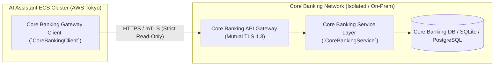

# [REQ-FUN-004] 勘定系連携・トランザクション参照 機能要件定義書 (Core Banking Integration)
## 日本のメガバンク AIカスタマーアシスタント システム要件定義

- **文書番号**: REQ-FUN-004
- **版数**: 第1.0版 (2026-08-21)
- **対象システム**: Bank AI Chat Assistant (AWS Tokyo `ap-northeast-1`)
- **準拠規格**:
  - FISC安全対策基準 第9版「外部接続統制 3.1」
  - 銀行法 第13条（業務の適切性）
- **関連ADR**:
  - [ADR-0004: Synthetic Japanese Account Schema](../../adr/0004-synthetic-japanese-account-schema.md)
  - [ADR-0008: Decoupled Core Banking Database & API](../../adr/0008-decoupled-core-banking-database-and-api.md)
- **実装マッピング**:
  - [`src/core_banking/service.py`](file:///home/joe/src/bank-ai-chat/src/core_banking/service.py)
  - [`src/core_banking/client.py`](file:///home/joe/src/bank-ai-chat/src/core_banking/client.py)
  - [`tests/test_core_banking.py`](file:///home/joe/src/bank-ai-chat/tests/test_core_banking.py)

---

## 1. 目的および疎結合勘定系連携アーキテクチャ (Decoupled Core Banking Architecture)

本機能要件定義書は、AIアシスタントサービスと銀行基幹勘定系システム（オンプレミスまたは専用VPC内のメインフレーム・勘定系DB）間のセキュアな**参照専用（Read-Only）REST API連携仕様**を規定します。



---

## 2. 勘定系APIインターフェース仕様 (Core Banking API Contracts)

### 2.1 顧客総合口座照会 (`GET /api/core/customers/{customer_id}`)
- **機能**: 顧客の基本情報、保有口座一覧、および直近取引履歴を取得。
- **リクエスト**: `customer_id` (`CUST-0001` 等)
- **レスポンス仕様**:
```json
{
  "customer_id": "CUST-0001",
  "name_kanji": "山田 太郎",
  "name_katakana": "ヤマダ タロウ",
  "branch_code": "001",
  "branch_name": "本店営業部",
  "account_number": "1234567",
  "customer_tier": "VIP",
  "happy_program_stage": "SUPER_VIP",
  "direct_banking_status": "ACTIVE",
  "accounts": [
    {
      "account_id": "ACC-0001-SAVINGS",
      "account_type": "普通預金",
      "account_type_code": "SAVINGS",
      "balance": 2450000.0,
      "currency": "JPY",
      "interest_rate": "0.020%"
    },
    {
      "account_id": "ACC-0001-TIME",
      "account_type": "定期預金",
      "account_type_code": "TIME_DEPOSIT",
      "balance": 5000000.0,
      "currency": "JPY",
      "interest_rate": "0.250%",
      "maturity_date": "2027-03-31"
    }
  ]
}
```

### 2.2 取引明細取得 (`GET /api/core/customers/{customer_id}/transactions`)
- **パラメータ**: `limit` (デフォルト: 10, 最大: 50), `account_id` (任意)
- **レスポンス**: 取引日付（降順）、取引区分、金額、摘要、差引残高の配列。

---

## 3. キャッシュおよび耐障害性・セキュリティ要件

1. **厳格な参照専用制約 (Read-Only Enforcement)**:
   - AIチャットシステムに付与される勘定系APIクレデンシャルは `SELECT` 権限のみ。更新・振込APIへの疎通はネットワークレベルで遮断。
2. **ローカルインメモリキャッシュ**:
   - 口座残高・明細データはセッション中（TTL 60秒）メモリキャッシュされ、勘定系への不要な過大負荷を防止。
3. **タイムアウトおよびサーキットブレーカー**:
   - 勘定系API呼び出しタイムアウトは **1.5秒** に設定。
   - 連続3回タイムアウト発生時はサーキットブレーカー（OPEN）が作動し、縮退応答（「ただいま口座照会機能が混み合っております」）に切り替え。

---

## 4. 受入テスト検証基準 (Acceptance Criteria)

- [x] `tests/test_core_banking.py` を実行し、残高照会・明細取得・顧客データ取得のテストケースが全件パスすること。
- [x] 存在しない顧客ID（例: `CUST-9999`）に対して、適切に `404 Not Found` または `None` を返却すること。
- [x] 残高データがBedrock Nova Liteへ渡される際に、7桁口座番号が伏字または保護コンテキストとして扱われること。
