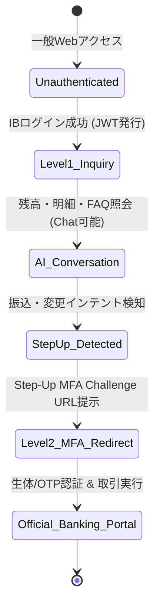

# [REQ-FUN-005] 認証・認可・ステップアップMFA要件定義書 (Auth & Session Spec)
## 日本のメガバンク AIカスタマーアシスタント システム要件定義

- **文書番号**: REQ-FUN-005
- **版数**: 第1.0版 (2026-08-21)
- **対象システム**: Bank AI Chat Assistant (AWS Tokyo `ap-northeast-1`)
- **準拠規格**:
  - 銀行法 第13条の2（取引時確認）
  - 全銀協「インターネットバンキングにおける多要素認証ガイドライン」
  - NIST SP 800-63B (Digital Identity Guidelines: Authentication and Lifecycle Management)
- **関連ADR**:
  - [ADR-0014: Zero Trust Step-Up Authentication Boundary](../../adr/0014-zero-trust-step-up-authentication-boundary.md)
  - [ADR-0022: Cross-Region DR, Fault Tolerance & Main Banking Independence](../../adr/0022-cross-region-disaster-recovery-and-fault-tolerance-architecture.md)
- **実装マッピング**:
  - [`src/backend/app.py`](file:///home/joe/src/bank-ai-chat/src/backend/app.py)
  - [`src/backend/auth.py`](file:///home/joe/src/bank-ai-chat/src/backend/auth.py)

---

## 1. ゼロトラスト認証境界および認可レベル (Zero Trust Auth Levels)

本システムは、照会機能と取引機能の権限境界を明確に分離した**2段階アクセス制御（Dual-Tier Access Control）**を採用します。

| 認証レベル | 適用対象機能 | 認証方式 / クレデンシャル | 許可されるアクション |
|---|---|---|---|
| **Level 1: 照会認証 (Inquiry Auth)** | 一般FAQ、残高照会、取引明細検索、優遇ステージ照会 | インターネットバンキング ログインセッション（JWT Bearer Token） | 口座残高・明細・ステージ情報の参照・AI要約 |
| **Level 2: 取引認証 (Step-Up MFA)** | 振込実行、暗証番号変更、定期預金解約、限度額変更 | 多要素認証（ワンタイムパスワード OTP / FIDO2 生体認証） | **チャット内実行は禁止**。公式IBトランザクション専用画面へ誘導 |



---

## 2. セッション管理仕様 (Session Lifecycle Management)

1. **JWT トークン仕様**:
   - アルゴリズム: `ES256` (ECDSA SHA-256) または `RS256`
   - 有効期間 (TTL): **30分**（操作なしで自動失効）
   - クレームペイロード: `sub` (Customer ID), `tier`, `exp`, `iat`, `jti`
2. **セッション分離 (Cross-Tenant Isolation)**:
   - 各セッションは顧客ID単位で厳格に分離され、異なる顧客のコンテキストがメモリやプロンプトに混入することを防止。
3. **明示的ログアウト・トークン無効化**:
   - 顧客が「ログアウト」を選択した際、JWTは直ちにブラックリスト（Redis / In-memory）に登録され無効化。
4. **本番厳格認証モード (`REQUIRE_STRICT_AUTH`) & 銀行本体セッション非干渉**:
   - **本番環境 (`prod`)**: 環境変数 `REQUIRE_STRICT_AUTH=true` を適用し、`/api/chat` および `/api/chat/stream` への全アクセスに有効なJWT Bearerトークンを強制（未認証リクエストは即座に `401 Unauthorized` 返却）。
   - **開発・検証環境 (`dev`)**: シミュレータおよび自動テストの利便性のため、未認証でもデモ顧客コンテキストで動作を許容。
   - **銀行本体セッションとの非干渉**: AIチャットトークンの失効やセッションタイムアウトが発生しても、インターネットバンキング本体のログインセッションには一切影響を与えません。

---

## 3. ステップアップMFA誘導エンドポイント仕様 (`/api/step-up-auth`)

重要取引インテント（振込、暗証番号変更等）を検知した際、バックエンドは以下のJSONペイロードを返却し、フロントエンドに公式IB認証ボタンをレンダリングさせます。

```json
{
  "status": "STEP_UP_REQUIRED",
  "action_type": "FUND_TRANSFER",
  "message": "振込や暗証番号の変更などのお取引・お手続きは、セキュリティ確保のためインターネットバンキングの公式取引画面にて多要素認証（ワンタイムパスワード等）が必要です。",
  "redirect_url": "https://ib.megabank.co.jp/banking/transfer?session_id=SESS-20260821-001&auth_flow=mfa_step_up",
  "required_auth_level": "MFA_HARDWARE_OR_BIOMETRIC"
}
```

---

## 4. 受入テスト検証基準 (Acceptance Criteria)

- [x] トークンなし、または期限切れJWTでの `/api/chat/stream` 呼び出しに対し、`401 Unauthorized` が返却されること (`tests/test_api_endpoints.py`)。
- [x] 「振込をして」「暗証番号を変更して」という入力に対し、チャット実行がブロックされ、正しい `STEP_UP_REQUIRED` レスポンスとリダイレクトURLが提示されること。
- [x] AIチャットのトークン失効時でも、ダイレクトバンキング本体のセッションが維持されること。
