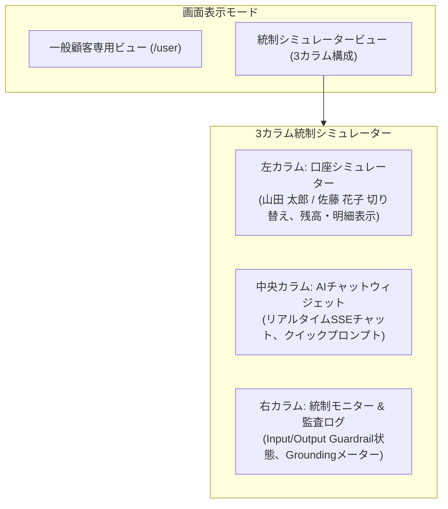

# [REQ-FUN-006] UI/UX・画面表示・ストリーミング要件定義書 (Frontend & UI/UX Spec)
## 日本のメガバンク AIカスタマーアシスタント システム要件定義

- **文書番号**: REQ-FUN-006
- **版数**: 第1.0版 (2026-08-21)
- **対象システム**: Bank AI Chat Assistant (AWS Tokyo `ap-northeast-1`)
- **準拠規格**:
  - JIS X 8341-3:2016 (高齢者・障害者等配慮設計指針 - レベルAA適合)
  - W3C Server-Sent Events (SSE) 仕様
  - 日本銀行協会「インターネットバンキング画面のアクセシビリティおよびセキュリティ表示ガイドライン」
- **関連ADR**:
  - [ADR-0013: SSE Streaming & Guardrail Buffer Architecture](../../adr/0013-sse-streaming-and-guardrail-buffer-architecture.md)
- **実装マッピング**:
  - [`src/frontend/index.html`](file:///home/joe/src/bank-ai-chat/src/frontend/index.html)
  - [`src/frontend/styles.css`](file:///home/joe/src/bank-ai-chat/src/frontend/styles.css)
  - [`src/frontend/app.js`](file:///home/joe/src/bank-ai-chat/src/frontend/app.js)

---

## 1. 目的およびUI/UX設計原則

本要件定義書は、日本のメガバンクにおけるWebおよびモバイルダイレクトバンキング向けAIアシスタントのフロントエンド画面構造、Server-Sent Events（SSE）ストリーミングレンダリング、アクセシビリティ、および統制プレーン可視化ウィジェットの仕様を定めます。

### 1.1 デザインシステム基本原則 (Japanese Megabank Aesthetics)
1. **信頼感と高い視認性（Bank Grade Aesthetics）**: ネイビー（#002B49）、アクセントゴールド（#D4AF37）、ダークスレート（#1E293B）を基調とした高品位な銀行ポータルデザイン。
2. **高速ストリーミング表示（Sub-second Chunk Rendering）**: バックエンドから送信されるSSEチャンクを即座にMarkdownパースし、タイピングアニメーションを伴って滑らかに表示。
3. **誤操作防止・免責事項の明示**: 法的免責文（`LEGAL_DISCLAIMER_JAPANESE`）は通常回答と明確に視覚分離（薄グレー背景・枠線・注記アイコン）して表示。

---

## 2. 画面レイアウト構成 (Dual-View Architecture)

フロントエンドは、一般顧客向けポータルビューと、監査・検証用シミュレータービューの2モードを提供します。



---

## 3. Server-Sent Events (SSE) ストリーミング仕様

### 3.1 SSEプロトコル選定理由（vs WebSocket）
- **単方向ストリーミングの簡潔性**: AI対話生成は「要求（Request）1回に対して逐次生成トークンが単方向に流れる」モデルであり、双方向ステートフルなWebSocketに比べHTTP/1.1・HTTP/2標準のSSEが最も軽量かつ堅牢。
- **AWS ALB・WAF親和性**: Application Load Balancer（ALB）やAWS WAFの標準HTTPパイプラインで透過的にプロキシ可能であり、プロトコル変換オーバーヘッドやステート維持メモリを最小化。
- **自動再接続 & バッファリング制御**: ブラウザ標準の再接続機構および `X-Accel-Buffering: no` によるナノ秒単位のフラッシュ描画を実現。

### 3.2 SSEイベントプロトコル
- **エンドポイント**: `POST /api/chat/stream`
- **Content-Type**: `text/event-stream; charset=utf-8`
- **キャッシュ制御**: `Cache-Control: no-cache`, `X-Accel-Buffering: no`

### 3.3 イベントペイロード構造
```text
data: {"type": "guardrail_status", "input_guardrail": {"allowed": true, "pii_scrubbed": ["[口座番号保護: XXXXXXX]"]}}

data: {"type": "content_chunk", "delta": "山田様、現在の普通預金残高は"}

data: {"type": "content_chunk", "delta": " 2,450,000円でございます。"}

data: {"type": "completion", "grounding_score": 0.96, "audit_id": "AUDIT-20260821-001"}
```

---

## 4. アクセシビリティおよび文字フォント仕様 (JIS X 8341-3 AA)

1. **フォントスタック**:
   - 和文: `Noto Sans JP`, `Hiragino Kaku Gothic ProN`, `Meiryo`, sans-serif
   - 欧文/数字: `Inter`, Roboto, sans-serif
2. **コントラスト比**:
   - 本文テキストと背景色のコントラスト比 **4.5:1 以上**（WCAG 2.1 AA準拠）。
3. **キーボード操作性**:
   - `Tab` キーによる全インタラクティブ要素（入力欄、送信ボタン、顧客選択ドロップダウン）へのフォーカス移動、および `Enter` キーによるメッセージ送信。

---

## 5. 受入テスト検証基準 (Acceptance Criteria)

- [x] メッセージ送信から初回トークン描画開始までの遅延が **800ms 未満** であること。
- [x] SSEストリーミング受信中にブラウザがフリーズせず、自動スクロールがスムーズに追従すること。
- [x] 顧客ペルソナ（山田 太郎 ↔ 佐藤 花子）の切り替え時に、チャット履歴および残高カードが矛盾なく即時更新されること。
