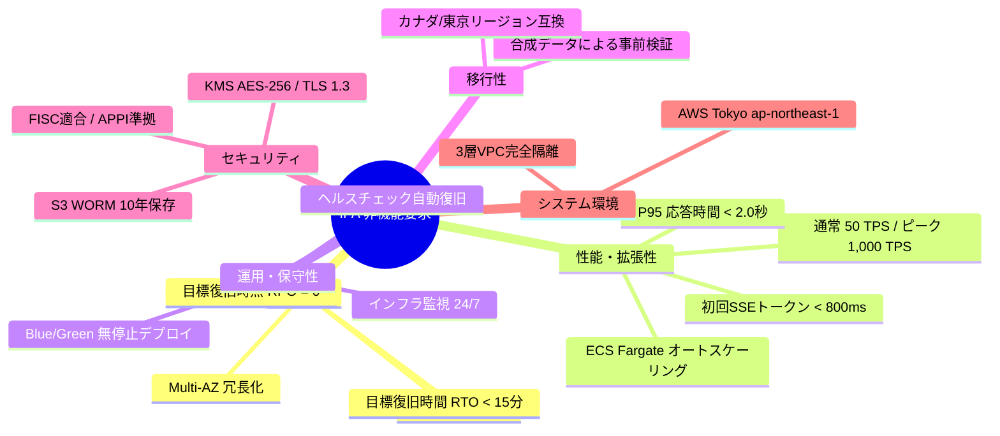

# [REQ-NFR-007] IPA非機能要求グレード準拠 非機能要件定義書 (Non-Functional Requirements)
## 日本のメガバンク AIカスタマーアシスタント システム要件定義

- **文書番号**: REQ-NFR-007
- **版数**: 第1.0版 (2026-08-21)
- **対象システム**: Bank AI Chat Assistant (AWS Tokyo `ap-northeast-1`)
- **準拠規格**:
  - 独立行政法人情報処理推進機構 (IPA)「非機能要求グレード（2018年版）」
  - FISC安全対策基準 第9版「システム信頼性・キャパシティ管理基準」
  - AWS Well-Architected Framework (信頼性の柱・パフォーマンス効率の柱)
- **関連ADR**:
  - [ADR-0007: Production AWS Detailed Design Specification](../../adr/0007-production-aws-detailed-design-specification.md)
  - [ADR-0011: Compute Architecture Re-evaluation (ECS vs Lambda)](../../adr/0011-compute-architecture-re-evaluation-ecs-vs-lambda.md)
- **ベースライン文書**: 
  - [`docs/requirements_definition.md`](../requirements_definition.md) (Sec 8)
  - [`docs/aws_architecture_governance_and_expert_review.md`](../aws_architecture_governance_and_expert_review.md)
  - [`docs/aws_cloud_architect_masterclass.md`](../aws_cloud_architect_masterclass.md)
- **実装マッピング**:
  - [`Dockerfile`](file:///home/joe/src/bank-ai-chat/Dockerfile)
  - [`docker-compose.yml`](file:///home/joe/src/bank-ai-chat/docker-compose.yml)

---

## 1. IPA非機能要求グレード 6大メジャードメイン要件

---

## 2. 詳細非機能仕様マトリクス

| ドメイン | 項目 | 目標仕様値 | 実装アーキテクチャ & 根拠 |
|---|---|---|---|
| **可用性** | 月間サービス稼働率 | **99.95% 以上** | Dual-AZ ECS Fargate、ALB、Multi-AZ OpenSearch Serverless |
| **可用性** | 障害時復旧目標 (RTO) | **15分以内** | ECSタスクの自動再起動およびALBヘルスチェック切り離し |
| **可用性** | データ損失目標 (RPO) | **RPO = 0** (即時永続化) | S3 Object Lock & DynamoDB Multi-AZレプリケーション |
| **性能** | 定常スループット | **50 TPS** | 2 vCPU, 4GB RAM x 2タスク構成 |
| **性能** | ピークスループット | **1,000 TPS** | CPU使用率 70% トリガーによる最大10タスク自動スケールアウト |
| **性能** | エンドツーエンドP95応答時間 | **2.0 秒未満** | Amazon Nova Lite高速推論 & 最適化インメモリベクトル検索 |
| **性能** | 初回SSEトークン描画遅延 | **800 ms 未満** | チャンクバッファリング最適化 (ADR-0013) |
| **運用性** | デプロイ方式 | **Blue/Green 無停止デプロイ** | AWS CodeDeploy / ECSローリングアップデート (Zero Downtime) |
| **保守性** | コンテナ起動時間 | **10秒以内 (Zero Cold Start)** | 常時起動Fargateコンテナ (Lambdaのコールドスタート問題を回避) |
| **環境** | データ主権 (Sovereignty) | **AWS Tokyo (`ap-northeast-1`)** | FISC基準に基づき全通信・ストレージを東京リージョン内に限定 |

---

## 3. ECS Fargate コンピュート最適化 (ADR-0011準拠)

AWS Lambda（サーバレス）ではなく **AWS ECS Fargate（コンテナ）** を採用することにより、以下の非機能的優位性を達成します：
1. **ストリーミング長寿命コネクションの保証**: API Gatewayの29秒ハードリミットを回避し、ALB経由で安定した長文SSEストリーミングを完走。
2. **コールドスタートの完全排除**: 金融取引において致命的な初回アクセス時の遅延（5〜10秒）をゼロ化。
3. **In-VPCコントロールプレーンの高速ローカル実行**: Python正規表現エンジンおよびトークン化ヴォールトを同一コンテナメモリ内でナノ秒単位で実行。

---

## 4. 受入テスト検証基準 (Acceptance Criteria)

- [x] 負荷テスト（Locust / JMeter）において、100 TPS負荷下でのP95レスポンスタイムが2.0秒以内であること。
- [x] いずれか1つのアベイラビリティゾーン（AZ）を意図的に遮断した場合でも、サービス断なく対話が継続できること。
