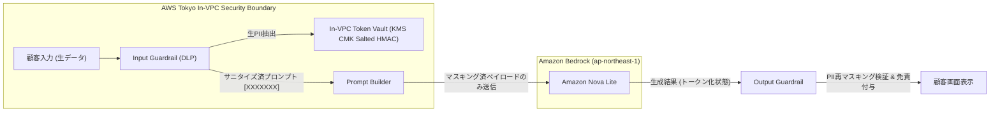

# [REQ-SEC-008] 個人情報保護法 (APPI) 準拠・PIIトークン化要件定義書 (APPI PII DLP Requirements)
## 日本のメガバンク AIカスタマーアシスタント システム要件定義

- **文書番号**: REQ-SEC-008
- **版数**: 第1.0版 (2026-08-21)
- **対象システム**: Bank AI Chat Assistant (AWS Tokyo `ap-northeast-1`)
- **準拠法規制**:
  - 個人情報の保護に関する法律（APPI）第20条（安全管理措置）、第23条（第三者提供の制限）
  - 個人情報保護委員会「金融分野における個人情報保護に関するガイドライン」
  - FISC安全対策基準 第9版 実務基準「データセキュリティ統制 4.2」
- **関連ADR**:
  - [ADR-0001: Japanese Banking Compliance & Control Planes](../../adr/0001-japanese-banking-compliance-and-control-planes.md)
  - [ADR-0009: DLP Security Guardrails & Compliance Framework](../../adr/0009-dlp-security-guardrails-and-compliance-framework.md)
  - [ADR-0012: In-VPC Salted Tokenization Vault](../../adr/0012-in-vpc-salted-tokenization-vault.md)
- **ベースライン文書**: 
  - [`docs/requirements_definition.md`](../requirements_definition.md) (Sec 2.1, 4)
  - [`docs/security_dlp_guardrails_requirements.md`](../security_dlp_guardrails_requirements.md) (Sec 1, 2)
- **実装マッピング**:
  - [`src/control_plane/input_guardrail.py`](file:///home/joe/src/bank-ai-chat/src/control_plane/input_guardrail.py)
  - [`src/control_plane/output_guardrail.py`](file:///home/joe/src/bank-ai-chat/src/control_plane/output_guardrail.py)
  - [`tests/test_guardrails.py`](file:///home/joe/src/bank-ai-chat/tests/test_guardrails.py)

---

## 1. 目的およびゼロPII送信境界（Zero PII Transmission Boundary）

本要件定義書は、個人情報保護法（APPI）に基づき、顧客が入力した対話プロンプトおよび勘定系データベースから抽出された個人特定情報（PII: Personally Identifiable Information）が、外部LLMモデルエンドポイント（Amazon Bedrock等）へ生の状態で送信されることを物理的・論理的に100%遮断する**In-VPC PIIマスキング・トークン化機構**の要件を定めます。

---

## 2. PII検出タクソノミーおよび正規表現ルール (PII Detection Taxonomy)

以下のPIIエンティティは、プロンプト組み立て前にIn-VPC Control Planeによりリアルタイムに検知され、非可逆プレースホルダーまたはソルト付きトークンに置換されます。

| PII区分 | 検出パターン (Regex) | 置換プレースホルダー | 法的・業務上のリスク |
|---|---|---|---|
| **7桁口座番号** | `(?<!\d)\d{7}(?!\d)` | `[口座番号保護: XXXXXXX]` | 不正出金、口座特定、なりすまし |
| **3桁支店コード** | `支店コード\s*[:：]?\s*(\d{3})\|支店番号\s*[:：]?\s*(\d{3})` | `支店コード: [XXX]` | 取引店特定による顧客プロファイリング |
| **暗証番号 / PIN** | `(暗証番号\|パスワード\|PIN\|pin)\s*[:：]?\s*(\d{4,8}\|[a-zA-Z0-9]{4,16})` | `\1: [暗証番号保護]` | 口座乗っ取り、不正送金 |
| **電話番号** | `0\d{1,4}-\d{1,4}-\d{4}\|0[789]0\d{8}` | `[電話番号保護]` | 個人追跡、スミッシング攻撃 |
| **カタカナ氏名** | `口座名義人?\s*[:：]?\s*([\u30A0-\u30FF]+\s*[\u30A0-\u30FF]+)` | `口座名義: [名義人保護]` | APPI第2条 特定個人識別情報 |
| **漢字氏名** | `^[\u4E00-\u9FFF\u3040-\u309F\s]{2,20}$` | `[氏名保護]` | APPI第2条 特定個人識別情報 |

---

## 3. In-VPC ソルト付きトークン化ヴォールト仕様 (KMS CMK Tokenization Vault)

1. **暗号化ソルト管理**:
   - AWS KMS Customer Managed Key (CMK) AES-256によって保護された動的ソルト（Dynamic Salt）を使用。
   - ソルト値はECS Fargateコンテナのセキュアメモリ内にのみ展開され、ディスクやログには一切平文出力されません。
2. **トークン生成方式**:
   - $\text{Token} = \text{HMAC-SHA256}(\text{Raw PII} \parallel \text{KMS Salt})$
   - トークンはセッション内でのみ有効であり、セッション終了時（TTL 30分）に即時破棄されます。
3. **二重漏洩防止スキャナ（Output Guardrail Scanner）**:
   - LLMが生成したレスポンスに対しても、再度PII正規表現スキャナを実行。
   - 万が一LLMが学習データや推論から7桁口座番号を出力した場合、`[口座番号保護]` に即時再置換し、CloudWatchへセキュリティ警告ログ（`PII_LEAK_PREVENTED`）を送信します。

---

## 4. ゼロ幅文字・難読化回避対策 (Unicode Anti-Obfuscation)

攻撃者によるスペース偽装やゼロ幅文字を用いたマスキング回避を防止するため、DLPスキャン直前に以下の正規化パイプラインを強制します：
1. **Unicode正規化 (NFKC)**: 全角英数字・半角カナの標準化。
2. **ゼロ幅文字除去**: `\u200B`（Zero-Width Space）, `\u200C`（Zero-Width Non-Joiner）, `\u200D`（Zero-Width Joiner）, `\uFEFF`（BOM）の完全除去。
3. **連続空白文字の単一化**: 氏名・番号間に挿入された連続スペースの圧縮。

---

## 5. 受入テスト検証基準 (Acceptance Criteria)

- [x] `tests/test_guardrails.py` において、口座番号、PIN、電話番号、カタカナ氏名のマスキングが 100% 成功すること。
- [x] 不正なゼロ幅文字混入ペイロードに対してマスキングが正常動作すること。
- [x] 出力ガードレールによるレスポンス内PII自動再マスキングが動作すること。
