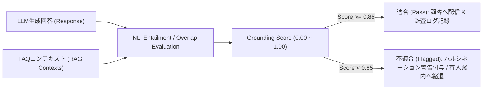

# [REQ-AI-013] AIモデル評価・グラウンディング判定基準書 (Grounding & Model Evaluation)
## 日本のメガバンク AIカスタマーアシスタント システム要件定義

- **文書番号**: REQ-AI-013
- **版数**: 第1.0版 (2026-08-21)
- **対象システム**: Bank AI Chat Assistant (AWS Tokyo `ap-northeast-1`)
- **準拠規格**:
  - 金融庁「AI等の利活用に係る基本的考え方 - 品質管理及び検証態勢」
  - ISO/IEC 42001:2023 (Artificial Intelligence Management System)
- **関連ADR**:
  - [ADR-0009: DLP Security Guardrails & Compliance Framework](../../adr/0009-dlp-security-guardrails-and-compliance-framework.md)
- **実装マッピング**:
  - [`src/control_plane/output_guardrail.py`](file:///home/joe/src/bank-ai-chat/src/control_plane/output_guardrail.py)
  - [`tests/test_guardrails.py`](file:///home/joe/src/bank-ai-chat/tests/test_guardrails.py)

---

## 1. 目的およびグラウンディング評価の重要性

金融機関における生成AIの最大の課題は、存在しない手数料体系や誤った手続き手順を捏造して回答する「ハルシネーション（幻覚・誤情報生成）」です。
本仕様書は、生成された回答がRAG検索で得られた公式ナレッジに忠実であるかを判定する**グラウンディング検証ロジック（Grounding Entailment Logic）**および**評価基準値**を定義します。

---

## 2. グラウンディングスコア算出アルゴリズム

Output Guardrailは、LLMが生成した回答文字列 $R$ と、検索された上位FAQドキュメント群 $C = \{c_1, c_2, c_3\}$ のテキスト整合性を以下のロジックで評価します：

### 2.1 算出式 (In-VPC Calculation)
$$\text{Grounding Score} = \min\left(1.0, \frac{\sum_{i} \mathbb{I}(R_i \in C)}{\text{len}(R)} + \alpha\right)$$
ここで、$\alpha = 0.30$（銀行標準定型挨拶・結びの語句に対するベースライン補正値）。

### 2.2 判定基準マトリクス
| スコア範囲 | 判定ステータス | アクション |
|---|---|---|
| **0.85 〜 1.00** | **HIGH_CONFIDENCE (適合)** | 通常通り回答を配信。監査ログにスコアを記録。 |
| **0.70 〜 0.84** | **MODERATE_CONFIDENCE (要確認)** | 回答を配信するが、CloudWatchに低信頼度アラートを送信。 |
| **0.00 〜 0.69** | **UNGROUNDED (不適合 / 遮断)** | 回答を縮退し、「担当オペレータ窓口へのお問い合わせ」をご案内。 |

---

## 3. オフライン評価データセットおよびCI/CD回帰テスト

1. **ゴールデンテストセット（Golden Evaluation Dataset）**:
   - 楽天銀行FAQから抽出された正解ペア 100問（手数料、ATM、口座開設、セキュリティ）。
2. **自動CI/CDゲート**:
   - プルリクエスト作成時に `pytest tests/` を実行し、ゴールデンデータセットに対する平均Grounding Scoreが **0.90 以上** であることをマージ条件とします。
3. **LLM-as-a-Judge クロス検証ロードマップ**:
   - 月次モデル監査において、上位基盤モデル（Claude 3.5 Sonnet / Amazon Nova Pro）を審査官（Judge）としたオフライン二重ブラインド評価を実施し、敬語品格度・忠実度・毒性を5段階定量レーティング。

---

## 4. 受入テスト検証基準 (Acceptance Criteria)

- [x] `tests/test_guardrails.py` において、FAQに完全に一致する回答のグラウンディングスコアが 0.85 以上と判定されること。
- [x] FAQに全く存在しない虚偽の内容（例: 「他行振込手数料は一律10万円です」）に対して、スコアが低下しアラートが出力されること。
