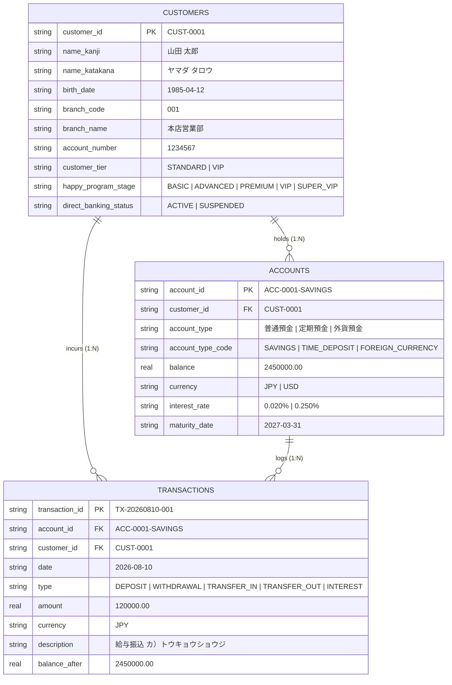

# [REQ-DAT-014] データモデル・スキーマ定義書 (Data Models & Schemas Specification)
## 日本のメガバンク AIカスタマーアシスタント システム要件定義

- **文書番号**: REQ-DAT-014
- **版数**: 第1.0版 (2026-08-21)
- **対象システム**: Bank AI Chat Assistant (AWS Tokyo `ap-northeast-1`)
- **準拠規格**:
  - 個人情報保護法 (APPI) 第20条（安全管理措置）・第23条（第三者提供の制限）
  - 全銀協（全国銀行協会）統一データフォーマット仕様
  - FISC安全対策基準 第9版 (データ管理基準 4.2.1)
- **関連ADR**: 
  - [ADR-0004: Synthetic Japanese Account Schema](../../adr/0004-synthetic-japanese-account-schema.md)
  - [ADR-0008: Decoupled Core Banking Database & API](../../adr/0008-decoupled-core-banking-database-and-api.md)
  - [ADR-0010: Personalized Account Tier Reasoning](../../adr/0010-personalized-account-tier-reasoning.md)
  - [ADR-0012: In-VPC Salted Tokenization Vault](../../adr/0012-in-vpc-salted-tokenization-vault.md)
- **ベースライン文書**: [`docs/requirements_definition.md`](../requirements_definition.md) (Sec 3)
- **実装マッピング**: 
  - [`src/core_banking/database.py`](file:///home/joe/src/bank-ai-chat/src/core_banking/database.py)
  - [`src/core_banking/service.py`](file:///home/joe/src/bank-ai-chat/src/core_banking/service.py)
  - [`data/mock_bank_accounts.json`](file:///home/joe/src/bank-ai-chat/data/mock_bank_accounts.json)
  - [`tests/test_account_data.py`](file:///home/joe/src/bank-ai-chat/tests/test_account_data.py)

---

## 1. 目的およびデータ保護基本原則

本仕様書は、日本のメガバンクAIカスタマーアシスタントシステムにおいて利用される**合成勘定系データ（Synthetic Core Banking Data）**、**FAQナレッジデータ**、および**監査ログデータ**のデータ構造、バリデーションルール、JSON Schema、およびリレーショナルデータベーススキーマを厳格に定義します。

### 1.1 個人情報保護法 (APPI) 準拠データ方針
1. **実顧客データ不使用（Zero Real-PII Ingestion）**: 開発・ステージング・CI/CD環境では本仕様に定義されたリアルな合成データのみを使用し、実口座・実顧客データの混入を物理的・論理的に遮断します。
2. **本番同等スキーマ整合性（Authentic Japanese Banking Schema）**: 本邦商業銀行の標準的な勘定項目（普通預金、定期預金、外貨預金、ハッピープログラム優遇ステージ、全銀協フォーマット）に完全準拠します。
3. **In-VPCマスキング整合性**: すべての個人情報フィールド（口座名義、口座番号、電話番号）は、In-VPCコントロールプレーンにおけるトークン化およびマスキング処理と1対1で対応可能な正規表現制約を持ちます。

---

## 2. フィールド共通バリデーションルール & 正規表現制約

システム全体（フロントエンド、APIゲートウェイ、Core Banking DB、ガードレール）で共有される文字コード制約およびバリデーション正規表現です。

| フィールド名 | 物理名 | 必須 | データ型 | バリデーション正規表現 / 制約 | マスキングプレースホルダー |
|---|---|---|---|---|---|
| 顧客ID | `customer_id` | ◯ | String | `^CUST-\d{4}$` (例: `CUST-0001`) | 対象外 (内部識別子) |
| 漢字氏名 | `name_kanji` | ◯ | String | `^[\u4E00-\u9FFF\u3040-\u309F\s]{1,20}$` (JIS第1・第2水準漢字、ひらがな) | `[NAME_MASKED]` |
| カタカナ氏名 | `name_katakana` | ◯ | String | `^[\u30A0-\u30FF\u30FC\s]{1,30}$` (全角カタカナ・長音符) | `[NAME_MASKED]` |
| 口座番号 | `account_number` | ◯ | String | `^\d{7}$` (半角数字7桁) | `[ACCOUNT_MASKED: XXXXXXX]` |
| 支店コード | `branch_code` | ◯ | String | `^\d{3}$` (半角数字3桁) | `[BRANCH_MASKED: XXX]` |
| 支店名 | `branch_name` | ◯ | String | `^[\u4E00-\u9FFF\u30A0-\u30FF]{2,15}支店$` | 対象外 |
| 生年月日 | `birth_date` | - | String | `^\d{4}-(0[1-9]|1[0-2])-(0[1-9]|[12]\d|3[01])$` (ISO 8601) | `[DATE_MASKED]` |
| 金額 (残高/取引) | `balance` / `amount` | ◯ | Number | 最小 `-999,999,999.99` 〜 最大 `999,999,999.99` (小数2桁許容) | なし |
| 通貨コード | `currency` | ◯ | String | `^(JPY\|USD\|EUR\|AUD)$` (ISO 4217) | なし |
| ゼロ幅文字除去 | N/A | - | String | evaluation前に `\u200B-\u200D`, `\uFEFF` を自動除去 | N/A |

---

## 3. リレーショナルデータモデル (SQLite / RDS PostgreSQL)

勘定系データベース（`data/bank_core.db`）の論理・物理設計です。



### 3.1 DDL 定義 (Deterministic SQL)
```sql
CREATE TABLE IF NOT EXISTS customers (
    customer_id TEXT PRIMARY KEY,
    name_kanji TEXT NOT NULL,
    name_katakana TEXT NOT NULL,
    birth_date TEXT,
    branch_code TEXT NOT NULL,
    branch_name TEXT NOT NULL,
    account_number TEXT NOT NULL,
    customer_tier TEXT DEFAULT 'STANDARD',
    happy_program_stage TEXT DEFAULT 'BASIC',
    direct_banking_status TEXT DEFAULT 'ACTIVE'
);

CREATE TABLE IF NOT EXISTS accounts (
    account_id TEXT PRIMARY KEY,
    customer_id TEXT NOT NULL,
    account_type TEXT NOT NULL,
    account_type_code TEXT NOT NULL,
    balance REAL NOT NULL DEFAULT 0.0,
    currency TEXT NOT NULL DEFAULT 'JPY',
    interest_rate TEXT,
    maturity_date TEXT,
    FOREIGN KEY (customer_id) REFERENCES customers (customer_id)
);

CREATE TABLE IF NOT EXISTS transactions (
    transaction_id TEXT PRIMARY KEY,
    account_id TEXT NOT NULL,
    customer_id TEXT NOT NULL,
    date TEXT NOT NULL,
    type TEXT NOT NULL,
    amount REAL NOT NULL,
    currency TEXT NOT NULL DEFAULT 'JPY',
    description TEXT NOT NULL,
    balance_after REAL NOT NULL,
    FOREIGN KEY (account_id) REFERENCES accounts (account_id),
    FOREIGN KEY (customer_id) REFERENCES customers (customer_id)
);

CREATE INDEX IF NOT EXISTS idx_tx_cust_date ON transactions(customer_id, date DESC);
CREATE INDEX IF NOT EXISTS idx_acc_cust ON accounts(customer_id);
```

---

## 4. JSON Schema 定義 (Draft 2020-12)

### 4.1 顧客プロファイルスキーマ (`CustomerProfile`)
```json
{
  "$schema": "https://json-schema.org/draft/2020-12/schema",
  "title": "CustomerProfile",
  "type": "object",
  "required": [
    "customer_id",
    "name_kanji",
    "name_katakana",
    "branch_code",
    "branch_name",
    "account_number",
    "happy_program_stage"
  ],
  "properties": {
    "customer_id": {
      "type": "string",
      "pattern": "^CUST-\\d{4}$"
    },
    "name_kanji": {
      "type": "string",
      "pattern": "^[\\u4E00-\\u9FFF\\u3040-\\u309F\\s]{1,20}$"
    },
    "name_katakana": {
      "type": "string",
      "pattern": "^[\\u30A0-\\u30FF\\u30FC\\s]{1,30}$"
    },
    "birth_date": {
      "type": "string",
      "pattern": "^\\d{4}-\\d{2}-\\d{2}$"
    },
    "branch_code": {
      "type": "string",
      "pattern": "^\\d{3}$"
    },
    "branch_name": {
      "type": "string"
    },
    "account_number": {
      "type": "string",
      "pattern": "^\\d{7}$"
    },
    "customer_tier": {
      "type": "string",
      "enum": ["STANDARD", "PREMIUM", "VIP"]
    },
    "happy_program_stage": {
      "type": "string",
      "enum": ["BASIC", "ADVANCED", "PREMIUM", "VIP", "SUPER_VIP"]
    },
    "direct_banking_status": {
      "type": "string",
      "enum": ["ACTIVE", "SUSPENDED", "LOCKED"]
    },
    "accounts": {
      "type": "array",
      "items": { "$ref": "#/$defs/AccountRecord" }
    },
    "recent_transactions": {
      "type": "array",
      "items": { "$ref": "#/$defs/TransactionRecord" }
    }
  },
  "$defs": {
    "AccountRecord": {
      "type": "object",
      "required": ["account_id", "account_type", "account_type_code", "balance", "currency"],
      "properties": {
        "account_id": { "type": "string" },
        "account_type": { "type": "string" },
        "account_type_code": { "type": "string", "enum": ["SAVINGS", "TIME_DEPOSIT", "FOREIGN_CURRENCY"] },
        "balance": { "type": "number" },
        "currency": { "type": "string", "enum": ["JPY", "USD", "EUR", "AUD"] },
        "interest_rate": { "type": "string" },
        "maturity_date": { "type": ["string", "null"] }
      }
    },
    "TransactionRecord": {
      "type": "object",
      "required": ["transaction_id", "date", "type", "amount", "currency", "description", "balance_after"],
      "properties": {
        "transaction_id": { "type": "string" },
        "date": { "type": "string", "pattern": "^\\d{4}-\\d{2}-\\d{2}$" },
        "type": { "type": "string", "enum": ["DEPOSIT", "WITHDRAWAL", "TRANSFER_IN", "TRANSFER_OUT", "INTEREST"] },
        "amount": { "type": "number" },
        "currency": { "type": "string" },
        "description": { "type": "string" },
        "balance_after": { "type": "number" }
      }
    }
  }
}
```

---

## 5. ハッピープログラム（優遇ステージ判定）仕様

本邦ネット銀行（楽天銀行等）の優遇ロジックを忠実に再現したステージ判定仕様です。

| ステージ名 | 判定条件 (資産残高 OR 月間対象取引件数) | ATM手数料無料回数 | 他行宛振込手数料無料回数 | 楽天ポイント獲得倍率 |
|---|---|---|---|---|
| **スーパーVIP (SUPER_VIP)** | 残高 300万円以上 または 取引30件以上 | 月7回無料 | 月3回無料 | 3倍 |
| **VIP** | 残高 100万円以上 または 取引20件以上 | 月5回無料 | 月3回無料 | 3倍 |
| **プレミアム (PREMIUM)** | 残高 50万円以上 または 取引10件以上 | 月2回無料 | 月2回無料 | 2倍 |
| **アドバンスト (ADVANCED)** | 残高 10万円以上 または 取引5件以上 | 月1回無料 | 月1回無料 | 1倍 |
| **ベーシック (BASIC)** | エントリーのみ (上記未満) | 0回 (有料) | 0回 (有料) | 1倍 |

---

## 6. 合成マスターデータセット一覧 (`data/mock_bank_accounts.json`)

システム検証用に準備された代表的なペルソナセットです。

| 顧客ID | 口座名義 (漢字/カナ) | 支店 | 普通預金残高 | 定期預金残高 | 会員ステージ | 代表取引例 |
|---|---|---|---|---|---|---|
| `CUST-0001` | 山田 太郎<br/>(ヤマダ タロウ) | 本店営業部 (001) | ¥2,450,000 | ¥5,000,000 | **SUPER_VIP** | 給与振込、家賃引落、証券口座送金 |
| `CUST-0002` | 佐藤 花子<br/>(サトウ ハナコ) | 新宿支店 (002) | ¥820,000 | ¥0 | **PREMIUM** | クレジット引落、コンビニATM出金 |
| `CUST-0003` | 鈴木 一郎<br/>(スズキ イチロウ) | 渋谷支店 (003) | ¥45,000 | ¥0 | **BASIC** | アルバイト給与、携帯料金引落 |

---

## 7. 受入テスト検証基準 (Acceptance Criteria)

- [x] **Schema Validation Test**: `tests/test_account_data.py` を実行し、全モックデータが上記 JSON Schema Draft 2020-12 に 100% 適合すること。
- [x] **DB Integrity Test**: `tests/test_core_banking.py` を実行し、外部キー制約、残高整合性、およびステージ判定計算が正確にパスすること。
- [x] **Zero-Real-PII Verification**: 全銀協テストダミー名義および合成番号のみが使用されていることをCIゲートで自動検証。
