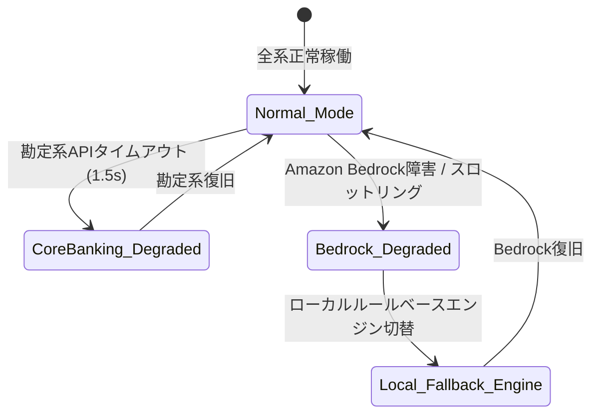

# [REQ-IF-016] エラーハンドリング・縮退運用要件定義書 (Fallback & Circuit Breaker)
## 日本のメガバンク AIカスタマーアシスタント システム要件定義

- **文書番号**: REQ-IF-016
- **版数**: 第1.0版 (2026-08-21)
- **対象システム**: Bank AI Chat Assistant (AWS Tokyo `ap-northeast-1`)
- **準拠規格**:
  - FISC安全対策基準 第9版「障害対策・コンティンジェンシープラン」
  - AWS Well-Architected Framework (Resilience & Graceful Degradation)
- **関連ADR**:
  - [ADR-0008: Decoupled Core Banking Database & API](../../adr/0008-decoupled-core-banking-database-and-api.md)
  - [ADR-0019: Local LLM Provider & Fallback Architecture](../../adr/0019-local-llm-provider-and-fallback-architecture.md)
- **実装マッピング**:
  - [`src/core_banking/client.py`](file:///home/joe/src/bank-ai-chat/src/core_banking/client.py)
  - [`src/llm/local_llm.py`](file:///home/joe/src/bank-ai-chat/src/llm/local_llm.py)
  - [`tests/test_local_llm.py`](file:///home/joe/src/bank-ai-chat/tests/test_local_llm.py)

---

## 1. 目的および縮退運転（Graceful Degradation）方針

銀行システムにおいては、一部の外部サービスや勘定系APIが障害・計画停止中であっても、サービス全体をクラッシュさせることなく、利用可能な機能（一般FAQ等）を維持する**多層的縮退運転（Multi-Tier Graceful Degradation）**が義務付けられています。



---

## 2. 障害パターン別フェイルセーフ仕様 (Failure Scenarios)

### 2.1 勘定系API障害時 (Core Banking Outage / Maintenance)
- **検知条件**: 勘定系Gatewayからの応答が1.5秒以上遅延、または HTTP 5xx エラー返却。
- **縮退アクション**:
  1. 口座残高・明細参照機能のみを一時停止。
  2. 一般FAQ（手数料、ATM案内等）は通常通り継続提供。
  3. AIは丁寧語で「ただいま口座照会システムがメンテナンス中のため、残高のご案内ができません。一般的なお手続きや手数料については引き続きご案内可能です。」と回答。

### 2.2 Bedrock Nova Lite障害・レートリミット時 (Bedrock Outage / Throttling)
- **検知条件**: `ThrottlingException` または Bedrockサービスダウン。
- **縮退アクション (ADR-0019準拠)**:
  1. `src/llm/local_llm.py`（軽量ローカル推論・ルールベースエンジン）へ自動フォールバック。
  2. 勘定系データおよびFAQナレッジを決定論的テンプレートにマッピングして回答を生成。
  3. CloudWatchへ重大アラート（`Severity: High`）を発報。

### 2.3 OpenSearch Serverless障害時 (Vector DB Outage)
- **検知条件**: ベクトル検索クエリのタイムアウト（> 1.0秒）。
- **縮退アクション**:
  1. キーワード完全一致による簡易ローカル辞書検索へフォールバック。
  2. 未知の質問に対しては「恐れ入りますが、該当の案内が見つかりませんでした。コンタクトセンター窓口をご利用ください。」と案内。

### 2.4 開発環境用ローカルLLM & オフラインフォールバック仕様 (ADR-0019準拠)
AWS Bedrock認証情報のないローカル開発環境やオフライン隔離テスト環境において、完全な機能動作を保証するためのローカルLLMプロバイダー仕様です：

- **推奨軽量モデル**:
  - `qwen2.5:0.5b` (メモリフットプリント ~390MB、高速敬語生成、推奨デフォルト)
  - `qwen2.5:1.5b` (メモリフットプリント ~980MB、高精度敬語生成)
  - `gemma:2b` (メモリフットプリント ~1.4GB)
- **環境変数設定インターフェース**:
  ```bash
  export LLM_PROVIDER=local
  export LOCAL_LLM_MODEL=qwen2.5:0.5b
  export LOCAL_LLM_URL=http://localhost:11434/v1
  ```
- **多段フォールバック挙動**: Ollamaサーバが停止している場合でも、`LocalLLMClient` は自動的に内部の **Local Light Development Engine (ルールベース推論)** にフォールバックし、テストスイート（`tests/test_local_llm.py`）をエラーなく実行可能。
- **セットアップ検証ツール**: `python3 scripts/setup_local_llm.py --model qwen2.5:0.5b` による自動モデルDL・稼働検証。

---

## 3. サーキットブレーカー構成パラメータ

- **Failure Rate Threshold**: 50% (直近10リクエスト中5回失敗で作動)
- **Wait Duration in Open State**: **30秒**
- **Automatic Self-Healing (Half-Open)**: 30秒後に試行リクエストを1件送信し、成功すれば `CLOSED`（正常）に自動復帰。

---

## 4. 受入テスト検証基準 (Acceptance Criteria)

- [x] `tests/test_local_llm.py` を実行し、AWS Bedrock未接続状態でもローカルフォールバックエンジンが正確な残高・ステージ案内を生成できること。
- [x] 勘定系DBを停止させた状態でチャットAPIを呼び出した際、500 Internal Server Errorにならず、適切な縮退案内メッセージが返却されること。
