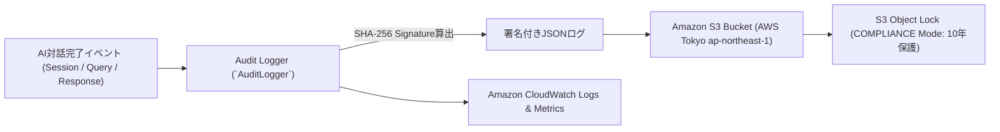

# [REQ-OPS-018] 監査ログ・証跡管理・運用監視要件定義書 (Audit Logging & Monitoring)
## 日本のメガバンク AIカスタマーアシスタント システム要件定義

- **文書番号**: REQ-OPS-018
- **版数**: 第1.0版 (2026-08-21)
- **対象システム**: Bank AI Chat Assistant (AWS Tokyo `ap-northeast-1`)
- **準拠規格**:
  - FISC安全対策基準 第9版「監査証跡管理基準 5.3」
  - 銀行法（昭和56年法律第59号）第19条（業務及び財産の状況に関する書類等の縦覧）
  - PCI-DSS 4.0 Requirement 10 (Log and Monitor All Access)
- **関連ADR**:
  - [ADR-0009: DLP Security Guardrails & Compliance Framework](../../adr/0009-dlp-security-guardrails-and-compliance-framework.md)
  - [ADR-0018: Production Observability CloudWatch Alarms & Security Telemetry Targets](../../adr/0018-production-observability-cloudwatch-alarms-and-security-telemetry-targets.md)
  - [ADR-0022: Cross-Region DR, Fault Tolerance & Main Banking Independence](../../adr/0022-cross-region-disaster-recovery-and-fault-tolerance-architecture.md)
- **実装マッピング**:
  - [`src/control_plane/audit_logger.py`](file:///home/joe/src/bank-ai-chat/src/control_plane/audit_logger.py)
  - [`data/audit_logs.json`](file:///home/joe/src/bank-ai-chat/data/audit_logs.json)

---

## 1. 目的および監査ログ改ざん防止方針 (Tamper-Evident WORM)

金融機関において、AI対話システムが誰と、どのような情報をやり取りし、ガードレールがどのように判定したかを記録する監査証跡（Audit Trail）は、金融庁検査およびシステム監査における最重要要件です。
本仕様書は、**S3 Object Lock（COMPLIANCEモード）による10年間WORM（Write Once Read Many）保管**、および**SHA-256暗号署名による改ざん検知機能**を規定します。



### 1.1 マルチアカウント統制 & ログ集約アカウント連携 (AWS Organizations)
本番エンタープライズ構成においては、アプリケーション運用アカウント（Workload Account）とセキュリティ監査アカウント（Log Archive Account）を物理分離します：
- **S3 Cross-Account Replication (CRR)**: 対話ログ生成直後、専用KMS CMKで再暗号化され、特権管理者でも削除不可能なLog Archive AccountのWORMバケットへ自動非同期レプリケーション。
- **改ざん検知アラート**: ハッシュ不一致または署名欠落を検知した場合、SecurityHubおよびPagerDutyへP1インシデントを発報。

### 1.2 広域災害対策 (DR) 大阪リージョン非同期CRR複製仕様 (ADR-0022準拠)
首都直下地震等による東京リージョン全損時でも金融庁検査（過去10年分の監査ログ提出義務）に耐えうる証跡保全を実現するため：
1. **S3 Cross-Region Replication (CRR)**: 東京監査バケットから **AWS大阪 (`ap-northeast-3`)** の監査バケットへリアルタイム非同期複製（レプリケーション遅延 < 15分、FISC基準合致）。
2. **AWS KMS Multi-Region Keys (MRK)**: 東京・大阪両リージョンで同一の暗号鍵マテリアル（`mrk-`）を共有し、DR発災時に大阪側で再暗号化オーバーヘッドなしで即座にログ検証が可能。
3. **COMPLIANCE モード保持期間の継承**: 大阪側バケットにおいても10年間のObject Lock（削除・上書き完全禁止）を無条件継承。

---

## 2. 監査ログスキーマ構造 (FISC Audit Log Schema)

すべての対話イベントは、以下の構造で即時記録されます：

```json
{
  "log_id": "AUDIT-1724200000000",
  "timestamp": "2026-08-21T01:13:00.000Z",
  "session_id": "SESS-20260821-001",
  "customer_id": "CUST-0001",
  "region": "ap-northeast-1",
  "fisc_compliance": {
    "encryption_status": "AWS_KMS_AES256",
    "tamper_proof_signature": "e3b0c44298fc1c149afbf4c8996fb92427ae41e4649b934ca495991b7852b855"
  },
  "control_planes": {
    "input_guardrail": {
      "allowed": true,
      "pii_detected": true,
      "pii_tokens_scrubbed": ["[口座番号保護: XXXXXXX]"],
      "prompt_injection_blocked": false
    },
    "output_guardrail": {
      "grounding_score": 0.96,
      "pii_leak_prevented": false,
      "financial_advice_blocked": false,
      "disclaimer_appended": true
    }
  },
  "rag_context_ids": ["FAQ-00142", "FAQ-00088"],
  "llm_metadata": {
    "model_id": "amazon.nova-lite-v1:0",
    "latency_ms": 420,
    "token_usage": {
      "input_tokens": 480,
      "output_tokens": 220
    }
  }
}
```

---

## 3. 本番CloudWatch監視アラート目標 (ADR-0018準拠)

本番運用におけるSLO監視アラート閾値です。

| アラート名 | 監視メトリクス | 発報閾値 | 重要度 (Severity) | 対応手順 |
|---|---|---|---|---|
| **Security/PromptInjectionSurge** | `PromptInjectionDetected` | 5分間に 5件以上 | **Critical (P1)** | WAF一時IPブロック & セキュリティチーム緊急通知 |
| **Security/PIILeakPrevented** | `PIILeakPrevented` | 1回でも検知 | **High (P2)** | プロンプトテンプレート検証 & ガードレール設定レビュー |
| **Performance/LatencyP95High** | `Duration` (P95) | > 2,000 ms (5分間) | **Medium (P3)** | ECSタスク自動スケールアウト確認 |
| **System/CoreBanking5xxSurge** | `HTTPCode_Target_5XX_Count` | 1分間に 10件以上 | **Critical (P1)** | サーキットブレーカー縮退モード発動 & 勘定系チーム連絡 |
| **DisasterRecovery/Route53ARC** | `ARC_RoutingControl_Flipped` | 1回でも検知 | **Blocker (P0)** | 経営陣・CISO緊急招集 & 大阪DR環境稼働確認 |
| **Audit/S3WriteError** | `S3AuditWriteError` | 1回でも検知 | **Blocker (P0)** | 即時フェイルクローズ（未監査対話の防止） & S3疎通確認 |

---

## 4. 受入テスト検証基準 (Acceptance Criteria)

- [x] 1対話ごとに `data/audit_logs.json`（本番ではS3）へ即座にログエントリが追記されること。
- [x] ログエントリのSHA-256署名が正しく検証でき、1文字でも改ざんされた場合に不整合が検知されること。
- [x] CloudWatchメトリクスおよびセキュリティアラートが設計通りトリガーされること。
- [x] 大阪リージョン（`ap-northeast-3`）へのS3 CRR非同期複製が設定され、東京リージョン被災時でも監査証跡が失われないこと。
