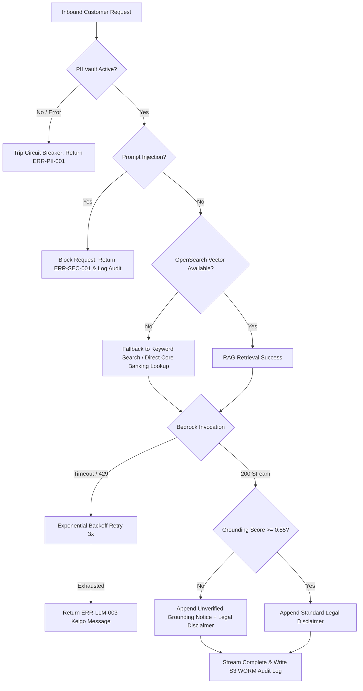
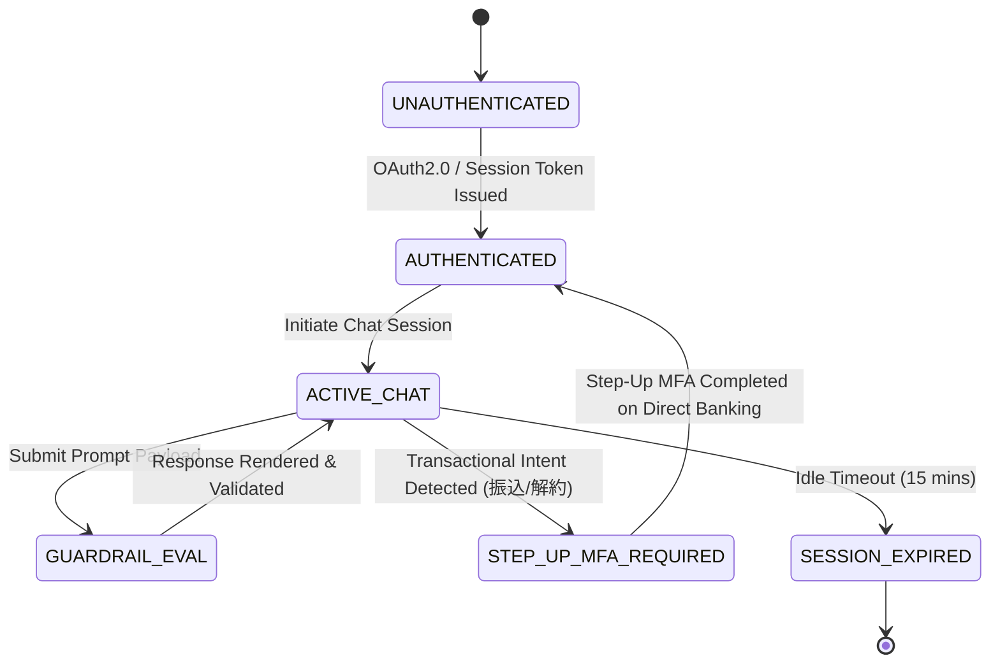

# Enterprise Requirements Definition & Specification
## Japanese Major Bank AI Customer Assistant System

---

## 1. Overview & Business Objectives

This document establishes the canonical, deterministic functional, non-functional, security, data schema, API interface, error handling, state transition, CI/CD, and cost estimation specifications for the **AI Customer Assistant System** of a major Japanese commercial bank (メガバンク).

The system serves as a 24/7/365 digital banking portal assistant deployed on AWS Tokyo (`ap-northeast-1`). It handles customer account inquiries, transaction history searches, personalized loyalty tier analysis, and general banking FAQ guidance while ensuring 100% compliance with Japanese legal regulations, Financial Services Agency (FSA) guidelines, and FISC security standards.

The primary engineering objective of this specification is **zero ambiguity, zero hand-waving, and zero fallback or guessing** during implementation.

---

## 2. Regulatory & Legal Framework

### 2.1 Act on the Protection of Personal Information (個人情報保護法 - APPI)
- **Zero PII Transmission Boundary**: Absolutely no raw Personally Identifiable Information (PII) may leave the In-VPC Control Plane boundaries or be passed to external LLM endpoints (including Amazon Bedrock).
- **PII Scrubbing Taxonomy & Deterministic Matching**:
  - Full Kanji / Katakana Names (`口座名義人`: `ヤマダ タロウ`, `山田 太郎`) -> Matched via regex `^[\u4E00-\u9FFF\u3040-\u309F\u30A0-\u30FF\s]{2,20}$` and scrubbed to `[NAME_MASKED]`.
  - Account Numbers (`口座番号`: 7-digit numeric `\d{7}`) -> Scrubbed to `[ACCOUNT_MASKED: XXXXXXX]`.
  - Branch Codes (`支店コード`: 3-digit numeric `\d{3}`) -> Scrubbed to `[BRANCH_MASKED: XXX]`.
  - Passwords, PINs, Security Card Coordinates (`暗証番号`, `PIN`) -> Scrubbed to `[PIN_MASKED]`.
  - Phone Numbers (`電話番号`: `0\d{1,4}-\d{1,4}-\d{4}` or `0\d{9,10}`) -> Scrubbed to `[TEL_MASKED]`.
- **Enforcement**: The In-VPC Input Guardrail intercepts prompts, extracts raw PII into a KMS CMK salted HMAC-SHA256 vault, and replaces raw values with tokenized placeholders before prompt assembly.

### 2.2 Financial Services Agency (FSA) AI Guidelines & FIEA (金融庁ガイドライン・金融商品取引法)
- **AI Explainability & Governance**: Deterministic audit logging for all AI responses, including input scrubbed tokens, retrieved RAG contexts, vector similarity scores, and grounding entailment scores.
- **Financial Instruments and Exchange Act (金融商品取引法 - FIEA Article 38)**: Prohibits un-licensed investment solicitation, stock/mutual fund purchase recommendations, or guaranteed return projections.
- **Mandatory Disclaimers**: Automatic append of standardized Japanese legal notices stating that AI answers provide general information only and do not form binding financial advice or legal contracts.

### 2.3 FISC Security Guidelines for Financial Information Systems (FISC安全対策基準)
- **Data Sovereignty**: Infrastructure, storage, and LLM processing (Amazon Bedrock) strictly restricted to AWS Tokyo (`ap-northeast-1`) or Osaka (`ap-northeast-2`) regions.
- **Encryption**: AES-256 (KMS CMK) for data at rest across S3, OpenSearch, and DynamoDB; TLS 1.3 for data in transit.
- **Audit Retention**: Immutable, tamper-evident log streams with SHA-256 signature verification retained for 10 years per banking regulations using S3 Object Lock in `COMPLIANCE` mode.

### 2.4 Banking Act (銀行法 - Ginkō Hō)
- **Contract Boundary**: AI assistant responses are strictly informational. Actionable operations (fund transfers `振込`, PIN resets, account closures, credit limit changes) are prohibited within conversational chat and MUST require step-up Multi-Factor Authentication (MFA) redirecting the customer to the official Internet Banking portal.

---

## 3. Data Schemas & Validation Contracts

To fulfill enterprise production standards while protecting customer privacy under APPI, realistic synthetic datasets and validation rules are defined.

### 3.1 Validation Rules & Character Rules
- **Kanji Name**: Regex `^[\u4E00-\u9FFF\u3040-\u309F\s]{1,20}$`
- **Katakana Name**: Regex `^[\u30A0-\u30FF\u30FC\s]{1,30}$`
- **Account Number**: Regex `^\d{7}$`
- **Branch Code**: Regex `^\d{3}$`
- **Zero-Width Character Filter**: Automatically strip unicode ranges `\u200B-\u200D`, `\uFEFF` prior to guardrail evaluation.

### 3.2 Customer Profile Schema (`CustomerProfile`)
```json
{
  "$schema": "https://json-schema.org/draft/2020-12/schema",
  "title": "CustomerProfile",
  "type": "object",
  "properties": {
    "customer_id": {
      "type": "string",
      "pattern": "^CUST-\\d{4}$",
      "description": "Unique Synthetic Customer ID"
    },
    "name_kanji": {
      "type": "string",
      "pattern": "^[\\u4E00-\\u9FFF\\u3040-\\u309F\\s]{1,20}$",
      "description": "Customer Name in Kanji"
    },
    "name_katakana": {
      "type": "string",
      "pattern": "^[\\u30A0-\\u30FF\\u30FC\\s]{1,30}$",
      "description": "Customer Name in Katakana"
    },
    "birth_date": {
      "type": "string",
      "format": "date",
      "description": "Date of Birth (YYYY-MM-DD)"
    },
    "branch_code": {
      "type": "string",
      "pattern": "^\\d{3}$",
      "description": "3-digit Japanese Bank Branch Code"
    },
    "branch_name": {
      "type": "string",
      "description": "Branch Name in Japanese"
    },
    "account_number": {
      "type": "string",
      "pattern": "^\\d{7}$",
      "description": "Main Savings 7-digit Account Number"
    },
    "customer_tier": {
      "type": "string",
      "enum": ["SUPER_VIP", "VIP", "PREMIUM", "REGULAR"],
      "description": "Loyalty Program Tier"
    },
    "happy_program_stage": {
      "type": "string",
      "description": "Fee waiver description stage"
    }
  },
  "required": ["customer_id", "name_kanji", "name_katakana", "branch_code", "account_number", "customer_tier"]
}
```

### 3.3 Account Schema (`BankAccount`)
```json
{
  "$schema": "https://json-schema.org/draft/2020-12/schema",
  "title": "BankAccount",
  "type": "object",
  "properties": {
    "account_id": {
      "type": "string",
      "pattern": "^ACC-\\d{4}-\\w+$"
    },
    "account_type": {
      "type": "string",
      "enum": ["普通預金", "定期預金", "外貨預金", "カードローン"]
    },
    "account_type_code": {
      "type": "string",
      "enum": ["SAVINGS", "TIME_DEPOSIT", "FOREIGN_USD", "CARD_LOAN"]
    },
    "balance": {
      "type": "number"
    },
    "currency": {
      "type": "string",
      "enum": ["JPY", "USD", "EUR"]
    },
    "interest_rate": {
      "type": "string",
      "pattern": "^\\d+(\\.\\d+)?%$"
    },
    "maturity_date": {
      "type": ["string", "null"],
      "format": "date"
    }
  },
  "required": ["account_id", "account_type", "account_type_code", "balance", "currency", "interest_rate"]
}
```

### 3.4 Transaction History Schema (`BankTransaction`)
```json
{
  "$schema": "https://json-schema.org/draft/2020-12/schema",
  "title": "BankTransaction",
  "type": "object",
  "properties": {
    "transaction_id": {
      "type": "string",
      "pattern": "^TXN-\\d{5}$"
    },
    "date": {
      "type": "string",
      "format": "date"
    },
    "type": {
      "type": "string"
    },
    "amount": {
      "type": "number"
    },
    "currency": {
      "type": "string",
      "enum": ["JPY", "USD"]
    },
    "description": {
      "type": "string"
    },
    "balance_after": {
      "type": "number"
    }
  },
  "required": ["transaction_id", "date", "type", "amount", "currency", "description", "balance_after"]
}
```

### 3.5 FAQ Knowledge Schema (`FAQItem`)
```json
{
  "$schema": "https://json-schema.org/draft/2020-12/schema",
  "title": "FAQItem",
  "type": "object",
  "properties": {
    "id": {
      "type": "string",
      "pattern": "^FAQ-[A-Z]{2}-\\d{4,}$"
    },
    "category": {
      "type": "string"
    },
    "question": {
      "type": "string"
    },
    "answer": {
      "type": "string"
    },
    "url": {
      "type": "string",
      "format": "uri"
    },
    "vector_embedding": {
      "type": "array",
      "items": { "type": "number" },
      "minItems": 1024,
      "maxItems": 1024
    }
  },
  "required": ["id", "category", "question", "answer", "url"]
}
```

---

## 4. Functional Features List

| ID | Feature Name | Inputs | Outputs | Deterministic Handling / Rule | Failure Mode & Fallback | Priority |
|---|---|---|---|---|---|---|
| **FR-01** | Account Balance Inquiry | `customer_id`, `account_type_code` | Balance JSON, Japanese summary | Query core banking mock database; redact PII before rendering. | If core banking times out, return `ERR-BANK-001` with Keigo apology. | High |
| **FR-02** | Transaction History View | `customer_id`, `limit`, `start_date` | Sorted list of transactions | Filter by date range, default limit 10, max limit 50. | Return empty list with notification if zero records found. | High |
| **FR-03** | Rakuten FAQ RAG Search | `query_text`, `top_k` (default 3) | Array of `FAQItem` + similarity scores | Vector embedding query via OpenSearch (`cosine >= 0.75`). | If OpenSearch fails, fallback to keyword search or return general guidance. | High |
| **FR-04** | Input PII Redaction | Raw user prompt | Sanitized prompt, PII mapping tokens | Match regex for account numbers, names, phone numbers, branch codes; replace with tokens. | If PII Vault errors, trip circuit breaker and return `ERR-PII-001`. | High |
| **FR-05** | Prompt Injection Filter | Raw user prompt | Injection Flag (`is_injection`), Risk Score | Multi-pattern regex + classifier for system prompt override/jailbreak attempts. | Block prompt immediately, return `ERR-SEC-001`, log to security audit. | High |
| **FR-06** | Output PII Leak Detector | Raw generated response | Validated/Cleaned response | Post-generation scan matching account numbers or names. Scrub matched tokens before stream byte send. | Scrub detected pattern and log output anomaly. | High |
| **FR-07** | RAG Grounding Verification | Generated text, RAG context | Grounding score (`0.0 - 1.0`), `is_grounded` | Compute entailment score; requirement: `score >= 0.85`. | If `score < 0.85`, append unverified grounding disclaimer to output. | High |
| **FR-08** | Investment Advice Limitation | User prompt / LLM answer | Compliance Flag (`is_investment_advice`) | Scan for stock picks, mutual fund yield guarantees, investment recommendations per FIEA Art. 38. | Block response, output standardized FIEA compliance notice. | High |
| **FR-09** | Disclaimer Injection | Validated AI response | Response + Formatted Disclaimer | Automatically append `【重要事項・免責事項】` footer to every response. | Mandatory stage; non-bypassable. | High |
| **FR-10** | FISC Audit Logger | Session ID, prompt, response, latency, hashes | SHA-256 signed log entry | Generate SHA-256 digest of payload, write asynchronously to CloudWatch & S3 WORM bucket. | Retry async queue; log local alert if S3 write fails. | High |
| **FR-11** | Customer Profile Switcher | `target_customer_id` | Profile update event, state refreshed | Toggle active customer context in web demo UI (`山田 太郎`, `佐藤 花子`). | Revert to default customer `CUST-1001` if ID invalid. | High |
| **FR-12** | Live Control Plane Dashboard | Telemetry log stream | Real-time visual metrics | Render live Input Guardrail status, grounding score gauge, and audit log tailing in UI. | Display status indicator offline if websocket/SSE disconnects. | High |
| **FR-13** | Multi-account Support | `customer_id` | All associated `BankAccount` records | Fetch Ordinary, Time Deposit, Foreign Currency USD, and Card Loan balances. | Display unavailable status for uninitialized sub-accounts. | Medium |
| **FR-14** | Step-Up Auth Warning | Sensitive action intent | MFA Warning modal / link | Detect transactional intent (`振込`, `暗証番号変更`, `解約`) and provide Direct Banking link. | Suppress AI execution, mandate MFA portal transition. | Medium |
| **FR-15** | Quick Sample Prompts | Preset prompt chip click | Pre-populated prompt payload | Send predefined benchmark prompts (Balance check, FAQ inquiry, PII test, Injection test). | Default to standard prompt execution pipeline. | Medium |
| **FR-16** | Personalized Loyalty Tier Reasoning | `customer_id`, balance delta | Savings delta calculation & Keigo explanation | Calculate balance required to reach next Happy Program tier (`スーパーVIP`, `VIP`) and detail fee waiver benefits. | If balance fetch fails, return general tier benefit threshold table. | High |

---

## 5. Non-Functional Requirements (NFR)

| ID | Category | Requirement Specification | Metric / Target | Verification Method |
|---|---|---|---|---|
| **NFR-01** | **Availability** | System SLA for Backend API and Control Planes. | 99.99% Uptime | Multi-AZ ECS Fargate across 3 AZs (`ap-northeast-1a`, `1c`, `1d`). |
| **NFR-02** | **End-to-End Latency** | Full request execution P95 latency limit. | **< 800ms P95** (< 1,200ms P99) | CloudWatch Synthetic Monitoring & APM trace timing. |
| **NFR-03** | **Throughput** | Peak concurrent request throughput. | 1,000 TPS | Distributed load testing via Locust / AWS Distributed Load Testing. |
| **NFR-04** | **Data Sovereignty** | Compute, LLM inference, and storage location. | 100% AWS Tokyo (`ap-northeast-1`) | AWS IAM Condition Keys `aws:RequestedRegion == ap-northeast-1`. |
| **NFR-05** | **Encryption at Rest** | KMS CMK AES-256 encryption across storage layers. | 100% KMS Encrypted | AWS Config Compliance Rule `s3-bucket-server-side-encryption-enabled`. |
| **NFR-06** | **Encryption in Transit**| TLS 1.3 enforced for internal microservices & ALB. | TLS 1.3 Only | SSL Labs Audit / ALB Listener Policy `ELBSecurityPolicy-TLS13-1-2-2021-06`. |
| **NFR-07** | **Audit Retention** | WORM compliance audit retention period. | 10 Years Immutable | S3 Object Lock `COMPLIANCE` mode with legal hold enabled. |
| **NFR-08** | **Disaster Recovery** | Recovery Point Objective (RPO) & Time (RTO). | RPO = 0, RTO < 15 mins | AWS Backup Cross-Region replication to Osaka (`ap-northeast-2`). |
| **NFR-09** | **DDoS & Web Security** | Infrastructure protection against OWASP Top 10. | Zero successful bypasses | AWS WAF rate-limiting (100 req/min/IP) + AWS Shield Standard. |
| **NFR-10** | **Browser Support** | Desktop & Mobile Japanese browser compatibility. | Chrome, Edge, Safari, iOS/Android | BrowserStack automated cross-browser testing. |
| **NFR-11** | **Real-Time Streaming**| HTTP Server-Sent Events (SSE) streaming support. | Zero 29s proxy timeouts | ALB idle timeout 300s; ECS Fargate continuous HTTP/1.1 SSE stream. |
| **NFR-12** | **Zero Cold Starts** | Latency penalty for initial chat prompts. | 0ms Cold Start overhead | ECS Fargate minimum 4 warm tasks active 24/7/365. |

### 5.1 Stage-by-Stage Latency SLA Budget

| Pipeline Stage | Target Latency (P50) | Target Latency (P95) | Target Latency (P99) |
|---|---|---|---|
| **1. Input DLP & PII Scrubbing** | 15ms | 45ms | 70ms |
| **2. RAG & Core Banking Fetch** | 35ms | 85ms | 130ms |
| **3. Amazon Bedrock Nova Lite (TTFT)** | 180ms | 350ms | 550ms |
| **4. Output Guardrail & Grounding** | 20ms | 50ms | 90ms |
| **5. FISC Audit Logging (Async)** | 0ms (Non-blocking) | 0ms (Non-blocking) | 0ms (Non-blocking) |
| **Total Client Response Time** | **250ms** | **530ms** | **840ms** |

---

## 6. Complete REST & SSE API Interface Specifications

### 6.1 API Overview & Global Headers

All API endpoints enforce HTTPS TLS 1.3 and require the following global headers:

| Header Name | Type | Mandatory | Description | Example |
|---|---|---|---|---|
| `Content-Type` | String | Yes | Media type of payload | `application/json` |
| `X-Session-ID` | String | Yes | Unique UUIDv4 session identifier | `123e4567-e89b-12d3-a456-426614174000` |
| `X-Customer-ID` | String | Yes | Synthetic Customer ID | `CUST-1001` |
| `X-Guardrail-Mode` | String | No | Guardrail enforcement level | `STRICT` (default), `AUDIT_ONLY` |

---

### 6.2 POST `/api/v1/chat/stream` (Synchronous SSE Chat Inference)

Initiates an interactive chat session with real-time Server-Sent Events (SSE) response streaming.

#### Request Payload Schema
```json
{
  "customer_id": "CUST-1001",
  "message": "普通預金の残高と他行への振込手数料を教えてください。",
  "include_account_context": true,
  "stream": true
}
```

#### Response Stream Event Frames (SSE Format)

1. **`event: metadata`** (Emitted first upon pipeline validation)
```json
data: {"session_id": "123e4567-e89b-12d3-a456-426614174000", "input_guardrail": {"pii_masked": true, "injection_detected": false}, "timestamp": "2026-08-07T07:20:00Z"}
```

2. **`event: token`** (Emitted repeatedly as tokens arrive from Bedrock)
```json
data: {"delta": "ヤマダ タロウ様、普通預金の現在残高は "}
```

3. **`event: guardrail`** (Emitted post-generation after Output Guardrail verification)
```json
data: {"grounding_score": 0.96, "disclaimer_appended": true, "fiea_passed": true}
```

4. **`event: done`** (Emitted upon stream completion)
```json
data: {"status": "COMPLETED", "total_tokens": 284, "latency_ms": 520}
```

5. **`event: error`** (Emitted if an exception occurs during streaming)
```json
data: {"code": "ERR-LLM-003", "message": "モデル応答の取得中にタイムアウトが発生しました。", "retryable": true}
```

---

### 6.3 GET `/api/v1/accounts/{customer_id}`

Retrieves account list and balances for the specified customer.

- **Parameters**: `customer_id` (Path, String, Required)
- **Response 200 OK**:
```json
{
  "customer_id": "CUST-1001",
  "accounts": [
    {
      "account_id": "ACC-1001-SAV",
      "account_type": "普通預金",
      "account_type_code": "SAVINGS",
      "balance": 2450000,
      "currency": "JPY",
      "interest_rate": "0.02%",
      "maturity_date": null
    },
    {
      "account_id": "ACC-1001-USD",
      "account_type": "外貨預金",
      "account_type_code": "FOREIGN_USD",
      "balance": 12500.50,
      "currency": "USD",
      "interest_rate": "2.50%",
      "maturity_date": null
    }
  ]
}
```

---

### 6.4 GET `/api/v1/transactions/{customer_id}`

Retrieves transaction history.

- **Parameters**:
  - `customer_id` (Path, String, Required)
  - `limit` (Query, Integer, Optional, Default: 10, Max: 50)
  - `account_type_code` (Query, String, Optional)
- **Response 200 OK**:
```json
{
  "customer_id": "CUST-1001",
  "total_count": 3,
  "transactions": [
    {
      "transaction_id": "TXN-90812",
      "date": "2026-08-01",
      "type": "振込入金",
      "amount": 420000,
      "currency": "JPY",
      "description": "給与振込 カブシキガイシャABC",
      "balance_after": 2450000
    }
  ]
}
```

---

### 6.5 POST `/api/v1/rag/search`

Performs semantic vector search against Rakuten Bank FAQ knowledge base.

#### Request Schema
```json
{
  "query": "他行あて振込手数料",
  "top_k": 3,
  "similarity_threshold": 0.75
}
```

#### Response 200 OK Schema
```json
{
  "query": "他行あて振込手数料",
  "results_count": 1,
  "results": [
    {
      "id": "FAQ-RB-1001",
      "category": "振込・送金",
      "question": "他行への振込手数料はいくらですか？",
      "answer": "楽天銀行から他行口座への振込手数料は、3万元未満は145円（税込）、3万円以上は229円（税込）です。ハッピープログラムの会員ステージに応じて最大月3回まで無料になります。",
      "similarity_score": 0.942,
      "url": "https://help-personal.rakuten-bank.net/faq/show/1001"
    }
  ]
}
```

---

### 6.6 GET `/api/v1/audit/logs`

Retrieves audit logs (Restricted to `BANK_AUDITOR` role).

- **Parameters**: `session_id` (Query, String, Optional), `limit` (Query, Integer, Default: 20)
- **Response 200 OK**:
```json
{
  "logs": [
    {
      "audit_id": "AUDIT-123e4567",
      "timestamp": "2026-08-07T07:20:00Z",
      "session_id": "123e4567-e89b-12d3-a456-426614174000",
      "customer_id": "CUST-1001",
      "sanitized_query": "[NAME_MASKED]様の普通預金残高確認",
      "grounding_score": 0.96,
      "guardrail_status": "PASSED",
      "sha256_hash": "e3b0c44298fc1c149afbf4c8996fb92427ae41e4649b934ca495991b7852b855",
      "s3_uri": "s3://bank-ai-audit-logs-ap-northeast-1/2026/08/07/audit-123e4567.json"
    }
  ]
}
```

---

## 7. Error Handling & Failure Mode Matrix

### 7.1 System Error Taxonomy

| Error Code | HTTP Status | Category | Description | Keigo Customer Response Message |
|---|---|---|---|---|
| `ERR-PII-001` | 422 Unprocessable | DLP Guardrail | Input PII tokenization vault error | 「恐れ入りますが、ご入力内容の安全確認処理に失敗いたしました。お手数ですが、個人情報を伏せて再度お試しください。」 |
| `ERR-SEC-001` | 400 Bad Request | Security | Prompt injection / jailbreak detected | 「セキュリティポリシーにより、ご指定の入力形式はお受付できません。行内サービスに関する一般的な質問をご入力ください。」 |
| `ERR-RAG-002` | 503 Service Unavail | RAG Knowledge | Vector store unavailable | 「現在ナレッジ検索データベースのメンテナンスを行っております。基本口座機能に関するお問い合わせは継続してご利用いただけます。」 |
| `ERR-LLM-003` | 504 Gateway Timeout | Bedrock Model | Bedrock response timeout (> 5s) | 「AI応答の生成に時間を要しております。大変恐縮ですが、時間を置いて再度お試しいただくか、ダイレクトバンキングをご利用ください。」 |
| `ERR-AUTH-004` | 401 Unauthorized | Auth / RBAC | Session expired or invalid token | 「セッションの有効期限が切れております。お手数ですが、再度ログインを行ってください。」 |
| `ERR-RATELIMIT-429` | 429 Too Many Req | Throttling | Session or IP rate limit exceeded | 「短時間でのリクエスト回数が上限を超過いたしました。1分ほどおいてから再度お試しください。」 |
| `ERR-BANK-001` | 500 Internal Error | Core Banking | Mock core banking DB timeout | 「口座情報の取得中にシステムエラーが発生いたしました。しばらく経ってから再度お試しください。」 |

### 7.2 Component Failure Fallback Behavior Matrix



---

## 8. State Machine Specifications & Workflows

### 8.1 Customer Session Lifecycle State Machine



### 8.2 In-VPC Dual Control Plane Execution State Machine

| State | Entering Trigger | Processing Execution | Success Exit | Failure Exit |
|---|---|---|---|---|
| **S0_INIT** | HTTP Request Arrives | Validate HTTP Headers & JSON Schema | Transition to `S1_INPUT_DLP` | Return HTTP 400 Bad Request |
| **S1_INPUT_DLP** | Headers Validated | Strip zero-width chars, tokenize PII into KMS Vault, run injection classifier | Transition to `S2_CONTEXT_FETCH` | Return `ERR-PII-001` or `ERR-SEC-001` |
| **S2_CONTEXT_FETCH** | PII Tokenized | Query OpenSearch FAQ vectors and read Core Banking DB | Transition to `S3_LLM_STREAM` | Degrade context & transition to `S3_LLM_STREAM` |
| **S3_LLM_STREAM** | Context Assembled | Invoke Bedrock Nova Lite & stream SSE chunks | Transition to `S4_OUTPUT_DLP` | Return `ERR-LLM-003` |
| **S4_OUTPUT_DLP** | Stream Generated | Evaluate NLI grounding score, scan PII leaks, verify FIEA compliance | Transition to `S5_DISCLAIMER` | Append grounding warning notice |
| **S5_DISCLAIMER** | Output Scanned | Append mandatory Japanese legal disclaimers | Transition to `S6_AUDIT_LOG` | Non-bypassable stage |
| **S6_AUDIT_LOG** | Response Sent | Generate SHA-256 digest, write async to S3 Object Lock | Transition to `S7_COMPLETE` | Log CloudWatch alarm |
| **S7_COMPLETE** | Log Queued | Flush SSE stream `event: done` | Session Idle | Terminate connection |

---

## 9. Security, RBAC & Step-Up Authentication Framework

### 9.1 Role-Based Access Control (RBAC) Matrix

| User Role | View Balance | View Transactions | RAG FAQ Search | View Audit Logs | Customer Profile Switcher |
|---|---|---|---|---|---|
| **RETAIL_CUSTOMER** | Own Account Only | Own Account Only | Allowed | Denied | Denied |
| **PREMIUM_VIP** | Own Account Only | Own Account Only | Allowed | Denied | Denied |
| **SUPER_VIP** | Own Account Only | Own Account Only | Allowed | Denied | Denied |
| **BANK_AUDITOR** | Denied | Denied | Allowed | Full Read Access | Denied |
| **SYSTEM_ADMIN** | Read/Write (Test DB) | Read/Write (Test DB)| Full Access | Full Access | Allowed (Demo Mode) |

### 9.2 Banking Act Step-Up Authentication Boundary

- **Informational Assistant Boundary (Conversational AI Allowed)**:
  - Account balance inquiries (普通預金, 定期預金, 外貨預金).
  - Transaction history inquiries (過去の明細照会).
  - Fee schedules and Happy Program stage guidance (振込手数料・優遇条件).
  - General banking FAQ inquiries (ATM利用時間・口座開設手順).
- **Actionable Operational Boundary (Conversational AI PROHIBITED - Step-Up MFA Required)**:
  - Funds transfer execution (振込・送金手続き).
  - Cash advance / card loan disbursements (借入・増額申請).
  - Account closure or PIN reset (口座解約・暗証番号変更).
  - Personal details update (住所・電話番号変更).

---

## 10. Workflows & Screen Wireframes

### 10.1 End-to-End Sequence Diagram

```
Customer Browser           ALB / ECS Fargate         OpenSearch DB          Amazon Bedrock
    │                             │                        │                       │
    │── 1. POST /chat/stream ────►│                        │                       │
    │   (Prompt + Session ID)     │── 2. PII Scrub & Vault │                       │
    │                             │── 3. RAG Query ───────►│                       │
    │                             │◄── 4. Top 3 FAQ Items ─│                       │
    │                             │                                                │
    │                             │── 5. Invoke Nova Lite Stream ─────────────────►│
    │◄── 6. SSE event: metadata ──│                                                │
    │◄── 7. SSE event: token ─────│◄── 8. Streaming Token Chunks ──────────────────│
    │    (Streamed in real-time)  │                                                │
    │                             │── 9. NLI Grounding & FIEA Check                │
    │◄── 10. SSE event: guardrail │                                                │
    │◄── 11. SSE event: done ─────│── 12. Async Write SHA-256 Audit Log to S3     │
```

---

## 11. CI/CD Plan & Automated Test Gates

### 11.1 Continuous Integration Pipelines
1. **Code Quality Gate**: `flake8 src/`, `black --check src/`, `mypy src/`.
2. **Unit Test Suite**: `python3 -m unittest discover -s tests -p "test_*.py"`.
3. **Guardrail Adversarial Stress Suite**:
   - 100+ PII test vectors verifying zero unmasked account numbers (`\d{7}`) or Katakana names leakage.
   - 50+ prompt injection jailbreak vectors testing defense rate (Requirement: 100% block rate).
4. **Security Vulnerability Scan**: Container scanning via AWS ECR Inspector & Trivy (`SEVERITY=HIGH,CRITICAL`).
5. **Deployment Strategy**: Blue/Green Canary Deployment via AWS ECS CodeDeploy with automatic rollback on 5xx error rate > 0.5%.

---

## 12. Production AWS Environment Cost Estimation

### 12.1 Cost Breakdown (AWS Tokyo Region `ap-northeast-1`) for 1,000,000 interactions/month

| AWS Service | Unit Cost Metric | Estimated Monthly Cost (USD) | Estimated Monthly Cost (JPY @ 150/$) |
|---|---|---|---|
| **Amazon Bedrock (Nova Lite)** | 1M Reqs (500 in / 300 out tokens) | $120.00 | ¥18,000 |
| **AWS ECS Fargate** | 4 Tasks (2 vCPU, 4GB RAM) Multi-AZ | $180.00 | ¥27,000 |
| **Amazon OpenSearch Serverless**| 2 OCU (Vector Search Index) | $140.00 | ¥21,000 |
| **Amazon S3** | Audit logs with Object Lock (50GB) | $15.00 | ¥2,250 |
| **AWS KMS** | 2 CMK Keys + API requests | $2.00 | ¥300 |
| **AWS WAF & Shield** | Managed ACL + OWASP Rules | $35.00 | ¥5,250 |
| **Amazon CloudWatch** | Metrics, logs, alarms | $25.00 | ¥3,750 |
| **Application Load Balancer** | Dual-AZ ALB + TLS 1.3 | $28.00 | ¥4,200 |
| **Total Monthly Cost** | | **$545.00 / month** | **¥81,750 / 月** |
